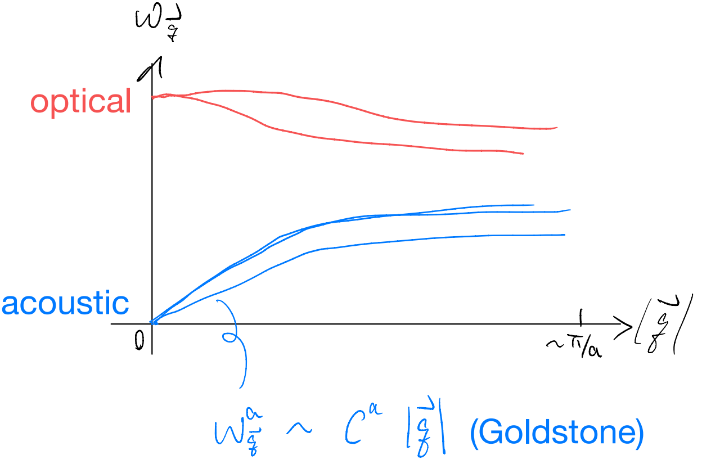
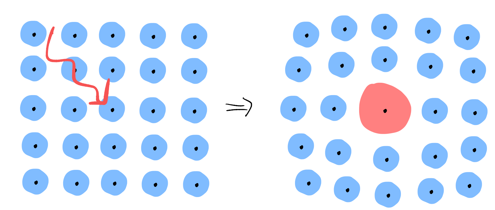

# lec03

topics:

1. free phonons: solving with (without) and with (without) invariance
2. acoustic versus optical phonons
3. finite temperature: density matrix

goals

1. getting used to Fourier transformation and canonical transformation
2. lightning review of quantum statistics mechanics

## QHO

recall we have the phonon Hamiltonian

$$ hat{H}=\frac{1}{2}\prod_{i,\alpha}{\left( \hat{\pi}_{i}^{\alpha} \right) ^2}+\frac{1}{2}\sum_{i,j,\alpha ,\beta}{\hat{\phi}_{i}^{\alpha}D_{ij}^{\alpha \beta}\hat{\phi}_{j}^{\beta}} $$

which we claim is diagonalized by

$$ ODO^T=\mathrm{diag}\left\{ \omega _{1}^{\alpha},\omega _{2}^{\alpha},\cdots \right\} ,\quad \omega _{i}^{\alpha}\ge 0.$$

This basis rotation induces one on the the operators

$$ \hat{\Pi}_{i}^{\alpha}=O_{ij}^{\alpha \beta}\hat{\pi}_{j}^{\beta},\quad \hat{\Phi}_{i}^{\alpha}=O_{ij}^{\alpha \beta}\hat{\phi}_{j}^{\beta}$$

we can verify

$$
\begin{align*}
    \left[ \hat{\Phi}_{i}^{\alpha},\hat{\Phi}_{j}^{\beta} \right] &=O_{il}^{\alpha r}O_{jm}^{\beta s}\left[ \hat{\phi}_{l}^{r},\hat{\phi}_{m}^{s} \right] \\
    &=iO_{il}^{\alpha r}O_{jm}^{\beta s}\delta _{lm}\delta _{rs}\\
    &=iO_{il}^{\alpha r}\left( O^T \right) _{lj}^{r\beta}\\
    &=i\left( OO^T \right) _{ij}^{\alpha \beta}\\
    &=i\delta _{ij}\delta _{\alpha \beta}
\end{align*}
$$

all other commutators vanish.

Note: we simply asserted that we are free to perform a linear transformation on the $\hat{\pi}$ and $\hat{\phi}$. But it may be more pleasing to show that there exists a unitary operator (acting on the Hilbert space) which transforms the operators in the way described. This is usually called a canonical transformation and is generated by a bilinears of $\hat{a} \& \hat{a}^\dagger$.

As such, the transformed Hamiltonian reads

$$
\begin{align*}
    \hat{H}^{\prime}&=\frac{1}{2}\sum_{i,\alpha}{\left( \hat{\Pi}_{i}^{\alpha} \right) ^2+\left( \omega _{i}^{\alpha} \right) ^2\left( \hat{\Phi}_{i}^{\alpha} \right) ^2}\\
    &=\sum_{i,\alpha}{\omega _{i}^{\alpha}\left( \hat{a}_{i}^{\alpha \dagger}\hat{a}_{i}^{\alpha}+\frac{1}{2} \right)}
\end{align*}
$$

The compound index $i\alpha$ can be viewed as a collective mode index. The Hamiltonian is simply $d\cdot V$ decoupled QHO, and the Hilbert space is now recognized with the tensor product of the $d\cdot V$ Fock spaces associated with them.

Summary: The diagonalization of the one-particle "dynamical matrix" gives us the frequencies of the "normal modes". This is the same as the classical problems. The quantum part simply comes from quantizing each of the individual harmonic oscillator, and recognizing they each come with a Fock space. The same is true for "free fermions", e.g., tight-binding models or even BdG mean-field.

So far, we have not assumed anything about the phonon problem except that we keep only up to quadratic terms. This is sometimes called a "harmonic approximation".

Let's now go to the more conventional solid-state setup and assume we have lattice translation symmetry of a crystal, i.e., $D_{ij}^{\alpha\beta}$ depends only on the distance between the equilibrium positions$\delta_{\vec{R}}=\vec{R}_j-\vec{R}_i$. To this end, let's switch notation slightly $D_{ij}^{\alpha\beta}\to D_{\vec{R}\vec{R'}}^{\alpha\beta}$.

Here, we let $\vec{R},\vec{R}'$ denote unit cell coordinates. There could be multiple atoms inside each unit cell, and we group all degrees of freedom inside a unit cell (spatial dimensions times number of atoms inside a unit cell) in the indices $\alpha,\beta$.

Note: This is a very solid-state-specific kind of worry. If you don't want to worry about that, then don't. Our approach works in the same way anyway.

The presence of (lattice) translation implies (crystal) momentum is a good quantum number. In other words, the eigenstates of the Hamiltonian can be labeled by their momenta. In our context, that's just a verbal of saying we can Block-diagonalize the dynamical matrix upon Fourier transform. Explicitly

$$
\begin{align*}
    &\frac{1}{V}\sum_{\vec{R},\vec{R}'}{D_{\vec{R}\vec{R}'}^{\alpha \beta}e^{-i\vec{q}\cdot \vec{R}}e^{-i\vec{q}'\cdot \vec{R}'}}\\
    \stackrel{\delta _{\vec{R}}=\vec{R}'-\vec{R}}{=}&\frac{1}{V}\sum_{\vec{R},\delta _{\vec{R}}}{D_{\delta _{\vec{R}}}^{\alpha \beta}e^{-i\vec{q}\cdot \vec{R}}e^{-i\vec{q}'\cdot \left( \vec{R}+\delta _{\vec{R}} \right)}}\\
    =&\sum_{\delta _{\vec{R}}}{D_{\delta _{\vec{R}}}^{\alpha \beta}e^{-i\vec{q}'\cdot \delta _{\vec{R}}}\frac{1}{V}\sum_{\vec{R}}{e^{-i\left( \vec{q}+\vec{q}' \right) \cdot \vec{R}}}}\\
    =&\sum_{\delta _{\vec{R}}}{D_{\delta _{\vec{R}}}^{\alpha \beta}e^{i\vec{q}\cdot \delta _{\vec{R}}}}\delta \left( \vec{q}+\vec{q}' \right) \\
\end{align*}
$$

$$ D_{\vec{q}}^{\alpha \beta}=\sum_{\delta _{\vec{R}}}{D_{\delta _{\vec{R}}}^{\alpha \beta}e^{i\vec{q}\cdot \delta _{\vec{R}}}}=\left( D_{-\vec{q}}^{\alpha \beta} \right) ^*$$

Note that the "Fourier transform" is nothing other than a unitary transformation. More explicitly, define the unitary matrix

$$ U_{\vec{q}\vec{R}}^{\alpha \beta}=\frac{1}{\sqrt{V}}e^{i\vec{q}\cdot \vec{R}}\delta _{\alpha \beta}$$

check

$$ \left( U^{\dagger}U \right) _{\vec{R},\vec{R}'}^{\alpha \beta}=\frac{1}{V}\sum_q{e^{-i\vec{q}\cdot \vec{R}'}e^{i\vec{q}\cdot \vec{R}}\delta _{\alpha \beta}}=\delta \left( \vec{R}-\vec{R}' \right) \delta _{\alpha \beta}$$

The block diagonalization of $D$ suggests we should transform

$$
\begin{align*}
    \hat{\phi}_{i}^{\alpha}D_{ij}^{\alpha \beta}\hat{\phi}_{j}^{\beta}&=\hat{\phi}^T\cdot D\cdot \hat{\phi}\\
    &=\left( \hat{\phi}^TU^T \right) \cdot \left( U^*DU^{\dagger} \right) \cdot \left( U\hat{\phi} \right) \\
    &=\sum_{\vec{q},\vec{q}'}{\hat{\phi}_{\vec{q}}^{\alpha}D_{\vec{q}}^{\alpha \beta}\delta \left( \vec{q}+\vec{q}' \right) \hat{\phi}_{\vec{q}'}^{\beta}}\\
    &=\sum_{\vec{q}}{\hat{\phi}_{\vec{q}}^{\alpha}D_{\vec{q}}^{\alpha \beta}\hat{\phi}_{-\vec{q}}^{\beta}}
\end{align*}
$$

where

$$ \hat{\phi}_{\vec{q}}^{\alpha}=\frac{1}{\sqrt{V}}\sum_{\vec{R}}{e^{i\vec{q}\cdot \vec{R}}\hat{\phi}_{\vec{R}}^{\alpha}} $$

similarly,

$$ \hat{\pi}_{\vec{q}}^{\alpha}=\frac{1}{\sqrt{V}}\sum_{\vec{R}}{e^{i\vec{q}\cdot \vec{R}}\hat{\pi}_{\vec{R}}^{\alpha}} $$

Note that the pairing between $\vec{q}$ and $-\vec{q}$ is natural for a couple of reasons

1. $\hat{\phi}_{\vec{q}}^{\alpha \dagger}=\frac{1}{\sqrt{V}}\sum_{\vec{R}}{e^{-i\vec{q}\cdot \vec{R}}\hat{\phi}_{\vec{R}}^{\alpha}}=\hat{\phi}_{-\vec{q}}^{\alpha}$
2. $\hat{t}_{\vec{a}}\hat{\phi}_{\vec{q}}^{\alpha}\hat{t}_{\vec{a}}^{-1}=\frac{1}{\sqrt{V}}\sum_{\vec{R}}{e^{i\vec{q}\cdot \vec{R}}\hat{\phi}_{\vec{R}+\vec{a}}^{\alpha}}=e^{-i\vec{q}\cdot \vec{a}}\hat{\phi}_{\vec{q}}^{\alpha}$, where $\hat{t}_{\vec{a}}$ is lattice translation by $\vec{a}$

So $\hat{\phi}_{\vec{q}}^\alpha$ and $\hat{\phi}_{-\vec{q}}^\alpha$ transform in opposite way under translation, and they have to appear in pairs to keep the Hamiltonian translation invariant. (Same story for non-FFLO superconductors: pairing $\sim\Delta C_{\vec{q}}^\dagger C_{-\vec{q}}^\dagger$)

Let's finish diagonalizing the Hamiltonian. First note that the Fourier transform is complex, so it's unitary (instead of orthogonal). This leads to a slightly different commutation relation.

$$
\begin{align*}
    \left[ \hat{\phi}_{\vec{q}}^{\alpha},\hat{\pi}_{\vec{q}'}^{\beta} \right] &=\frac{1}{V}\sum_{\vec{R},\vec{R}'}{e^{i\vec{q}\cdot \vec{R}}e^{i\vec{q}'\cdot \vec{R}'}\left[ \hat{\phi}_{\vec{R}}^{\alpha},\hat{\pi}_{\vec{R}'}^{\beta} \right]}\\
    &=\frac{1}{V}\sum_{\vec{R},\vec{R}'}{e^{i\vec{q}\cdot \vec{R}}e^{i\vec{q}'\cdot \vec{R}'}i\delta \left( \vec{R}-\vec{R}' \right) \delta _{\alpha \beta}}\\
    &=\frac{i\delta _{\alpha \beta}}{V}\sum_{\vec{R}}{e^{i\left( \vec{q}+\vec{q}' \right) \cdot \vec{R}}}\\
    &=i\delta \left( \vec{q}+\vec{q}' \right) \delta _{\alpha \beta}
\end{align*}
$$

i.e., the canonical conjugate pairs are $\hat{\phi}_{\vec{q}}^\alpha \& \hat{\pi}_{-\vec{q}}^\alpha$. The transformed Hamiltonian is now

$$ \hat{H}=\frac{1}{2}\sum_{\vec{q}}{\left( \sum_{\alpha}{\hat{\pi}_{\vec{q}}^{\alpha}\hat{\pi}_{-\vec{q}}^{\alpha}}+\sum_{\alpha \beta}{\hat{\phi}_{\vec{q}}^{\alpha}D_{\vec{q}}^{\alpha \beta}\hat{\phi}_{-\vec{q}}^{\beta}} \right)}$$

We further diagonalize the block

$$ S_{\vec{q}}^{\dagger}D_{\vec{q}}S_{\vec{q}}=\mathrm{diag}\left\{ \left( \omega _{\vec{q}}^{1} \right) ^2,\left( \omega _{\vec{q}}^{2} \right) ^2,\cdots \right\} $$

and transform $\hat{\pi}_{\vec{q}}^\alpha$ and $\hat{\phi}_{\vec{q}}^\alpha$ accordingly. This leads to

$$ \hat{H}=\frac{1}{2}\sum_{\vec{q},\alpha}{\left( \hat{\Pi}_{\vec{q}}^{\alpha}\hat{\Pi}_{-\vec{q}}^{\alpha}+\left( \omega _{\vec{q}}^{\alpha} \right) ^2\hat{\Phi}_{\vec{q}}^{\alpha}\hat{\Phi}_{-\vec{q}}^{\beta} \right)}$$

we should now define the creation and annihilation operators

$$ \hat{a}_{\vec{q}}^{\alpha}=\left( \sqrt{\omega _{\vec{q}}^{\alpha}}\hat{\Phi}_{\vec{q}}^{\alpha}+\frac{i}{\sqrt{\omega _{\vec{q}}^{\alpha}}}\hat{\Pi}_{\vec{q}}^{\alpha} \right) /\sqrt{2}$$

$$ \hat{a}_{\vec{q}}^{\alpha \dagger}=\left( \sqrt{\omega _{\vec{q}}^{\alpha}}\hat{\Phi}_{-\vec{q}}^{\alpha}-\frac{i}{\sqrt{\omega _{\vec{q}}^{\alpha}}}\hat{\Pi}_{-\vec{q}}^{\alpha} \right) /\sqrt{2} $$

As usual, let's check

$$ \left[ \hat{a}_{\vec{q}}^{\alpha},\hat{a}_{\vec{q}}^{\alpha ^{\dagger}} \right] =\frac{1}{2}\left[ \hat{\Phi}_{\vec{q}}^{\alpha},-i\hat{\Pi}_{-\vec{q}}^{\alpha} \right] +\frac{1}{2}\left[ i\hat{\Pi}_{\vec{q}}^{\alpha},\hat{\Phi}_{-\vec{q}}^{\alpha} \right] =1$$

Anticipating the answer, let's compute

$$ \hat{a}_{\vec{q}}^{\alpha \dagger}\hat{a}_{\vec{q}}^{\alpha}=\frac{1}{2}\left( \omega _{\vec{q}}^{\alpha}\hat{\Phi}_{-\vec{q}}^{\alpha}\hat{\Phi}_{\vec{q}}^{\alpha}+i\hat{\Phi}_{-\vec{q}}^{\alpha}\hat{\Pi}_{\vec{q}}^{\alpha}-i\hat{\Pi}_{-\vec{q}}^{\alpha}\hat{\Phi}_{\vec{q}}^{\alpha}+\hat{\Pi}_{-\vec{q}}^{\alpha}\hat{\Phi}_{\vec{q}}^{\alpha}/\omega _{\vec{q}}^{\alpha} \right) $$

$$ \hat{a}_{-\vec{q}}^{\alpha \dagger}\hat{a}_{-\vec{q}}^{\alpha}=\frac{1}{2}\left( \omega _{\vec{q}}^{\alpha}\hat{\Phi}_{\vec{q}}^{\alpha}\hat{\Phi}_{-\vec{q}}^{\alpha}+i\hat{\Phi}_{\vec{q}}^{\alpha}\hat{\Pi}_{-\vec{q}}^{\alpha}-i\hat{\Pi}_{\vec{q}}^{\alpha}\hat{\Phi}_{-\vec{q}}^{\alpha}+\hat{\Pi}_{\vec{q}}^{\alpha}\hat{\Phi}_{-\vec{q}}^{\alpha}/\omega _{\vec{q}}^{\alpha} \right) $$

where we have used $\omega_{\vec{q}}^{\alpha}=\omega_{-\vec{q}}^{\alpha}$ as $D_{\vec{q}}^{\alpha \beta}=\left( D_{-\vec{q}}^{\alpha \beta} \right) ^*$.

$$
\begin{align*}
    &\hat{a}_{\vec{q}}^{\alpha \dagger}\hat{a}_{\vec{q}}^{\alpha}+\hat{a}_{-\vec{q}}^{\alpha \dagger}\hat{a}_{-\vec{q}}^{\alpha}\\
    =&\omega _{\vec{q}}^{\alpha}\hat{\Phi}_{\vec{q}}^{\alpha}\hat{\Phi}_{-\vec{q}}^{\alpha}+\hat{\Pi}_{\vec{q}}^{\alpha}\hat{\Pi}_{-\vec{q}}^{\alpha}/\omega_{\vec{q}}^{\alpha}+\frac{i}{2}\left[ \hat{\Phi}_{-\vec{q}}^{\alpha},\hat{\Pi}_{\vec{q}}^{\alpha} \right] +\frac{i}{2}\left[ \hat{\Phi}_{\vec{q}}^{\alpha},\hat{\Pi}_{-\vec{q}}^{\alpha} \right] \\
    =&\omega _{\vec{q}}^{\alpha}\hat{\Phi}_{\vec{q}}^{\alpha}\hat{\Phi}_{-\vec{q}}^{\alpha}+\hat{\Pi}_{\vec{q}}^{\alpha}\hat{\Pi}_{-\vec{q}}^{\alpha}/\omega_{\vec{q}}^{\alpha}-1
\end{align*}
$$

$$
\begin{align*}
    \hat{H}&=\frac{1}{2}\sum_{\alpha}{\left( \hat{\Pi}_{\vec{0}}^{\alpha 2}+\omega _{\vec{0}}^{\alpha 2}\hat{\Phi}_{\vec{0}}^{\alpha 2} \right)}+\sum_{\alpha ,\vec{q}:q>0}{\left( \hat{\Pi}_{\vec{q}}^{\alpha}\hat{\Pi}_{-\vec{q}}^{\alpha}+\omega _{\vec{q}}^{\alpha 2}\hat{\Phi}_{\vec{q}}^{\alpha}\hat{\Phi}_{-\vec{q}}^{\alpha} \right)}\\
    &=\frac{1}{2}\sum_{\alpha}{\left( \hat{\Pi}_{\vec{0}}^{\alpha 2}+\omega _{\vec{0}}^{\alpha 2}\hat{\Phi}_{\vec{0}}^{\alpha 2} \right)}+\sum_{\alpha ,\vec{q}:q>0}{\omega _{\vec{q}}^{\alpha}\left( \hat{a}_{\vec{q}}^{\alpha \dagger}\hat{a}_{\vec{q}}^{\alpha}+\hat{a}_{-\vec{q}}^{\alpha \dagger}\hat{a}_{-\vec{q}}^{\alpha}+1 \right)}\\
    &=\frac{1}{2}\sum_{\alpha}{\left( \hat{\Pi}_{\vec{0}}^{\alpha 2}+\omega _{\vec{0}}^{\alpha 2}\hat{\Phi}_{\vec{0}}^{\alpha 2} \right)}+\sum_{\alpha ,\vec{q}:q\ne 0}{\omega _{\vec{q}}^{\alpha}\left( \hat{a}_{\vec{q}}^{\alpha \dagger}\hat{a}_{\vec{q}}^{\alpha}+\frac{1}{2} \right)}
\end{align*}
$$

Notice that we have treated $\vec{q}=0$ differently. This is more than a formality (e.g. we would have double counted if we simply group the sums for $\vec{q}$ and $-\vec{q}$). Physically, having crystal momentum of $\vec{q}=\vec{0}$ implies

1. we specify a distortion of the atoms within one unit cell
2. we copy the distortion everywhere

One specific distortion we can obtain in this way is to shift every atom by the same amount in the same direction. Such uniform distortion is simply a center of mass motion, which should not cost any elastic energy.

In other words, we expect the lowest frequencies at $\vec{q}=\vec{0}$ to be $0$. We have as many of them as the spatial dimension $d$. In fact, we can say something stronger: a nearly uniform distortion should, by similar reasoning, takes very little energy. We can make the energy cost as small as we wish by taking $|\vec{q}|\to 0$. This implies we have $d$ branches of low-lying phonon modes radiating out from the $\Gamma$ point ($\vec{q}=\vec{0}$). There are called "acoustic phonons". There existence is a consequence of the spontaneously broken global continuous translation symmetry when we, say, go from a liquid of the same atoms to a crystal. They can be identified as examples of Goldstone modes. Recall, however, that in our current treatment the $\alpha$ index ranges beyond $1,2,\cdots,d$ if we have multiple atoms per unit cell. We argued the lowest $d$ eigenvalues of $D_{\vec{q}}^{\alpha\beta}$ will be $0$, but we don't really have a constraint for the rest. These will generically have a finite frequency, and they are referred to as the "optical phonons".

Goldstone modes: $\omega_{vec{q}}^\alpha\sim C^\alpha |\vec{q}|$

Anyway, we can finally write the phonon Hamiltonian as (CM abbreviate for Classical Mechanics)

$$ \hat{H}=\sum_{\alpha =1}^d{\frac{\hat{\Pi}_{\mathrm{CM}}^{\alpha 2}}{2M}}+\sum_{\alpha ,\vec{q}:q\ne 0}{\omega _{\vec{q}}^{\alpha}\left( \hat{a}_{\vec{q}}^{\alpha \dagger}\hat{a}_{\vec{q}}^{\alpha}+\frac{1}{2} \right)}$$

This isn't really any different from what we have without assuming translation symmetry! All we have gained is a more refined understanding on how the "modes" are organized with respect to the conserved crystal momentum.

Let's end this part by spending a bit of time thinking about the eigenstates, and then also what happens at finite temperature (as a quantum statistics mechanics review).

## Q stat mech review

For simplicity, let's drop the CM motion piece. The phonon Hamiltonian is then

$$ \hat{H}=\sum_{\vec{q},\alpha}{\omega _{\vec{q}}^{\alpha}\left( \hat{a}_{\vec{q}}^{\alpha \dagger}\hat{a}_{\vec{q}}^{\alpha}+\frac{1}{2} \right)}$$

Each of the number operators $\hat{n}_{\vec{q}}=\hat{a}_{\vec{q}}^\dagger \hat{a}_{\vec{q}}$ commutes with the Hamiltonian, and so the eigenstates are simply labeled by them

$$ \hat{H}|\left\{ n_{\vec{q}}^{\alpha} \right\} \rangle =\sum_{\vec{q},\alpha}{\omega _{\vec{q}}^{\alpha}\left( n_{\vec{q}}^{\alpha}+\frac{1}{2} \right)}|\left\{ n_{\vec{q}}^{\alpha} \right\} \rangle $$

The constant $\omega_{\vec{q}}^\alpha/2$ in the Hamiltonian is problematic for two reasons

1. It's shared by all states, but physical processes can only probe energy differences between states
2. It scales with the number of atoms inside. If we wish to take a continuum limit, it diverges

It is customary to simply drop that overall constant in the Hamiltonian. So far, we have focused on the eigenstates. At zero temperature, we can simply state that the system is in the lowest energy state. At finite temperatures, however, we expect states within an energy scale of $k_BT$ to be "populated". This is reflected in the density matrix.

$$
\begin{gather*}
    \hat{\rho}=\frac{e^{-\beta \hat{H}}}{\mathcal{Z}}\\
    \mathcal{Z} =\mathrm{Tr}\left( e^{-\beta \hat{H}} \right) \\
    \beta =\frac{1}{k_BT}\\
    \mathrm{Tr}\left( \hat{\rho} \right) =1
\end{gather*}
$$

Expectation value for a physical observable is then given by

$$ \left< \hat{A} \right> =\mathrm{Tr}\left( \hat{\rho}\hat{A} \right)  $$

For our free phonon problem, we know all the eigenstates and one can evaluate explicitly

$$
\begin{align*}
    \mathcal{Z} \left( \beta \right) &=\mathrm{Tr}\left( e^{-\beta \hat{H}} \right) =\sum_{\left\{ n_{\vec{q}}^{\alpha} \right\}}{\langle \left\{ n_{\vec{q}}^{\alpha} \right\} |e^{-\beta \hat{H}}|\left\{ n_{\vec{q}}^{\alpha} \right\} \rangle}\\
    &=\sum_{\left\{ n_{\vec{q}}^{\alpha} \right\}}{\exp \left( -\beta \sum_{\vec{q},\alpha}{\omega _{\vec{q}}^{\alpha}n_{\vec{q}}^{\alpha}} \right)}\\
    &=\sum_{\left\{ n_{\vec{q}}^{\alpha} \right\}}{\prod_{\vec{q},\alpha}{\exp \left( -\beta \omega _{\vec{q}}^{\alpha}n_{\vec{q}}^{\alpha} \right)}}\\
    &=\prod_{\vec{q},\alpha}{\sum_{n_{\vec{q}}^{\alpha}=0}^{\infty}{\exp \left( -\beta \omega _{\vec{q}}^{\alpha}n_{\vec{q}}^{\alpha} \right)}}\\
    &=\prod_{\vec{q},\alpha}{\frac{1}{1-\exp \left( -\beta \omega _{\vec{q}}^{\alpha} \right)}}
\end{align*}
$$

$$ \Rightarrow \ln \mathcal{Z} \left( \beta \right) =-\sum_{\vec{q},\alpha}{\ln \left( 1-e^{-\beta \omega _{\vec{q}}^{\alpha}} \right)}$$

To find, e.g., the energy expectation value we notice

$$ \left< H \right> =\frac{\mathrm{Tr}\left( \hat{H}\rho \right)}{\mathcal{Z}}=-\partial _{\beta}\ln \mathcal{Z} \left( \beta \right) $$

That's an awesome trick. What about computing some other expectation values? It's **tempting** to imaging generalizing

$$
\begin{gather*}
    \mathcal{Z} \left( \beta ,J \right) =\mathrm{Tr}\left( e^{-\beta \hat{H}+J\hat{O}} \right) \\
    \partial _J\ln \mathcal{Z} \left( \beta ,J \right) =\frac{\partial _J\mathrm{Tr}\left( e^{-\beta \hat{H}+J\hat{O}} \right)}{Z\left( \beta ,J \right)}\stackrel{?}{=}\frac{\mathrm{Tr}\left( \hat{O}e^{-\beta \hat{H}+J\hat{O}} \right)}{Z\left( \beta ,J \right)}\\
    \left. \partial _J\ln \mathcal{Z} \left( \beta ,J \right) \right|_{J=0}\stackrel{?}{=}\frac{\mathrm{Tr}\left( \hat{O}e^{-\beta \hat{H}} \right)}{Z\left( \beta ,J \right)}=\left< \hat{O} \right>
\end{gather*}
$$

**BUT** $\hat{H} \& \hat{O}$ may not commute! The manipulation above is faulty in general. Nevertheless, the spirit above is great. We just need a more sophisticated formalism to make it work. That requires time-ordering, generating functional, path integral etc. More later.

In any case, we have completely solved the free phonon problem, in the sense that for any observables we would want to compute, we have a way of doing so (by rotating to the decoupled QHO basis).

But let's pretend we are experimentalists. How do we even get to get to find the coupling coefficients etc in the first place? Without that, how do we find out the phonon frequencies etc? The natural approach is to perturb the system, and watches how it responds, e.g.,

If you have a guitar string, you probe its frequency by plucking with you fingers, Too bad our fingers are too big for the microscopic crystal! Instead, we probe phonons with other tools, like photon, or more indirectly through electrons in the solid. E.g.

We generally expect the equilibrium position of the atoms to shift depending on the electronic state. So, we can use the electron as our "phonon pick"!

To that end, let's now introduce the electron, a fermion.
