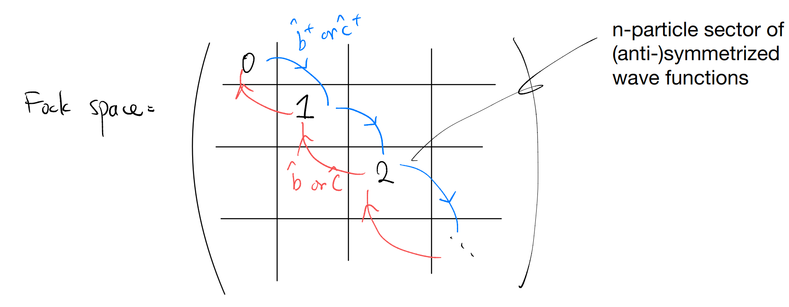

# lec04

:::{note}
This is **NOT** the official course PHYS5340 website yet!

* If you are student in this course, **always** take the lecture notes as the correct one if you find any differences between lecture notes and website contents
* If you are just passerby, use the materials below at your own risk. Since the website is still the first version (even alpha version), there could be some typos, incorrect/inaccurate/improper statements.
:::

:::{note}
**All** materials in this website are based on the course offered at HKUST
:::

:::{note}
As a "casual course", we provide only general references but not specific ones to the materials introduced
:::

:::{note}
**All** materials' copyright in this website are reserved for the course lecturer

* If you want to use the material somewhere, you might need to contact the lecturer first
:::

:::{note}
Contribution is always **welcome**. if you find any typo, incorrect/inaccurate/improper statements or necessary references, do not hesitate to

* raise an issue on github repo
* make an pull request on github repo
* contact me directly
:::

202200216

topics

1. particle statistics
2. localized electrons
3. Heisenberg picture
4. Green's and spectral functions: a primer

Goals

1. relate particle statistics to (anti-)commutation of second quantized operators
2. sharpening connection of Green's functions vs excitations

Reminder: PS1 due coming Fri $1:30\text{pm}-\varepsilon$

## particle statistics

We have mentioned on and off that phonon problem is a bosonic one. Recall from QM that boson vs fermion is a question about particle exchange statistics. In the so-called "first quantized" wave function, a two-particle wave function depends on two coordinate variables

$$ \Psi \left( x_1,x_2 \right) =\langle x_1,x_2|\Psi \rangle $$

"Particle statistics" refers to what happen if we decide to relabel the two indistinguishable particles

$$ \Psi \left( x_1,x_2 \right) =\begin{cases}
    \Psi \left( x_2,x_1 \right) ;\quad \mathrm{boson}\\
    -\Psi \left( x_2,x_1 \right) ;\quad \mathrm{fermion}\\
\end{cases}$$

Generalization to an $N$-particle state is similar, noticing any permutation is a product of pair-wise exchanges. For our purpose, we just assert without any justification that one can relate the state with one boson at $x_1$ and one at $x_2$ can be identified with

$$ |x_1,x_2\rangle =\hat{b}_{x_1}^{\dagger}\hat{b}_{x_2}^{\dagger}|0\rangle $$

where $\hat{b}^\dagger$ is the creation operator we have written down countless time already from QHO. In essence, we associate to each point $x$ in space a QHO. The vacuum $|0\rangle$ is then the joint vacuum of all these QHO's.

Notes:

1. but (if) space is continuous, then we have uncountably many QHO's even in a finite volume of space! That sounds sick. That is sick. But that's okay.
2. We have implicitly promoted the single-particle wave function $\delta(x)$ to an operator $\hat{b}_x^\dagger$. That's why this is called "second quantization".
3. implicitly, we have defined an object which maps space to quantum operators: $\vec{r}\to \hat{b}_x^\dagger$. Such maps are called "fields". (E.g., think about electric field $\vec{r}\to \vec{E_{\vec{r}}}$. Our fields here are quantum mechanical in that they do not have simple point-wise multiplication but instead canonical commutation). Whence the name "QFT"

Now, back to particle statistics. We have, for bosons,

$$ \Psi _B\left( x_1,x_2 \right) =\langle 0|\hat{b}_{x_1}^{\dagger}\hat{b}_{x_2}^{\dagger}|0\rangle =\langle 0|\hat{b}_{x_2}^{\dagger}\hat{b}_{x_1}^{\dagger}|0\rangle =\Psi _B\left( x_2,x_1 \right) $$

So the exchange sign of $+1$ is really the commutation of among the creation(annihilation) operators. It is then natural to guess what should happen for fermions:

$$ \Psi _F\left( x_1,x_2 \right) =\langle 0|\hat{c}_{x_1}^{\dagger}\hat{c}_{x_2}^{\dagger}|0\rangle =-\langle 0|\hat{c}_{x_2}^{\dagger}\hat{c}_{x_1}^{\dagger}|0\rangle =\Psi _F\left( x_2,x_1 \right)  $$

This implies the fermionic creation and annihilation operators should satisfy canonical anti-commutation relations. Let $\{\hat{A},\hat{B}\}=\hat{A}\hat{B}+\hat{B}\hat{A}$. For fermions

$$ \left\{ \hat{c}_x,\hat{c}_y \right\} =\left\{ \hat{c}_{x}^{\dagger},\hat{c}_{y}^{\dagger} \right\} =0 $$

$$ \left\{ \hat{c}_{x}^{\dagger},\hat{c}_y \right\} =\delta \left( x-y \right) $$

$$ \left\{ \hat{c}_x,\hat{c}_x \right\} =\left\{ \hat{c}_{x}^{\dagger},\hat{c}_{x}^{\dagger} \right\} =0\quad \Rightarrow \quad \hat{c}_{x}^{2}=\hat{c}_{x}^{\dagger 2}=0$$

Note: we take these as the practical definition for the "second-quantized" operators. One can also do it in the traditional way of making very explicit connections to the Hilbert space of symmetrized / anti-symmetrized wave functions. Schematically,

The "first quantized" description focus on each particle sector individually. The "second quantized" description focus on how to relate the different sectors. In particular, we have a natural relation between the ground state and a state in the $n$-particle sector. Consider putting $n$ particles (bosons or fermions) into $n$ "orbitals" $\phi_1,\phi_2,\cdots,\phi_n$

$$ \Phi _{x_1,x_2,\cdots ,x_n}^{\phi _1,\phi _2,\cdots ,\phi _n}\xrightarrow{\mathrm{sym}}\hat{b}_{\phi _1}^{\dagger}\hat{b}_{\phi _2}^{\dagger}\cdots \hat{b}_{\phi _n}^{\dagger}|0\rangle \quad \mathrm{bosons}$$

$$ \Phi _{x_1,x_2,\cdots ,x_n}^{\phi _1,\phi _2,\cdots ,\phi _n}\xrightarrow{\mathrm{anti}-\mathrm{sym}}\hat{c}_{\phi _1}^{\dagger}\hat{c}_{\phi _2}^{\dagger}\cdots \hat{c}_{\phi _n}^{\dagger}|0\rangle \quad \mathrm{fermions}$$

where we assume the "orbitals" are distinct and orthogonal. (i.e., we are considering a canonical transformation on the defining modes of the system).

The above is rather schematic. In practice there are some factors of $\sqrt{n!}$ etc. if one wants to relate first and second quantization. We won't cover that here (usually covered in advanced QM), see e.g. Coleman Chapter-3 for more details.

Final note: so is QHO bosonic?

**It depends**. IF you have exactly one particle, there is no exchange and hence no statistics. If you have multiple particles, then the statistics is an "intrinsic" aspect of the problem in the sense that it defines the many-body Hilbert space, whereas being a QHO is "kinematic" in the sense that it's just characterizing the Hamiltonian acting on the Hilbert space. E.g.,

1. Phonons: the momenta and displacements of different atoms commute, so we have a bosonic problem to start with. In the "harmonic approximation" we have a collection of coupled QHO
2. Electronic quantum Hall: we have fermions to start with, but the B-field enters the single particle problem as a spatially varying gauge field. That also leads to the QHO Hamiltonian for the single particle problem. But now the raising / lowering operators act between different **fermionic** modes that could be empty or filled

P.S. We can certainly have bosonic operators in a fermionic Hilbert space: combining an even number of fermionic operators leads to bosonic ones. For those of you have prefer a math-oriented language, the operator algebra is $Z_2$-graded and we have even=bosonic and odd=fermionic.

P.P.S. We can even have effectively fermionic operators in a bosonic Hilbert space. That's the wonder of topological order...

## Localized electrons

Let us now consider our very first electronic problem. Consider as a warm-up an electronic Hamiltonian

$$
\begin{align*}
    \hat{H}=&\varepsilon \left( \hat{c}_{\uparrow}^{\dagger}\hat{c}_{\downarrow}+\hat{c}_{\downarrow}^{\dagger}\hat{c}_{\uparrow} \right) \quad \mathrm{many body}\\
    &=\left( \hat{c}_{\uparrow}^{\dagger},\hat{c}_{\downarrow}^{\dagger} \right) \left( \begin{matrix}
        0&  \varepsilon\\
        \varepsilon&  0\\
    \end{matrix} \right) \left( \hat{c}_{\uparrow},\hat{c}_{\downarrow} \right) \quad \mathrm{single particle}\\
\end{align*}
$$

Let's consider writing out the matrix elements in the Fock space

$$ \hat{H}|0\rangle =\varepsilon \left( \hat{c}_{\uparrow}^{\dagger}\hat{c}_{\downarrow}+\hat{c}_{\downarrow}^{\dagger}\hat{c}_{\uparrow} \right) |0\rangle =0$$

$$
\begin{align*}
    \hat{H}\hat{c}_{\uparrow}^{\dagger}|0\rangle &=\varepsilon \left( \hat{c}_{\uparrow}^{\dagger}\hat{c}_{\downarrow}+\hat{c}_{\downarrow}^{\dagger}\hat{c}_{\uparrow} \right) \hat{c}_{\uparrow}^{\dagger}|0\rangle \\
    &=\varepsilon \left( \hat{c}_{\uparrow}^{\dagger}\hat{c}_{\downarrow}\hat{c}_{\uparrow}^{\dagger}+\hat{c}_{\downarrow}^{\dagger}\hat{c}_{\uparrow}\hat{c}_{\uparrow}^{\dagger} \right) |0\rangle \\
    &=\varepsilon \left( -\hat{c}_{\uparrow}^{\dagger}\hat{c}_{\uparrow}^{\dagger}\hat{c}_{\downarrow}+\hat{c}_{\downarrow}^{\dagger}\left( 1-\hat{c}_{\uparrow}^{\dagger}\hat{c}_{\uparrow} \right) \right) |0\rangle \\
    &=\varepsilon \left( 0+\hat{c}_{\downarrow}^{\dagger}-\hat{c}_{\downarrow}^{\dagger}\hat{c}_{\uparrow}^{\dagger}\hat{c}_{\uparrow} \right) |0\rangle \\
    &=\varepsilon \left( 0+\hat{c}_{\downarrow}^{\dagger}-0 \right) |0\rangle \\
    &=\varepsilon \hat{c}_{\downarrow}^{\dagger}|0\rangle
\end{align*}
$$

$$ \hat{H}\hat{c}_{\downarrow}^{\dagger}|0\rangle =\varepsilon \left( \hat{c}_{\uparrow}^{\dagger}\hat{c}_{\downarrow}+\hat{c}_{\downarrow}^{\dagger}\hat{c}_{\uparrow} \right) \hat{c}_{\downarrow}^{\dagger}|0\rangle =\varepsilon \hat{c}_{\uparrow}^{\dagger}|0\rangle $$

$$ \hat{H}\hat{c}_{\uparrow}^{\dagger}\hat{c}_{\downarrow}^{\dagger}|0\rangle =\varepsilon \left( \hat{c}_{\uparrow}^{\dagger}\hat{c}_{\downarrow}+\hat{c}_{\downarrow}^{\dagger}\hat{c}_{\uparrow} \right) \hat{c}_{\uparrow}^{\dagger}\hat{c}_{\downarrow}^{\dagger}|0\rangle =0 $$

$$ \hat{H}=\left( \begin{matrix}
  0&    0&    0&    0\\
  0&    0&    \varepsilon&    0\\
  0&    \varepsilon&    0&    0\\
  0&    0&    0&    0\\
\end{matrix} \right) $$

in the basis $\left\{ |0\rangle ,\hat{c}_{\uparrow}^{\dagger}|0\rangle ,\hat{c}_{\downarrow}^{\dagger}|0\rangle ,\hat{c}_{\uparrow}^{\dagger}\hat{c}_{\downarrow}^{\dagger}|0\rangle \right\}$ ($\left\{ \hat{c}_{\uparrow}^{\dagger}|0\rangle ,\hat{c}_{\downarrow}^{\dagger}|0\rangle \right\}$ is single-particle basis). We know the single-particle eigenstates are

$$ \varepsilon \left( \begin{matrix}
  0&    1\\
  1&    0\\
\end{matrix} \right) \left( \begin{array}{c}
  1\\
  \pm 1\\
\end{array} \right) =\pm \varepsilon \left( \begin{array}{c}
  1\\
  \pm 1\\
\end{array} \right)$$

It is natural to "rotate" in the eigenbasis

$$ \hat{c}_{+}^{\dagger}=\frac{1}{\sqrt{2}}\left( \hat{c}_{\uparrow}^{\dagger}+\hat{c}_{\downarrow}^{\dagger} \right) ,\quad \hat{c}_{-}^{\dagger}=\frac{1}{\sqrt{2}}\left( \hat{c}_{\uparrow}^{\dagger}-\hat{c}_{\downarrow}^{\dagger} \right) $$

we may check

$$ \begin{cases}
  \left\{ \hat{c}_{\pm}^{\dagger},\hat{c}_{\pm} \right\} =\frac{1}{2}\left\{ \hat{c}_{\uparrow}^{\dagger}\pm \hat{c}_{\downarrow}^{\dagger},\hat{c}_{\uparrow}\pm \hat{c}_{\downarrow} \right\} =\frac{1}{2}\left( 1\pm 0\pm 0+1 \right) =1\\
  \left\{ \hat{c}_{+}^{\dagger},\hat{c}_- \right\} =\frac{1}{2}\left\{ \hat{c}_{\uparrow}^{\dagger}+\hat{c}_{\downarrow}^{\dagger},\hat{c}_{\uparrow}-\hat{c}_{\downarrow} \right\} =\frac{1}{2}\left( 1+0-0-1 \right) =0\\
\end{cases}$$

$$ \Rightarrow \begin{cases}
  \left\{ \hat{c}_{\alpha}^{\dagger},\hat{c}_{\beta} \right\} =\delta _{\alpha \beta}\\
  \left\{ \hat{c}_{\alpha}^{\dagger},\hat{c}_{\beta}^{\dagger} \right\} =\left\{ \hat{c}_{\alpha},\hat{c}_{\beta} \right\} =0\\
\end{cases}$$

Using which we have

$$ \hat{H}=\varepsilon \hat{c}_{+}^{\dagger}\hat{c}_+-\varepsilon \hat{c}_{-}^{\dagger}\hat{c}_-$$

We can schematically draw the spectrum as ($\varepsilon>0$)

Side note: The calculation above can be readily generalized. Consider some Hamiltonian defined over $N$ fermionic modes:

$$ \hat{H}=\sum_{\alpha ,\beta =1}^N{\hat{c}_{\alpha}^{\dagger}h_{\alpha \beta}\hat{c}_{\beta}}$$

Here, $h$ is a Hermitian matrix and can be diagonalized by a unitary

$$ h_{\alpha \beta}=\sum_i{U_{\alpha i}\varepsilon _i\left( U^{\dagger} \right) _{i\beta}}$$

$$
\begin{align*}
    \hat{H}&=\sum_i{\left( \sum_{\alpha}{\hat{c}_{\alpha}^{\dagger}}U_{\alpha i} \right) \varepsilon _i\left( \sum_{\beta}{\left( U^{\dagger} \right) _{i\beta}\hat{c}_{\beta}} \right)}\\
    &=\sum_i{\varepsilon _i\hat{c}_{i}^{\dagger}\hat{c}_i}\quad \mathrm{canonical transformation}
\end{align*}
$$
(c.f. the phonon discussion)

Back to the two mode problem: this is again an exactly solved problem, which is in a way similar to the QHO / free phonon. We know all the eigenstates and eigen-energies. Yet, it is natural to ask how we can probe the "physics" of the system. Suppose we start with the ground state ($t>0$):

$$ |\Omega \rangle =\hat{c}_{-}^{\dagger}|0\rangle =\frac{1}{\sqrt{2}}\left( \hat{c}_{\uparrow}^{\dagger}-\hat{c}_{\downarrow}^{\dagger} \right) |0\rangle $$

Recall our discussion on propagator / correlation functions / Green's functions. Let us compare

1. create an up electron: $\hat{c}_\uparrow^\dagger$
2. evolution for time $t$: $e^{-i\hat{H}t}$

$$ e^{-i\hat{H}t}\hat{c}_{\uparrow}^{\dagger}|\Omega \rangle \quad \mathrm{vs}\quad \hat{c}_{\uparrow}^{\dagger}e^{-i\hat{H}t}|\Omega \rangle $$

$$ \quad G_{\uparrow \uparrow}\left( t \right) =-i\langle \Omega |e^{i\hat{H}t}\hat{c}_{\uparrow}e^{-i\hat{H}t}\hat{c}_{\uparrow}^{\dagger}|\Omega \rangle $$

where $e^{i\hat{H}t}\hat{c}_{\uparrow}e^{-i\hat{H}t}$ is the conjugate action of time evolution on an operator. We claimed

1. Such functions contains important dynamical info about the system
2. It is natural to interpret it as a specific kind of correlation function

Let us now introduce these ideas more systematically

Heisenberg picture

So far, we have introduced time evolution of a quantum system through the evolution operator $\hat{U}=e^{-i\hat{H}t}$, which satisfies

$$ i\partial _t\hat{U}=\hat{H}\hat{U}$$

Implicitly, we know that if a state satisfies the Schrodinger equation

$$ i\partial _t|\Psi \left( t \right) \rangle =\hat{H}|\Psi \left( t \right) \rangle $$

then its time evolution can be expressed simply as

$$ |\Psi \left( t \right) \rangle =\hat{U}|\Psi \left( 0 \right) \rangle =e^{-i\hat{H}t}|\Psi \left( 0 \right) \rangle $$

$$ i\partial _t|\Psi \left( t \right) \rangle =i\partial _t\left( \hat{U}|\Psi \left( 0 \right) \rangle \right) =\left( i\partial _t\hat{U} \right) |\Psi \left( 0 \right) \rangle =\hat{H}\left( \hat{U}|\Psi \left( 0 \right) \rangle \right) =\hat{H}|\Psi \left( t \right) \rangle $$

Now imagine computing some observables as the state evolves

$$ A\left( t \right) =\langle \Psi \left( t \right) |\hat{A}|\Psi \left( t \right) \rangle =\langle \Psi \left( 0 \right) |\hat{U}^{\dagger}\hat{A}\hat{U}|\Psi \left( 0 \right) \rangle $$

It's simply a mater of interpretation to say that the operator is evolving $\hat{A}\rightarrow \hat{U}^{\dagger}\hat{A}\hat{U}$, and we compute its expectation value with respect to a fixed state $|\Psi\rangle(0)$. This perspective is called the "Heisenberg picture".

$$ \mathrm{Schrodinger}\begin{cases}
  |\Psi \left( 0 \right) \rangle _S\rightarrow |\Psi \left( t \right) \rangle _S=\hat{U}|\Psi \left( 0 \right) \rangle _S\\
  \hat{A}_S\rightarrow \hat{A}_S\\
\end{cases}$$

$$ \mathrm{Heisenberg}\begin{cases}
  |\Psi \rangle _H\rightarrow |\Psi \rangle _H\\
  \hat{A}_H\left( 0 \right) \rightarrow \hat{A}_H\left( t \right) =\hat{U}^{\dagger}\hat{A}_H\left( 0 \right) \hat{U}\\
\end{cases}$$

Here we assume the operator is time-independent in the Schrodinger picture. We can also check explicitly what is the equation governing the time evolution of Heisenberg-picture operators:

$$
\begin{align*}
    i\partial _t\hat{A}_H\left( t \right) &=i\partial _t\left( \hat{U}^{\dagger}\hat{A}_H\left( 0 \right) \hat{U} \right) \\
    &=-\hat{H}\hat{A}_H\left( t \right) +\hat{A}_H\left( t \right) \hat{H}\\
    &=\left[ \hat{A}_H\left( t \right) ,\hat{H} \right]
\end{align*}
$$

In fact, nothing in the check above demands that we use the actual Hamiltonian! One can imagine picking a "convenient" part of the actual Hamiltonian in defining the dynamics of the operators. Correspondingly, however, the state vectors are **NOT** static since we are not using the actual Hamiltonian. In this hybrid picture, both the operators and the state evolve. This is called the "interaction picture"; more later.

Note: for those of you who know quantum optics, think about rotating wave approximation.

\section{One-particle Green's function: a first example}

In the following, we keep the subscript $S$ vs $H$ implicit. Whenever we write a time dependence for an operator, it is understood that we are in the Heisenberg picture.

Back to our example. Recall we were comparing

$$ \hat{c}_{\uparrow}^{\dagger}e^{-i\hat{H}t}|\Omega \rangle \quad \mathrm{vs}\quad e^{-i\hat{H}t}\hat{c}_{\uparrow}^{\dagger}|\Omega \rangle $$

where

$$ \hat{H}=\varepsilon \left( \hat{c}_{\uparrow}^{\dagger}\hat{c}_{\downarrow}+\hat{c}_{\downarrow}^{\dagger}\hat{c}_{\uparrow} \right) $$

$$ |\Omega \rangle =\frac{1}{\sqrt{2}}\left( \hat{c}_{\uparrow}^{\dagger}-\hat{c}_{\downarrow}^{\dagger} \right) |0\rangle $$

In Heisenberg picture, we have defined

$$
\begin{align*}
    G_{\uparrow \uparrow}\left( t \right) &=-i\langle \Omega |e^{i\hat{H}t}\hat{c}_{\uparrow}e^{-i\hat{H}t}\hat{c}_{\uparrow}^{\dagger}|\Omega \rangle \\
    &=-i\langle \Omega |\hat{c}_{\uparrow}\left( t \right) \hat{c}_{\uparrow}^{\dagger}\left( 0 \right) |\Omega \rangle
\end{align*}
$$

which can be interpreted as a (quantum) auto-correlation function: we create an electron at time $t=0$, and then annihilate it at time $t$. We are measuring correlation across time. Yet, this is **NOT** by itself a physical observable! We cannot understand it as the expectation value of some Hermitian operator. Nevertheless, "unphysical" expressions of such form provides the basis for computing actual observables. As one first check, let us investigate how $G(t)$ reflects the energy scale of the problem. Noticing

$$ \hat{H}=\varepsilon \hat{c}_{+}^{\dagger}\hat{c}_+-\varepsilon \hat{c}_{-}^{\dagger}\hat{c}_-$$

$$ \hat{c}_{\pm}^{\dagger}=\frac{1}{\sqrt{2}}\left( \hat{c}_{\uparrow}^{\dagger}\pm \hat{c}_{\downarrow}^{\dagger} \right) $$

we first note that time evolution for $\hat{c}_{\pm}^\dagger$ is simple. In the Heisenberg picture,

$$
\begin{align*}
    i\partial _t\left( {\color{blue} \hat{c}_{\pm}^{\dagger}\left( t \right) } \right) &=\left[ {\color{blue} \hat{c}_{\pm}^{\dagger}\left( t \right) },\hat{H} \right] \\
    &=\hat{U}^{\dagger}\left[ {\color{red} \hat{c}_{\pm}^{\dagger}},\pm \varepsilon {\color{red} \hat{c}_{\pm}^{\dagger}\hat{c}_{\pm}} \right] \hat{U}\\
    &=\hat{U}^{\dagger}\left( \pm \varepsilon {\color{red} \hat{c}_{\pm}^{\dagger}} \right) \left[ {\color{red} \hat{c}_{\pm}^{\dagger}},{\color{red} \hat{c}_{\pm}} \right] \hat{U}\\
    &=\hat{U}^{\dagger}\left( \pm \varepsilon {\color{red} \hat{c}_{\pm}^{\dagger}} \right) \left( 2{\color{red} \hat{c}_{\pm}^{\dagger}\hat{c}_{\pm}}-1 \right) \hat{U}\\
    &=\mp \varepsilon {\color{blue} \hat{c}_{\pm}^{\dagger}\left( t \right) }
\end{align*}
$$

$$ {\color{blue} \hat{c}_{\pm}^{\dagger}\left( t \right) }={\color{blue} \hat{c}_{\pm}^{\dagger}\left( 0 \right) }e^{\pm i\varepsilon t}$$

With the blue symbols denoting Heisenberg picture and the red symbols Schrodinger picture. Noticing $\hat{c}_{\uparrow}^{\dagger}\left( t \right) =\frac{1}{\sqrt{2}}\left( \hat{c}_{+}^{\dagger}\left( t \right) +\hat{c}_{-}^{\dagger}\left( t \right) \right)$,

$$
\begin{align*}
    G_{\uparrow \uparrow}\left( t \right) &=-i\langle \Omega |\hat{c}_{\uparrow}\left( t \right) \hat{c}_{\uparrow}^{\dagger}\left( 0 \right) |\Omega \rangle \\
    &=-\frac{i}{2}\langle \Omega |\left( \hat{c}_+\left( t \right) +\hat{c}_-\left( t \right) \right) \left( \hat{c}_{+}^{\dagger}\left( 0 \right) +\hat{c}_{-}^{\dagger}\left( 0 \right) \right) |\Omega \rangle \\
    &=-\frac{i}{2}\langle 0|\hat{c}_-\left( \hat{c}_+e^{-i\varepsilon t}+\hat{c}_-e^{i\varepsilon t} \right) \left( \hat{c}_{+}^{\dagger}+\hat{c}_{-}^{\dagger} \right) \hat{c}_{-}^{\dagger}|0\rangle \\
    &=-\frac{i}{2}\langle 0|\hat{c}_-\hat{c}_+e^{-i\varepsilon t}\hat{c}_{+}^{\dagger}\hat{c}_{-}^{\dagger}|0\rangle \\
    &=-\frac{i}{2}e^{-i\varepsilon t}\langle 0|\left( 1-\hat{c}_{+}^{\dagger}\hat{c}_+ \right) \left( 1-\hat{c}_{-}^{\dagger}\hat{c}_- \right) |0\rangle \\
    &=-\frac{i}{2}e^{-i\varepsilon t}
\end{align*}
$$

How to interpret this?

## One-particle Green's function and spectral Lehmann representation

Our "single-site" example is designed to be simple (simple enough to solve everything exactly). Interestingly, the physical picture derived from above is actually very general, as we will see now.

Suppose we have an electronic problem with some many-body Hamiltonian $\hat{H}$ and the ground state $|\Omega\rangle$. We consider the one-particle Green's function as defined above:

$$
\begin{align*}
    G_{\alpha \alpha}\left( t \right) &=-i\langle \Omega |\hat{c}_{\alpha}\left( t \right) \hat{c}_{\alpha}^{\dagger}\left( 0 \right) |\Omega \rangle _H\\
    &=-i\langle \Omega |e^{i\hat{H}t}\hat{c}_{\alpha}e^{-i\hat{H}t}\hat{c}_{\alpha}^{\dagger}|\Omega \rangle _S
\end{align*}
$$

where we use one subscript to denote if the expression is understood in the Heisenberg or Schrodinger picture.

To probe the dynamics, it is natural to go to the eigenbasis of the Hamiltonian. We insert a complete set of basis

$$
\begin{align*}
    G_{\alpha \alpha}\left( t \right) &=-i\sum_n{e^{iE_{\Omega}t}\langle \Omega |\hat{c}_{\alpha}|n\rangle _Se^{-iE_nt}\langle n|\hat{c}_{\alpha}^{\dagger}|\Omega \rangle _S}\\
    &=-i\sum_n{\left| \langle n|\hat{c}_{\alpha}^{\dagger}|\Omega \rangle _S \right|^2e^{-i\left( E_n-E_{\Omega} \right) t}}
\end{align*}
$$

where $\langle n|\hat{c}_{\alpha}^{\dagger}|\Omega \rangle_S$ is the matrix element and $e^{-i\left( E_n-E_{\Omega} \right) t}$ is the energy difference. This is practically identical to what we had, but we now know neither the matrix element nor the excitation energy (i.e., energy difference from the ground state)!

Importantly, the many-body spectrum is dense! Remember the number of quantum states scales exponentially with the system size $\text{dim}(\mathcal{H})\sim 2^V$.
