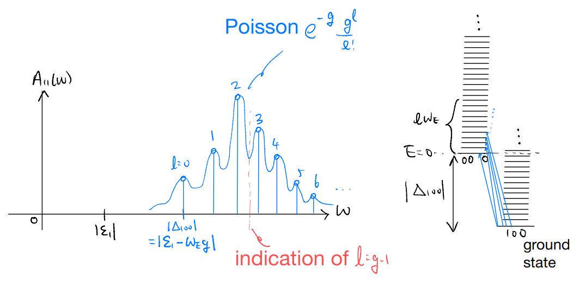

# lec07

20220225

Topics

1. Impurity spectral function: Einstein model and numerical experiment

Goals

1. First example of a physically interesting spectral function
2. Appreciating how to "extract" physical info from spectral function

Consider the state with one electron removed:

$$ \hat{c}_1|\Omega \rangle =|\left\{ 0,0,0 \right\} \rangle \otimes \prod_q{\hat{D}_{q}^{\dagger}\left( \frac{M_{1q}}{\omega _q} \right) |\left\{ 0_q \right\} \rangle _0}$$

This is **not** an eigenstate of $\hat{H}$! The eigenstates should have been

$$ |\left\{ 0,0,0 \right\} \rangle \otimes |\left\{ m_q \right\} \rangle $$

Non-eigenstates means states with dynamics. So now we consider

$$
\begin{align*}
    G_{11}\left( t \right) &=\left( -i \right) \langle \Omega |\hat{c}_{1}^{\dagger}\left( t \right) \hat{c}_1\left( 0 \right) |\Omega \rangle \\
    &=\left( -i \right) \langle \Omega |e^{i\hat{H}t}\hat{c}_{1}^{\dagger}e^{-i\hat{H}t}\hat{c}_1|\Omega \rangle \\
    &=\left( -i \right) e^{i\Delta _{100}t}\langle \Omega |\hat{c}_{1}^{\dagger}e^{-i\hat{H}t}\hat{c}_1|\Omega \rangle \\
    &=\left( -i \right) e^{i\Delta _{100}t}\left[ \langle 0_q|_0\prod_q{\hat{D}_q\left( \frac{M_{1q}}{\omega _q} \right)} \right] \otimes \langle \left\{ 100 \right\} |\hat{c}_{1}^{\dagger}e^{-i\hat{H}t}\hat{c}_1\\
    &\qquad|\left\{ 100 \right\} \rangle \otimes \prod_q{\hat{D}_{q}^{\dagger}\left( \frac{M_{1q}}{\omega _q} \right)}|\left\{ 0_q \right\} \rangle _0\\
    &=\left( -i \right) e^{i\Delta _{100}t}\left[ \langle 0_q|_0\prod_q{\hat{D}_q\left( \frac{M_{1q}}{\omega _q} \right)} \right] \exp \left\{ -i\left. \hat{H} \right|_{\left\{ 000 \right\}}t \right\}\prod_q{\hat{D}_{q}^{\dagger}\left( \frac{M_{1q}}{\omega _q} \right)}|\left\{ 0_q \right\} \rangle _0\\
\end{align*}
$$

But

$$ \left. \hat{H} \right|_{\left\{ 000 \right\}}==\sum_q{\omega _q\hat{a}_{q}^{\dagger}\hat{a}_q}+\Delta _{000}$$

$$ \Delta _{000}=0$$

We have

$$ G_{11}\left( t \right) =\left( -i \right) e^{i\Delta _{100}t}\prod_q{\left( \langle -\frac{M_{1q}}{\omega _q}|e^{-i\omega _q\hat{a}_{q}^{\dagger}\hat{a}_qt}|\frac{M_{1q}}{\omega _q}\rangle _0 \right)}$$

where the state in the bra and ket is the coherent state. This is just the "propagator" in the coherent-state basis!

$$
\begin{align*}
    G_{11}\left( t \right) &=\left( -i \right) e^{i\Delta _{100}t}\prod_q{\left( \langle -\frac{M_{1q}}{\omega _q}|\frac{M_{1q}}{\omega _q}e^{-i\omega _qt}\rangle _0 \right)}\\
    &=\left( -i \right) e^{i\Delta _{100}t}\prod_q{\exp \left( \frac{M_{1q}^{2}}{\omega _{q}^{2}}e^{-i\omega _qt} \right) \exp \left( -\frac{M_{1q}^{2}}{\omega _{q}^{2}} \right)}
\end{align*}
$$

Let's define $g_q=\left( \frac{M_{1q}}{\omega_q} \right) ^2$, then

$$ G_{11}\left( t \right) =\left( -i \right) e^{i\Delta _{100}t}\exp \left( \sum_q{g_q\left( e^{-i\omega _qt}-1 \right)} \right) $$

To make further progress, consider again the Einstein model with

$$ \omega _q=\omega _E,\quad \forall q$$

Let $g=\sum_q{g_q}$, then

$$ G_{11}\left( t \right) =\left( -i \right) e^{i\Delta _{100}t}\exp \left( ge^{-i\omega _Et}-g \right) $$

We can now consider the Fourier transform

$$
\begin{align*}
    G_{11}\left( \omega \right) &=\left( -i \right) e^{-g}\lim_{\eta \rightarrow 0^+} \int_0^{\infty}{dte^{i\Delta _{100}t}e^{i\omega t}e^{-\eta t}\exp \left( ge^{-i\omega _Et} \right)}\\
    &=\left( -i \right) e^{-g}\sum_{l=0}^{\infty}{\lim_{\eta \rightarrow 0^+} \int_0^{\infty}{dt\frac{g^l}{l!}e^{i\left( \omega +\Delta _{100}-l\omega _E+i\eta \right) t}}}\\
    &=e^{-g}\sum_{l=0}^{\infty}{\lim_{\eta \rightarrow 0^+} \frac{g^l}{l!}\frac{1}{\omega +\Delta _{100}-l\omega _E+i\eta}}\\
\end{align*}
$$

and same as before we find the spectral function

$$
\begin{align*}
    A_{11}\left( \omega \right) &=\frac{-1}{\pi}\mathrm{Im}G_{11}\left( \omega \right) \\
    &=\sum_{l=0}^{\infty}{e^{-g}\frac{g^l}{l!}\delta \left( \omega -\left( -\Delta _{100}+l\omega _E \right) \right)}
\end{align*}
$$

$$ \Delta _{100}=\varepsilon _1-\sum_q{\frac{M_{1q}^{2}}{\omega _q}}=\varepsilon _1-\omega _Eg<0$$

The spectral function is the sum of delta functions. For which $l$ do we get the highest weight?

$$ \frac{g^{l+1}}{\left( l+1 \right) !}=\left( \frac{g}{l+1} \right) \left( \frac{g^l}{l!} \right) $$

increasing for $l<g-1$, decreasing for $l>g-1$

Interpretation: when we try to remove an electron, we discover that in the ground state the "electron" is actually dressed by the phonons. With strong coupling ($g\gg 1$), the dominant spectral peak is far from the bare electronic orbital contribution of $|\Delta_{100}|$.

Notes:

1. The Einstein model is simple by design, and enables very explicit computation of the frequency-space Green's function (and hence spectral function). Our real-time solution, however, holds for more general phonon dispersion. When we deviate from the Einstein model we should start seeing deviation from the "sum of delta function" form of the spectral function
2. More interestingly, one should ask what happens for acoustic phonons which have $\omega_q\to 0$ as $q\to 0$. Recall the strength of the $e-ph$ coupling was parameterized by $g_q=\left(\frac{M_{iq}}{\omega_q}\right)^2$. If $M_{iq}$ stays finite and $\omega_q\to 0$, we have diverging coupling and hence energies etc.!

This is a rather general feature: low-energy modes are "dangerous" because they are easy to excite. In finding the ground state, one should, generally speaking, check how the "fluctuations" (lowest excitations) could destabilize the ground state. This amounts to a kind of self-consistency check. If the assumed ground state implies strong fluctuations which kills itself, the ground state does not actually "form". This is the key physical picture behind the Merlin-Wagner theorem on the absence of spontaneous continuous symmetry breaking in low dimensions.

Now, back to our impurity-phonon problem: physically, the acoustic phonons have vanishing frequency in the long-wavelength limit because they are Goldstone modes. The Goldstones exist because of symmetries, and are correspondingly constrained by symmetries. In our context, the catastrophe is avoided by having a "derivative coupling", such that the $e-ph$ coupling has a momentum dependence of $M_{iq}\propto q$ as $q\to 0$. This gives a finite coupling strength as both $M_{iq}$ and $\omega_q$ vanish linearly in $q$.

Note: play with the uploaded Python code if you want to explore what happens beyond the Einstein model.
