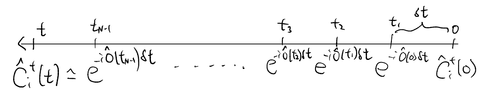
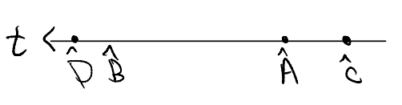

# lec08

:::{note}
This is **NOT** the official course PHYS5340 website yet!

* If you are student in this course, **always** take the lecture notes as the correct one if you find any differences between lecture notes and website contents
* If you are just passerby, use the materials below at your own risk. Since the website is still the first version (even alpha version), there could be some typos, incorrect/inaccurate/improper statements.
:::

:::{note}
**All** materials in this website are based on the course offered at HKUST
:::

:::{note}
As a "casual course", we provide only general references but not specific ones to the materials introduced
:::

:::{note}
**All** materials' copyright in this website are reserved for the course lecturer

* If you want to use the material somewhere, you might need to contact the lecturer first
:::

:::{note}
Contribution is always **welcome**. if you find any typo, incorrect/inaccurate/improper statements or necessary references, do not hesitate to

* raise an issue on github repo
* make an pull request on github repo
* contact me directly
:::

20220302

Topics

1. Impurity spectral function: solving again with Heisenberg
2. Dyson series, time ordering, and time-ordered exponential

Goals

1. Learning how to deal with time-dependent perturbations

## Solving again: Heisenberg picture

Our solution for the impurity (one-electron) spectral function was satisfactory (I think), in the sense that we have found a concrete expression which does encode a lot of interesting physics (e.g., enable numerical simulation, and analytical solution with the simplified Einstein phonons). Yet, it is also clear that our calculation approach worked because we have an exactly solved model. This is a luxury to have, and oftentimes people take "exactly solubility" to equate to "boring". (Of course, this is subjected to personal taste)

The bottom line is, our problem was exactly solvable because it ultimately decouples into independent QHO (shifted phonon Hamiltonian) and fermions (individually conserved particle number). We only have a minimal degree of interactions in our model, namely, the phonon-mediated density-density interactions between the electrons.

Our course is called "Quantum many-body theory", and apparently I cannot avoid introducing techniques for solving more general interacting many-body problems! This motivates to go through a more complicated approach of solving the same problem again, through the Heisenberg picture.

Recall in the Heisenberg picture the states are stationary, and the operators evolve according to

$$ \hat{O}_H\left( t \right) =e^{i\hat{H}t}\hat{O}_Se^{-i\hat{H}t}$$

their time evolution is governed by the equation of motion

$$ i\partial _t\hat{O}_H\left( t \right) =\left[ \hat{O}_H\left( t \right) ,\hat{H} \right] _H$$

everything below will be in the Heisenberg picture, and we drop the subscript. Here we want to compute the real-time Green's function

$$G_{ii}\left( t \right) =\langle \Omega |\hat{c}_{i}^{\dagger}\left( t \right) \hat{c}_i\left( 0 \right) |\Omega \rangle $$

and so we would want to compute the time evolution of $\hat{c}_i^\dagger(t)$ under the Hamiltonian

$$ \hat{H}=\sum_{i=1}^N{\varepsilon _i\hat{n}_i}+\sum_q{\omega _q\hat{a}_{q}^{\dagger}\hat{a}_q}+\sum_{i,q}{\hat{n}_iM_{iq}\left( \hat{a}_q+\hat{a}_{q}^{\dagger} \right)}$$

So we first find the equation of motion for $\hat{c}_i(t)$. Notice

$$
\begin{align*}
    \left[ \hat{c}_{i}^{\dagger}\left( t \right) ,\hat{n}_j\left( t \right) \right] &=\left[ \hat{c}_{i}^{\dagger}\left( t \right) ,\hat{c}_{j}^{\dagger}\left( t \right) \hat{c}_j\left( t \right) \right] \\
    &=\delta _{ij}\left( \hat{c}_{i}^{\dagger}\left( t \right) \left[ \hat{c}_{i}^{\dagger}\left( t \right) ,\hat{c}_i\left( t \right) \right] \right) \\
    &=\delta _{ij}\hat{c}_{i}^{\dagger}\left( t \right) \left( 2\hat{c}_{i}^{\dagger}\left( t \right) \hat{c}_i\left( t \right) -1 \right) \\
    &=-\delta _{ij}\hat{c}_{i}^{\dagger}\left( t \right)
\end{align*}
$$

we then have

$$
\begin{align*}
    i\partial _t\hat{c}_{i}^{\dagger}\left( t \right) &=\left[ \hat{c}_{i}^{\dagger}\left( t \right) ,\hat{H} \right] \\
    &=\sum_j{\left[ \hat{c}_{i}^{\dagger}\left( t \right) ,\varepsilon _j\hat{n}_j\left( t \right) +\hat{n}_j\left( t \right) \sum_q{M_{jq}\left( \hat{a}_q\left( t \right) +\hat{a}_{q}^{\dagger}\left( t \right) \right)} \right]}\\
    &=-\left( \varepsilon _i+\sum_q{M_{iq}\left( \hat{a}_q\left( t \right) +\hat{a}_{q}^{\dagger}\left( t \right) \right)} \right) \hat{c}_{i}^{\dagger}\left( t \right) \\
    &=\hat{O}\left( t \right) \hat{c}_{i}^{\dagger}\left( t \right)
\end{align*}
$$

$$ \hat{O}\left( t \right) =-\varepsilon _i-\sum_q{M_{iq}\left( \hat{a}_q\left( t \right) +\hat{a}_{q}^{\dagger}\left( t \right) \right)}$$

compared to our earlier "single-site" electronic model (c.f. Lecture-4), the difference is that the orbital energy $\varepsilon_i$ is now promoted to a time-dependent operator. The "operators" act on the phonon Fock space, and reflects the electron-phonon coupling. The time-dependence comes from the time evolution of the phonon operators, which reflects their dynamics.

This, therefore, implies that we have to also solve for the time-evolution of the phonon operators, Again, we first notice

$$ \left[ \hat{a}_q\left( t \right) ,\hat{a}_{q'}^{\dagger}\left( t \right) \right] =\delta _{qq'}$$

$$ \Rightarrow \quad \left[ \hat{a}_q\left( t \right) ,\hat{a}_{q'}^{\dagger}\left( t \right) \hat{a}_{q'}\left( t \right) \right] =\delta _{qq'}\hat{a}_q\left( t \right) $$

and so the equation of motion is

$$
\begin{align*}
    i\partial _t\hat{a}_q\left( t \right) &=\left[ \hat{a}_q\left( t \right) ,\sum_{q'}{\left( \omega _{q'}\hat{a}_{q'}^{\dagger}\hat{a}_{q'}+\sum_i{\hat{n}_iM_{iq'}\left( \hat{a}_{q'}+\hat{a}_{q'}^{\dagger} \right)} \right)} \right] \\
    &=\omega _q\hat{a}_q\left( t \right) +\sum_i{\hat{n}_iM_{iq}}
\end{align*}
$$

the $e-ph$ coupling again leads to a new piece, which requires us to consider

$$ i\partial _t\hat{n}_i\left( t \right) =\left[ \hat{n}_i\left( t \right) ,\hat{H} \right] =0$$

which means $\hat{n}_i(t)$ is an "integral of motion" and stays constant $\hat{n}_i(t)=\hat{n}_i$.

Note: We have basically set up a hierarchy of equation of motions (EOM): when we try to solve for the evolution of an operator, we see that its EOM contains some other operators, and we have to proceed with finding the EOM of these other operators etc. Such hierarchy is not closed in general, which makes it impossible to write down a closed set of equations (and let alone finding the exact solution). From this lens, our model is exactly solved in that the hierarchy terminates, and we only need to consider the coupled equations for $\hat{c}_i^\dagger (t)$ and $\hat{a}_q(t)$. We may first solve

$$ i\partial _t\hat{a}_q\left( t \right) =\omega _q\hat{a}_q\left( t \right) +\sum_i{\hat{n}_iM_{iq}}$$

Let

$$ \hat{a}_q\left( t \right) =\hat{A}+\hat{B}e^{-i\omega_qt}$$

$$ i\partial _t\hat{a}_q\left( t \right) =\omega _q\hat{B}e^{-i\omega t}=\omega _q\left( \hat{a}_q\left( t \right) -\hat{A} \right) $$

comparing the equations above,

$$ -\omega _q\hat{A}=\sum_i{\hat{n}_iM_{iq}}$$

$$ \Rightarrow\quad \hat{a}_q\left( t \right) =-\sum_i{\hat{n}_i\frac{M_{iq}}{\omega _q}}+\hat{B}e^{-i\omega _qt}$$

$$ \hat{a}_q\left( 0 \right) =-\sum_i{\hat{n}_i\frac{M_{iq}}{\omega _q}}+\hat{B}$$

$$ \Rightarrow \quad \hat{B}=\hat{a}_q\left( 0 \right) +\sum_i{\hat{n}_i\frac{M_{iq}}{\omega _q}}$$

$$ \Rightarrow \quad \hat{a}_q\left( t \right) +\sum_i{\hat{n}_i\frac{M_{iq}}{\omega _q}}=\left( \hat{a}_q\left( 0 \right) +\sum_i{\hat{n}_i\frac{M_{iq}}{\omega _q}} \right) e^{-i\omega _qt}$$

Looks familiar? This simply reflects our earlier observation that, the "eigen" phonon operators in the $\{n_i\}$ sector is related to the bare one (i.e., in the absence of $e-ph$ coupling) by a shift using the displacement operator.

To simplify notation, let us define

$$ \hat{a}_{q}^{\left\{ n_i \right\}}\left( t \right) =\hat{a}_q\left( t \right) +\sum_i{\hat{n}_i\frac{M_{iq}}{\omega _q}}$$

Then we simply have

$$ \hat{a}_{q}^{\left\{ n_i \right\}}\left( t \right) =\hat{a}_{q}^{\left\{ n_i \right\}}\left( 0 \right) e^{-i\omega _qt}$$

With this preparation we can go back to study the time-evolution of  the fermion operator

$$ i\partial _t\hat{c}_{i}^{\dagger}\left( t \right) =\hat{O}\left( t \right) \hat{c}_{i}^{\dagger}\left( t \right) $$

$$
\begin{align*}
    \hat{O}\left( t \right) &=-\varepsilon _i-\sum_q{M_{iq}\left( \hat{a}_q\left( t \right) +\hat{a}_{q}^{\dagger}\left( t \right) \right)}\\
    &=-\varepsilon _i-\sum_q{M_{iq}\left( \hat{a}_{q}^{\left\{ n_i \right\}}\left( t \right) +\hat{a}_{q}^{\left\{ n_i \right\} \dagger}\left( t \right) -2\sum_j{\hat{n}_j\frac{M_{jq}}{\omega _q}} \right)}
\end{align*}
$$

How do we solve this? Recall, if we have a simple function

$$ i\partial _tf\left( t \right) =g\left( t \right) f\left( t \right) $$

$$ \Rightarrow \,\,f\left( t \right) =f\left( 0 \right) \exp \left( -i\int_0^t{g\left( t' \right) dt'} \right) $$

$$
\begin{align*}
    i\partial _tf\left( t \right) &=f\left( 0 \right) \left( i\partial _t\exp \left( -i\int_0^t{g\left( t' \right) dt'} \right) \right) \\
    &=f\left( 0 \right) \left( \partial _t\int_0^t{g\left( t' \right) dt'} \right) \exp \left( -i\int_0^t{g\left( t' \right) dt'} \right) \\
    &=g\left( t \right) f\left( t \right)
\end{align*}
$$

It is then tempting to declare our formal solution is simply

$$ \hat{c}_{i}^{\dagger}\left( t \right) \stackrel{?}{=}\exp \left( -i\int_0^t{\hat{O}\left( t' \right) dt'} \right) \hat{c}_{i}^{\dagger}\left( 0 \right) $$

But we should Remember the meaning of the exponential here is that it is a formal power series!

$$
\begin{align*}
    \hat{c}_{i}^{\dagger}&\stackrel{?}{=}\sum_{n=0}^{\infty}{\frac{\left( -i \right) ^n}{n!}\left[ \int_0^t{dt'\hat{O}\left( t' \right)} \right] ^n}\hat{c}_{i}^{\dagger}\left( 0 \right)\\
    &=\left( 1-i\int_0^t{dt_1\hat{O}\left( t_1 \right)}+\frac{\left( -i \right) ^2}{2}\int_0^t{dt_1\int_0^t{dt_2\hat{O}\left( t_1 \right) \hat{O}\left( t_2 \right)}}+\cdots \right) \hat{c}_{i}^{\dagger}\left( 0 \right)
\end{align*}
$$

$$i\partial _t\hat{c}_{i}^{\dagger}\left( t \right) \stackrel{?}{=}\left\{ \hat{O}\left( t \right) -\frac{i}{2}\left[ \hat{O}\left( t \right) \left( \int_0^t{dt_2\hat{O}\left( t_2 \right)} \right) +\left( \int_0^t{dt_1\hat{O}\left( t_1 \right)} \right) \hat{O}\left( t \right) \right] +\cdots \right\} \hat{c}_{i}^{\dagger}\left( 0 \right) $$

versus

$$ \hat{O}\left( t \right) \hat{c}_{i}^{\dagger}\left( t \right) =\hat{O}\left( t \right) \left( 1-i\int_0^t{dt_1\hat{O}\left( t_1 \right)}+\cdots \right) \hat{c}_{i}^{\dagger}\left( 0 \right) $$

the two expression agree to this order only if

$$ \frac{1}{2}\left[ \hat{O}\left( t \right) \left( \int_0^t{dt_2\hat{O}\left( t_2 \right)} \right) +\left( \int_0^t{dt_1\hat{O}\left( t_1 \right)} \right) \hat{O}\left( t \right) \right] =\hat{O}\left( t \right) \int_0^t{dt_1\hat{O}\left( t_1 \right)}$$

$$ \Rightarrow \quad \left[ \int_0^t{dt_1\hat{O}\left( t_1 \right)},\hat{O}\left( t \right) \right] =0$$

But the "same" operator at different times may not commute with "itself"! E.g., consider a single QHO, let

$$ \hat{O}\left( t \right) =\hat{a}\left( t \right) +\hat{a}^{\dagger}\left( t \right) =\hat{a}\left( 0 \right) e^{-i\omega t}+\hat{a}^{\dagger}\left( 0 \right) e^{i\omega t}$$

$$
\begin{align*}
    \left[ \hat{O}\left( t_1 \right) ,\hat{O}\left( t_2 \right) \right] &=\left[ \hat{a}\left( 0 \right) e^{-i\omega t_1}+\hat{a}^{\dagger}\left( 0 \right) e^{i\omega t_1},\hat{a}\left( 0 \right) e^{-i\omega t_2}+\hat{a}^{\dagger}\left( 0 \right) e^{i\omega t_2} \right] \\
    &=\left[ \hat{a}^{\dagger}\left( 0 \right) ,\hat{a}\left( 0 \right) \right] e^{i\omega \left( t_1-t_2 \right)}+\left[ \hat{a}\left( 0 \right) ,\hat{a}^{\dagger}\left( 0 \right) \right] e^{-i\omega \left( t_1-t_2 \right)}\\
    &=-2i\sin \omega \left( t_1-t_2 \right)
\end{align*}
$$

In other words, the "solution" we proposed is problematic when such non-commutation arises. To solve the problem, we have two (equivalent) pictures:

(1) Discretize then limit

Consider a small time interval $\delta_t$. To leading order in $\delta_t$, we may pretend $\hat{O}(t)\approx \hat{O}(t+\delta_t)$ is constant. Then we have

$$ \hat{c}_{i}^{\dagger}\left( t+\delta _t \right) \approx e^{-i\hat{O}\delta _t}\hat{c}_{i}^{\dagger}\left( t \right) $$

Doing this successively, we can approximate a long-time evolution

and we claim this becomes exact in the limit

$$ \hat{c}_{i}^{\dagger}\left( t \right) =\lim_{N\rightarrow \infty} e^{-i\hat{O}\left( t_{N-1} \right) t/N}\cdots e^{-i\hat{O}\left( t_n \right) t/N}\cdots e^{-i\hat{O}\left( t_1 \right) t/N}e^{-i\hat{O}\left( 0 \right) t/N}\hat{c}_{i}^{\dagger}\left( 0 \right) $$

$$ t_n=\frac{nt}{N}$$

Remarks:

1. This is quite intuitive, but at the same time we did not justify its validity (e.g., error estimate, convergence of limit etc.). We will not worry about these problems, and just declare it's okay.
2. How might one even try to evaluate this? In the case when the operators are more general (complicated), it may not be feasible to work out everything explicitly and exactly using only the abstract operator algebra.

One natural way forward is to go back to some explicit "basis", e.g., in a coordinate-space basis we may replace $\hat{x}\to x$. Yet, in the same basis momentum $\hat{p}\to -i\partial_x$ is still an operator. Rather, it becomes a number only if we go to a momentum basis. Such dichotomy of "what is easy" is the defining feature (trouble) of quantum mechanics.

But we are considering small time intervals! Their failure to commute enters in $O(\delta_t^2)$. In other words, we can insert resolutions of identity for both $x$ and $p$ at each time-slice, and then treat them as commuting variables (since they are now only real numbers) in the limit $\delta_t\to 0$! This is the path integral picture.

(2) Fix the ordering up

Alternatively, we can also try to "repair" our good old solution

$$ \hat{c}_{i}^{\dagger}\left( t \right) \sim \exp \left( -i\int_0^t{dt'\hat{O}\left( t' \right)} \right) \hat{c}_{i}^{\dagger}\left( 0 \right) $$

after all, we know it is perfectly fine when $\hat{O}(t)$ at different times commute. (In particular, when it is time-independent.)

To this end, we first notice if we write

$$ \hat{c}_{i}^{\dagger}\left( t \right) =\hat{U}\left( t \right) \hat{c}_{i}^{\dagger}\left( 0 \right) $$

with the "initial condition" $\hat{U}\left( 0 \right) =1$, and demand it to be a solution to

$$ i\partial _t\hat{c}_{i}^{\dagger}\left( t \right) =\hat{O}\left( t \right) \hat{c}_{i}^{\dagger}\left( t \right) $$

$$ \Rightarrow \quad \left( i\partial _t\hat{U}\left( t \right) \right) \hat{c}_{i}^{\dagger}\left( 0 \right) =\hat{O}\left( t \right) \hat{U}\left( t \right) \hat{c}_{i}^{\dagger}\left( 0 \right) $$

$$ \Rightarrow \quad i\partial _t\hat{U}\left( t \right) =\hat{O}\left( t \right) \hat{U}\left( t \right) $$

We can as well go from the "differential" equation to an "integral" equation

$$ \hat{U}\left( t \right) =\hat{U}\left( 0 \right) -i\int_0^t{dt_1\hat{O}\left( t_1 \right) \hat{U}\left( t_1 \right)}$$

This isn't quite "solving" $\hat{U}(t)$ yet, as it still appears on both left- and right-hand sides. But we may now iterate

$$
\begin{align*}
    \hat{U}\left( t \right) &=1-i\int_0^t{dt_1\hat{O}\left( t_1 \right) \hat{U}\left( t_1 \right)}\\
    &=1-i\int_0^t{dt_1\hat{O}\left( t_1 \right) \left[ 1-i\int_0^{t_1}{dt_2\hat{O}\left( t_2 \right) \hat{U}\left( t_2 \right)} \right]}\\
    &=1-i\int_0^t{dt_1\hat{O}\left( t_1 \right)}+\left( -i \right) ^2\int_0^t{dt_1\int_0^{t_1}{dt_2\hat{O}\left( t_1 \right) \hat{O}\left( t_2 \right) \hat{U}\left( t_2 \right)}}\\
    &=1-i\int_0^t{dt_1\hat{O}\left( t_1 \right)}+\left( -i \right) ^2\int_0^t{dt_1\int_0^{t_1}{dt_2\hat{O}\left( t_1 \right) \hat{O}\left( t_2 \right)}}\\
    &\qquad+\left( -i \right) ^3\int_0^t{dt_1\int_0^{t_1}{dt_2\int_0^{t_2}{dt_3\hat{O}\left( t_1 \right) \hat{O}\left( t_2 \right) \hat{O}\left( t_3 \right) \hat{U}\left( t_3 \right)}}}\\
    &\vdots
\end{align*}
$$

we thus also get a formal power series solution to $\hat{U}(t)$, with the general form of the $n$-th term given by

$$ \hat{U}\left( t \right) =\sum_{n=0}^{\infty}{\left( -1 \right) ^n\int_0^t{dt_1\int_0^{t_1}{dt_2}\cdots \int_0^{t_{n-1}}{dt_n\hat{O}\left( t_1 \right) \hat{O}\left( t_2 \right) \cdots \hat{O}\left( t_n \right)}}}$$

This is called the "Dyson series". We see that it is quite "close" to the expansion of the exponential. But with two important differences:

1. we are missing a factor of $n!$ in the factorial.
2. the multiple time variables are ordered since each is bounded by the preceding one under the integral:

   $$ t_n<t_{n-1}<\cdots <t_2<t_1<t$$

   such ordering is the key to repairing our "exponential solution" with regards to the non-commuting nature $\left[ \hat{O}\left( t \right) ,\hat{O}\left( t' \right) \right] \ne 0$.

Observation (1) invites us to "over count" the terms by treating the different $\hat{O}(t_n)$ more equally, and in doing so we have to replace

$$ \int_0^{t_{n-1}}{dt_n}\mapsto \int_0^t{dt_n}$$

At the same time, observation (2) instructs us to be disciplined when we perform such over-counting, since otherwise we screw up with the ordering of the operators demanded by the non-commuting nature of $\hat{O}(t)$ at different times. Combined, we claim

$$
\begin{align*}
    \hat{U}\left( t \right) &=\sum_{n=0}^{\infty}{\frac{\left( -1 \right) ^n}{n!}\mathcal{T} \left[ \int_0^t{dt_1\int_0^t{dt_2}\cdots \int_0^t{dt_n\hat{O}\left( t_1 \right) \hat{O}\left( t_2 \right) \cdots \hat{O}\left( t_n \right)}} \right]}\\
    &=\mathcal{T} \left[ \exp \left\{ -i\int_0^t{dt'\hat{O}\left( t' \right)} \right\} \right]
\end{align*}
$$

called the "time-ordered exponential". Here $\mathcal{T}$ is the "time-ordering" operator

$$ \mathcal{T} \left[ \hat{A}\hat{B}\hat{C}\hat{D} \right] =\hat{D}\hat{B}\hat{A}\hat{C}$$

for

