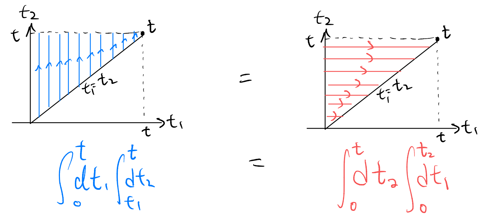
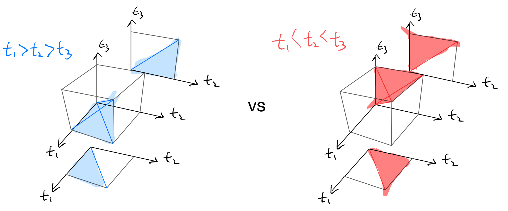

# lec09

20220302

Topics

1. Impurity spectral function from the Heisenberg picture: Dyson series and time-ordered exponential
2. "Sub-problem" driven QHO
3. introduction to Normal order and Wick's theorem

Goals

1. Getting familiar with time-ordering
2. Starting to appreciate how to evaluate time-ordered exponential
3. A primer to many-body perturbation theory

Last lecture, we spend most of our time on the following equation of motion

$$ i\partial _t\hat{c}_{i}^{\dagger}\left( t \right) =\hat{O}\left( t \right) \hat{c}_{i}^{\dagger}\left( t \right) $$

and we arrived at the formal solution

$$ \hat{c}_{i}^{\dagger}\left( t \right) =\hat{U}\left( t \right) \hat{c}_{i}^{\dagger}\left( 0 \right) $$

$$
\begin{align*}
    \hat{U}\left( t \right) &=\mathcal{T} \left[ \exp \left( -i\int_0^t{dt'\hat{O}\left( t' \right)} \right) \right] \\
    &=\sum_{n=0}{\frac{\left( -i \right) ^n}{n!}\mathcal{T} \left[ \int_0^t{dt_1\int_0^t{dt_2\cdots \int_0^t{dt_n\hat{O}\left( t_1 \right) \hat{O}\left( t_2 \right) \cdots \hat{O}\left( t_n \right)}}} \right]}
\end{align*}
$$

we claimed this is simply the consequence of a "disciplined over-counting" of the Dyson series

$$ \hat{U}\left( t \right) =\sum_{n=0}{\left( -i \right) ^n\int_0^t{dt_1\int_0^{t_1}{dt_2\cdots \int_0^{t_{n-1}}{dt_n\hat{O}\left( t_1 \right) \hat{O}\left( t_2 \right) \cdots \hat{O}\left( t_n \right)}}}}$$

To see why this "disciplined over-counting" makes sense, let us first consider the second-order term in the power series

$$
\begin{align*}
    &\frac{\left( -i \right) ^2}{2!}\mathcal{T} \left[ \int_0^t{dt_1\int_0^t{dt_2\hat{O}\left( t_1 \right) \hat{O}\left( t_2 \right)}} \right] \\
    =&\frac{\left( -i \right) ^2}{2!}\mathcal{T} \left[ \int_0^t{dt_1\int_0^{t_1}{dt_2\underset{t_1>t_2}{\underbrace{\hat{O}\left( t_1 \right) \hat{O}\left( t_2 \right) }}}}+\int_0^t{dt_1\int_{t_1}^t{dt_2\underset{t_2>t_1}{\underbrace{\hat{O}\left( t_1 \right) \hat{O}\left( t_2 \right) }}}} \right] \\
    =&\frac{\left( -i \right) ^2}{2!}\left\{ \int_0^t{dt_1\int_0^{t_1}{dt_2\hat{O}\left( t_1 \right) \hat{O}\left( t_2 \right)}}+\int_0^t{dt_1\int_{t_1}^t{dt_2\hat{O}\left( t_2 \right) \hat{O}\left( t_1 \right)}} \right\} \\
\end{align*}
$$

Graphically, the domain of integration for the second term is

$$ \int_0^t{dt_1\int_{t_1}^t{dt_2}}=\int_0^t{dt_2\int_0^{t_2}{dt_1}}$$

So we have

$$
\begin{align*}
    &\frac{\left( -i \right) ^2}{2!}\mathcal{T} \left[ \int_0^t{dt_1\int_0^t{dt_2\hat{O}\left( t_1 \right) \hat{O}\left( t_2 \right)}} \right] \\
    =&\frac{\left( -i \right) ^2}{2!}\left\{ \int_0^t{dt_1\int_0^{t_1}{dt_2\hat{O}\left( t_1 \right) \hat{O}\left( t_2 \right)}}+{\color{red} \int_0^t{dt_2\int_0^{t_2}{dt_1{\color{black}\hat{O}\left( t_2 \right) \hat{O}\left( t_1 \right)}}}} \right\} \\
    =&\frac{\left( -i \right) ^2}{2!}\left\{ \int_0^t{dt_1\int_0^{t_1}{dt_2\hat{O}\left( t_1 \right) \hat{O}\left( t_2 \right)}}+\underset{\mathrm{relabel}\; t_1\leftrightarrow t_2}{\underbrace{{\color{red} \int_0^t{dt_1\int_0^{t_2}{dt_2{\color{black}\hat{O}\left( t_1 \right) \hat{O}\left( t_2 \right)}}}}}} \right\} \\
    =&\left( -i \right) ^2\int_0^t{dt_1\int_0^{t_1}{dt_2\hat{O}\left( t_1 \right) \hat{O}\left( t_2 \right)}}
\end{align*}
$$

this justifies our over-counting claim (to the second order).

The argument generalizes to higher orders. For instance consider

all these regions give the same term upon time-ordering and relabeling. All we need to do is to determine how many such regions are there. One way to see it is that each of the $3!$ permutation of $t_1,t_2,t_3$ corresponds to one region. E.g.,

$$
\begin{align*}
    \left( t_1,t_2,t_3 \right) &\Rightarrow t_1<t_2<t_3\\
    \left( t_2,t_3,t_1 \right) &\Rightarrow t_2<t_3<t_1\\
    \left( t_1,t_3,t_2 \right) &\Rightarrow t_1<t_3<t_2\\
    \vdots &\Rightarrow \vdots
\end{align*}
$$

More explicitly, we can also evaluate the volume of one region

$$ \int_0^t{dt_1\int_0^{t_1}{dt_2\int_0^{t_2}{dt_2\left( 1 \right)}}}=\int_0^t{dt_1\int_0^{t_1}{dt_2\left( t_2 \right)}}=\int_0^t{dt_1\left( \frac{t_{1}^{2}}{2} \right)}=\frac{t^3}{3\cdot 2}$$

and so the number of regions is $t^3/\left( \frac{t^3}{3\cdot 2} \right) =3!$.

Either of these arguments generalizes to the $n$-th order term. This establishes the equivalence of the Dyson series expansion and the time-ordered exponential.

Okay, great! With such a complicated preparation we can finally return to re-calculating the impurity Green's function (?)

$$
\begin{align*}
    G_{11}\left( t \right) =&-i\langle \Omega |\hat{c}_{1}^{\dagger}\left( t \right) \hat{c}_1\left( 0 \right) |\Omega \rangle \\
    =&-i\langle \Omega |\underset{\mathrm{phonon}\;\mathrm{only}}{\underbrace{\mathcal{T} \left[ \exp \left( -i\int_0^t{dt'\hat{O}\left( t' \right)} \right) \right] }}\hat{c}_{1}^{\dagger}\left( 0 \right) \hat{c}_1\left( 0 \right) |\Omega \rangle \\
    &=\left( -i \right) _{100}\langle \left\{ 0_q \right\} |\mathcal{T} \left[ \exp \left( -i\int_0^t{dt'\hat{O}\left( t' \right)} \right) \right] |\left\{ 0_q \right\} \rangle _{100}
\end{align*}
$$

where

$$
\begin{align*}
    \hat{O}_{100}\left( t \right) =&-\varepsilon _1-\sum_q{M_{1q}\left( \hat{a}_{q}^{\left\{ 100 \right\}}\left( t \right) +\hat{a}_{q}^{\left\{ 100 \right\} \dagger}\left( t \right) -2\frac{M_{1q}}{\omega _q} \right)}\\
    =&-\varepsilon _1+2\sum_q{\frac{M_{1q}^2}{\omega _q}}-\sum_q{M_{1q}\left( \hat{a}_{q}^{\left\{ 100 \right\}}\left( t \right) +\hat{a}_{q}^{\left\{ 100 \right\} \dagger}\left( t \right) \right)}
\end{align*}
$$

and the phonon ground state in the $\{100\}$ sector is defined by (verify!)

$$ \hat{a}_{q}^{\left\{ 100 \right\}}\left( t \right) |\left\{ 0 \right\} _q\rangle _{100}=0,\quad \forall q$$

To proceed, we make two observations:

1. the constant piece in $\hat{O}(t)$ does not cause trouble, and we can just deal with it  directly to get a phase;
2. The different phonon modes labeled by $q$ do not interfere with each other, and so we can evaluate them "in parallel"

This gives

$$
\begin{align*}
    G_{11}\left( t \right) =&\left( -i \right) \exp \left[ -i\left( -\varepsilon _1+2\sum_q{\frac{M_{1q}^{2}}{\omega _q}} \right) \right] \\
    &\times \prod_q{_{100}\langle 0_q|\mathcal{T} \left[ \exp \left( iM_{1q}\int_0^t{dt'\left( \hat{a}_{q}^{\left\{ 100 \right\}}\left( t \right) +\hat{a}_{q}^{\left\{ 100 \right\} \dagger}\left( t \right) \right)} \right) \right] |0_q\rangle _{100}}
\end{align*}
$$

Neat, but how do we evaluate this???

## Sub-problem: single QHO

After massaging, we are down to evaluating the expression

$$\sim \langle 0|\mathcal{T} \left[ e^{-i\int_0^t{dt'\left( \zeta \left( t \right) \hat{a}^{\dagger}\left( t \right) +\bar{\zeta}\left( t \right) \hat{a}\left( t \right) \right)}} \right] |0\rangle $$

once for each mode labeled by $q$, with both the phonon operators and the ground state defined by the electronic configuration $\{100\}$. We have also generalized the constant $M_{iq}$ to a time-dependent function $\zeta(t)$. For simplicity, we consider here the equivalent problem of our good old single QHO. (Note: we mostly follow notations in Coleman Chapter-5 here)

how do we evaluate this? As we alluded to in the last lecture, we could employ path integral methods if we understand the time-ordered exponential as the time evolution of many small intervals; alternatively, we can try to evaluate it order-by-order if we take the Dyson-series like expansion.

Here, let us take the second route. (Check out Coleman 5.1.1 for an evaluation along the first route.)

Expanding up to first few terms,

$$
\begin{align*}
    &\langle 0|\mathcal{T} \left[ e^{-i\int_0^t{dt'\left( \zeta \left( t \right) \hat{a}^{\dagger}\left( t \right) +\bar{\zeta}\left( t \right) \hat{a}\left( t \right) \right)}} \right] |0\rangle \\
    =&\langle 0|0\rangle -i\langle 0|\int_0^t{dt'\left( \zeta \left( t \right) \hat{a}^{\dagger}\left( t \right) +\bar{\zeta}\left( t \right) \hat{a}\left( t \right) \right)}|0\rangle \\
    &\quad +\frac{\left( -i \right) ^2}{2}\langle 0|\mathcal{T} \left[ \left( \int_0^t{dt'\left( \zeta \left( t \right) \hat{a}^{\dagger}\left( t \right) +\bar{\zeta}\left( t \right) \hat{a}\left( t \right) \right)} \right) ^2 \right] |0\rangle +\cdots \\
\end{align*}
$$

where

$$ \langle 0|0\rangle =1$$

$$\langle 0|\hat{a}^{\dagger}\left( t \right) |0\rangle =\langle 0|\hat{a}\left( t \right) |0\rangle =0$$

$$ \Rightarrow \quad \langle 0|\int_0^t{dt'\left( \zeta \left( t \right) \hat{a}^{\dagger}\left( t \right) +\bar{\zeta}\left( t \right) \hat{a}\left( t \right) \right)}|0\rangle =0$$

and so our first nontrivial term to evaluate is

$$
\begin{align*}
    &\frac{\left( -i \right) ^2}{2}\langle 0|\mathcal{T} \left[ \left( \int_0^t{dt'\left( \zeta \left( t \right) \hat{a}^{\dagger}\left( t \right) +\bar{\zeta}\left( t \right) \hat{a}\left( t \right) \right)} \right) ^2 \right] |0\rangle \\
    =&\frac{\left( -i \right) ^2}{2}\langle 0|\mathcal{T} \Bigl[ \int_0^t{dt_1\int_0^t{dt_2}}\zeta \left( t_1 \right) \zeta \left( t_2 \right) \hat{a}^{\dagger}\left( t_1 \right) \hat{a}^{\dagger}\left( t_2 \right) +\zeta \left( t_1 \right) \bar{\zeta}\left( t_2 \right) \hat{a}^{\dagger}\left( t_1 \right) \hat{a}\left( t_2 \right) \\
    &\qquad \left. +\bar{\zeta}\left( t_1 \right) \zeta \left( t_2 \right) \hat{a}\left( t_1 \right) \hat{a}^{\dagger}\left( t_2 \right) +\bar{\zeta}\left( t_1 \right) \bar{\zeta}\left( t_2 \right) \hat{a}\left( t_1 \right) \hat{a}\left( t_2 \right) \right] |0\rangle
\end{align*}
$$

Noticing

$$\hat{a}\left( t \right) |0\rangle =0,\quad \langle 0|\hat{a}^{\dagger}\left( t \right) =0 $$

one may want to claim the only surviving term is

$$ \sim \langle 0|\mathcal{T} \left[ \int_0^t{dt_1\int_0^t{dt_2\bar{\zeta}\left( t_1 \right) \zeta \left( t_2 \right) \hat{a}\left( t_1 \right) \hat{a}^{\dagger}\left( t_2 \right)}} \right] |0\rangle $$

**But this is wrong!** Remember, the time-ordering operator upfront implies the actual order may not be what we have written down. Instead, let us impose the time-ordering explicitly the, we do have

$$
\begin{align*}
    &\frac{\left( -i \right) ^2}{2}\langle 0|\mathcal{T} \left[ \left( \int_0^t{dt'\left( \zeta \left( t \right) \hat{a}^{\dagger}\left( t \right) +\bar{\zeta}\left( t \right) \hat{a}\left( t \right) \right)} \right) ^2 \right] |0\rangle \\
    =&\left( -i \right) ^2\langle 0|\left[ \int_0^t{dt_1\int_0^{{\color[RGB]{240, 0, 0} t_1}}{dt_2\bar{\zeta}\left( t_1 \right) \zeta \left( t_2 \right) \hat{a}\left( t_1 \right) \hat{a}^{\dagger}\left( t_2 \right)}} \right] |0\rangle \\
    =&\left( -i \right) ^2\langle 0|\left[ \int_0^t{dt_1\int_0^{{\color[RGB]{240, 0, 0} t_1}}{dt_2\bar{\zeta}\left( t_1 \right) \zeta \left( t_2 \right) e^{-i\omega \left( t_1-t_2 \right)}}}\hat{a}\left( 0 \right) \hat{a}^{\dagger}\left( 0 \right) \right] |0\rangle \\
    =&\left( -i \right) ^2\int_0^t{dt_1\int_0^{{\color[RGB]{240, 0, 0} t_1}}{dt_2\bar{\zeta}\left( t_1 \right) \zeta \left( t_2 \right) e^{-i\omega \left( t_1-t_2 \right)}}}\langle 0|\left( \hat{a}^{\dagger}\left( 0 \right) \hat{a}\left( 0 \right) +1 \right) |0\rangle \\
    =&\left( -i \right) ^2\int_0^t{dt_1\int_0^{{\color[RGB]{240, 0, 0} t}}{dt_2{\color[RGB]{240, 0, 0} \Theta \left( t_1-t_2 \right) }e^{-i\omega \left( t_1-t_2 \right)}\bar{\zeta}\left( t_1 \right) \zeta \left( t_2 \right)}}
\end{align*}
$$

where we have used the Heaviside step-function to restore the full integration domain for $t_2$. Let us define

$$ \mathscr{G} \left( t-t' \right) =\left( -i \right) \Theta \left( t-t' \right) e^{-i\omega \left( t-t' \right)}$$

then we see that

$$ \langle 0|\mathcal{T} \left[ e^{-i\int_0^t{dt'\left( \zeta \left( t \right) \hat{a}^{\dagger}\left( t \right) +\bar{\zeta}\left( t \right) \hat{a}\left( t \right) \right)}} \right] |0\rangle =1-i\int_0^t{dt_1\int_0^t{dt_2\bar{\zeta}\left( t_1 \right) \mathscr{G} \left( t_1-t_2 \right) \zeta \left( t_2 \right)}}+\cdots $$

where the second term is "number", and no "ordering"! With a leap of faith, let us announce the answer

$$ \langle 0|\mathcal{T} \left[ e^{-i\int_0^t{dt'\left( \zeta \left( t \right) \hat{a}^{\dagger}\left( t \right) +\bar{\zeta}\left( t \right) \hat{a}\left( t \right) \right)}} \right] |0\rangle =e^{-i\int_0^t{dt_1\int_0^t{dt_2\bar{\zeta}\left( t_1 \right) \mathscr{G} \left( t_1-t_2 \right) \zeta \left( t_2 \right)}}}$$

this is kind of natural: starting with the QHO in the ground state, we perturb it by a time-dependent linear term. So if at time $t_2$ we create a quanta, let it time evolve for time $t_1-t_2$ and at time $t_1$ we annihilate it to go back to the ground state. We need to allow for all such processes happening at different times $t_1,t_2$. This "explains" the expression.

Of course, we haven't really proved the validity of our answer. More later.

## Back to the main thread

As an indirect check of the expression we claimed, let us use it for the impurity-phonon problem:

$$ \zeta \left( t \right) =\bar{\zeta}\left( t \right) =-M_{1q}$$

$$
\begin{align*}
    G_{11}\left( t \right) &=\left( -i \right) e^{-i\left( -\varepsilon _1+2\sum_q{\frac{M_{1q}^{2}}{\omega _q}} \right)}\prod_q{_{100}\langle 0_q|\mathcal{T} \left[ e^{iM_{1q}\int_0^t{dt'\left( \hat{a}_{q}^{\left\{ 100 \right\}}\left( t \right) +\hat{a}_{q}^{\left\{ 100 \right\} \dagger}\left( t \right) \right)}} \right] |0_q\rangle _{100}}\\
    &=\left( -i \right) e^{-i\left( -\varepsilon _1+2\sum_q{\frac{M_{1q}^{2}}{\omega _q}} \right)}\prod_q{e^{-iM_{1q}^{2}\int_0^t{dt_1\int_0^t{dt_2\mathscr{G} _q\left( t_1-t_2 \right)}}}}
\end{align*}
$$

Evaluating the double integral

$$
\begin{align*}
    \int_0^t{dt_1\int_0^t{dt_2\mathscr{G} _q\left( t_1-t_2 \right)}}&=-i\int_0^t{dt_1\int_0^t{dt_2\Theta \left( t_1-t_2 \right) e^{-i\omega _q\left( t_1-t_2 \right)}}}\\
    &=-i\int_0^t{dt_1\int_0^{t_1}{dt_2e^{-i\omega _q\left( t_1-t_2 \right)}}}\\
    &=-i\int_0^t{dt_1\frac{1-e^{-i\omega _qt_1}}{i\omega _q}}\\
    &=-\frac{t}{\omega _q}+\frac{e^{-i\omega _qt}-1}{-i\omega _{q}^{2}}
\end{align*}
$$

with this we conclude (recalling $g_q=\frac{M_{1q}^{2}}{\omega_{q}^{2}}$)

$$
\begin{align*}
    G_{11}\left( t \right) &=\left( -i \right) e^{-i\left( -\varepsilon _1+2\sum_q{\frac{M_{1q}^{2}}{\omega _q}} \right)}\prod_q{e^{i\frac{M_{1q}^{2}}{\omega _q}t}e^{\frac{M_{1q}^{2}}{\omega _{q}^{2}}\left( e^{-i\omega _qt}-1 \right)}}\\
    &=\left( -i \right) \underset{e^{i\Delta _{100}t}}{\underbrace{e^{-i\left( -\varepsilon _1+\sum_q{\frac{M_{1q}^{2}}{\omega _q}} \right) t}}}e^{\sum_q{g_q\left( e^{-i\omega _qt}-1 \right)}}
\end{align*}
$$

This checks out! Whether this Heisenberg picture is clearer than the exact solution or not is a matter of taste: they do have a slightly different flavor nevertheless. In the exact solution, we relied heavily on the properties of the displacement operator which we discussed way back. In contrast, in the Heisenberg picture discussion, we see that we are implicitly attacking a much more general problem, namely, how to evaluate the time-evolution operator of a more general time-dependent Hamiltonian.
