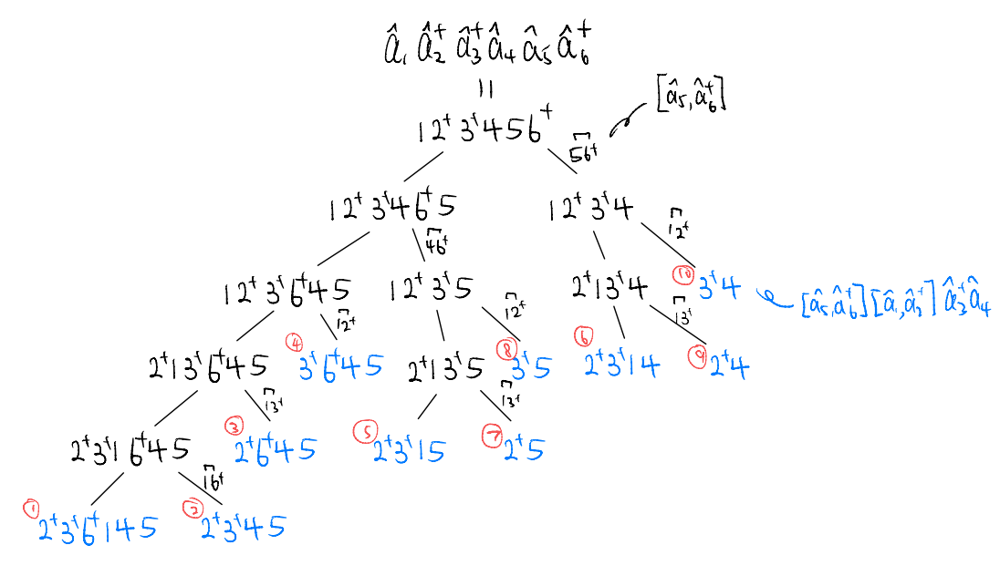
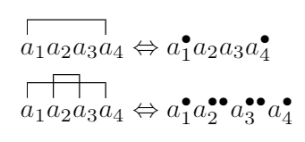

# lec10

:::{note}
This is **NOT** the official course PHYS5340 website yet!

* If you are student in this course, **always** take the lecture notes as the correct one if you find any differences between lecture notes and website contents
* If you are just passerby, use the materials below at your own risk. Since the website is still the first version (even alpha version), there could be some typos, incorrect/inaccurate/improper statements.
:::

:::{note}
**All** materials in this website are based on the course offered at HKUST
:::

:::{note}
As a "casual course", we provide only general references but not specific ones to the materials introduced
:::

:::{note}
**All** materials' copyright in this website are reserved for the course lecturer

* If you want to use the material somewhere, you might need to contact the lecturer first
:::

:::{note}
Contribution is always **welcome**. if you find any typo, incorrect/inaccurate/improper statements or necessary references, do not hesitate to

* raise an issue on github repo
* make an pull request on github repo
* contact me directly
:::

20220309

Topics

1. Normal order
2. (Static) Wick's theorem

Goals

1. Learning how to compute ground state expectation values
2. Appreciating the what it means to be "free", "Gaussian", "non-interacting"

Remark: we will spend this week on a fairly technical (general) discussion.

## Normal order

As discussed last time, we announced the answer

$$ \langle 0|\mathcal{T} \left[ e^{-i\int_0^t{dt'\left( \zeta \left( t' \right) \hat{a}^{\dagger}\left( t' \right) +\zeta ^*\left( t' \right) \hat{a}\left( t' \right) \right)}} \right] |0\rangle =e^{-i\int_0^t{dt_1\int_0^t{dt_2\zeta ^*\left( t_1 \right) \mathscr{G} \left( t_1-t_2 \right) \zeta \left( t_2 \right)}}}$$

$$ \mathscr{G} \left( t_1-t_2 \right) =\Theta \left( t_1-t_2 \right) e^{-i\omega \left( t_1-t_2 \right)}$$

simply by "checking" the lowest nontrivial term! It will make sense to demand that we do a more honest check by considering the general terms.

Let us expand the LHS

$$ \mathrm{LHS}=\sum_{n=0}{\frac{\left( -i \right) ^n}{n!}\langle 0|\mathcal{T} \left[ \left( \int_0^t{dt'\hat{\phi}\left( t' \right)} \right) ^n \right] |0\rangle}$$

$$ \hat{\phi}\left( t \right) =\zeta \left( t \right) \hat{a}^{\dagger}\left( t \right) +\zeta ^*\left( t \right) \hat{a}\left( t \right) $$

First, we notice that the only non-vanishing terms have to come with the same number of $\hat{a}\& \hat{a}^\dagger$: otherwise we leave the ground state and will have zero overlap. In particular, the odd-order terms vanish identically since there is no way to "balance" $\hat{a}\&\hat{a}^{\dagger}$ there. In other words,

$$ \mathrm{LHS}=\sum_{n=0}{\frac{\left( -i \right) ^{2n}}{\left( 2n \right) !}\langle 0|\mathcal{T} \left[ \left( \int_0^t{dt'\hat{\phi}\left( t' \right)} \right) ^{2n} \right] |0\rangle}$$

Let us inspect the second nontrivial term now:

$$
\begin{align*}
    &\frac{\left( -i \right) ^4}{4!}\langle 0|\mathcal{T} \left[ \int_0^t{dt_1\int_0^t{dt_2\int_0^t{dt_3\int_0^t{dt_4\hat{\phi}\left( t_1 \right) \hat{\phi}\left( t_2 \right) \hat{\phi}\left( t_3 \right) \hat{\phi}\left( t_4 \right)}}}} \right] |0\rangle \\
    =&\frac{\left( -i \right) ^4}{4!}\langle 0|\mathcal{T} \left[ \int_0^t{dt_1\int_0^t{dt_2\int_0^t{dt_3\int_0^t{dt_4\left( \zeta \left( t_1 \right) \zeta \left( t_2 \right) \zeta ^*\left( t_3 \right) \zeta ^*\left( t_4 \right) \hat{a}^{\dagger}\left( t_1 \right) \hat{a}^{\dagger}\left( t_2 \right) \hat{a}\left( t_3 \right) \hat{a}\left( t_4 \right) \right.}}}} \right. \\
    &\qquad \left. \left. +\zeta \left( t_1 \right) \zeta ^*\left( t_2 \right) \zeta ^*\left( t_3 \right) \zeta \left( t_4 \right) \hat{a}^{\dagger}\left( t_1 \right) \hat{a}\left( t_2 \right) \hat{a}\left( t_3 \right) \hat{a}^{\dagger}\left( t_4 \right) +\cdots \right) \right] |0\rangle
\end{align*}
$$

Ideally, we want to simplify our problem using

$$ \hat{a}\left( t \right) |0\rangle =0$$

$$ \langle 0|\hat{a}^{\dagger}\left( 0 \right) =0$$

but, as we mentioned earlier, the precise ordering of the operators is to be determined by the time-ordering, which is "changing" as we perform the integrals! It is then not so obvious which terms survive and which do not.

Nevertheless, it is indeed correct that we could greatly simplify the calculation if we can bring the $\hat{a}^\dagger$ to the left and $\hat{a}$ to the right. This is called the "normal order". The normal ordering of a time-ordered operator is the key to our evaluation, facilitated by what is usually called the Wick's theorem / lemma.

Note: "the" normal order is defined with respect to the ground state. When we say we bring, e.g., $\hat{a}^\dagger$ to the left and $\hat{a}$ to the right, it is implicitly assumed that our goal is to evaluate some expectation values with respect to the vacuum. Generally speaking, a different ground state calls for a different "normal" order.

## Wick's theorem

Imagine taking the product of a string of creation and annihilation operators, e.g.,

$$ \hat{a}_1\hat{a}_{2}^{\dagger}\hat{a}_{3}^{\dagger}\hat{a}_4\hat{a}_5\hat{a}_{6}^{\dagger}$$

here, the subscripts are quite general, in that they may not only be referring to the "modes", but could also be, e.g., indicating the time as in $\hat{a}_{i}^{\dagger}=\hat{a}^{\dagger}\left( t_i \right)$. We have defined the normal order to be

$$ :\hat{a}_1\hat{a}_{2}^{\dagger}\hat{a}_{3}^{\dagger}\hat{a}_4\hat{a}_5\hat{a}_{6}^{\dagger}:=\hat{a}_{2}^{\dagger}\hat{a}_{3}^{\dagger}\hat{a}_{6}^{\dagger}\hat{a}_1\hat{a}_4\hat{a}_5\quad [\mathrm{bosonic]}$$

where the notation $:\;:$ denotes normal ordering. A natural question here is, how different is an operator $\hat{O}$ compared to its normal order $:\hat{O}:$? Relatedly, what is the ground state expectation value

$$ \langle 0|\hat{a}_1\hat{a}_{2}^{\dagger}\hat{a}_{3}^{\dagger}\hat{a}_4\hat{a}_5\hat{a}_{6}^{\dagger}|0\rangle $$

provided that it is not obviously $0$?

To develop some feeling for the problem, let's try to bring our example to the normal order

$$
\begin{align*}
    &\hat{a}_1\hat{a}_{2}^{\dagger}\hat{a}_{3}^{\dagger}\hat{a}_4{\color{red} \hat{a}_5\hat{a}_{6}^{\dagger}}\\
    =&\hat{a}_1\hat{a}_{2}^{\dagger}\hat{a}_{3}^{\dagger}\hat{a}_4\left( \hat{a}_{6}^{\dagger}\hat{a}_5+\underset{\mathrm{c}-\mathrm{number}}{\underbrace{\left[ \hat{a}_5,\hat{a}_{6}^{\dagger} \right] }} \right) \\
    =&\hat{a}_1\hat{a}_{2}^{\dagger}\hat{a}_{3}^{\dagger}{\color{red} \hat{a}_4\hat{a}_{6}^{\dagger}}\hat{a}_5+\left[ \hat{a}_5,\hat{a}_{6}^{\dagger} \right] {\color{red} \hat{a}_1\hat{a}_{2}^{\dagger}}\hat{a}_{3}^{\dagger}\hat{a}_4\\
    =&\cdots
\end{align*}
$$

where the operators to be exchanged are in red color.

Some observations:

1. whenever we move an $\hat{a}$ pass an $\hat{a}^\dagger$, we generate two terms. One now has the "right" order for the two operators involved, and the other leads to a commutator multiplied to a "shorter term" with fewer operators involved.
2. We can now imagine iterating the procedure. There will be a "long string" remaining which contains the same number of operators inside ($6$ in our example). But each of the "short strings" would also need to be brought to a normal order, and in doing so generate even shorter strings.
3. Importantly, the process terminates when everything is normal ordered!

Let's now proceed with our example in a visually more suggestive manner

we may rewrite this tree in a more conventional form

$$
\begin{align*}
    \hat{a}_1\hat{a}_{2}^{\dagger}\hat{a}_{3}^{\dagger}\hat{a}_4\hat{a}_5\hat{a}_{6}^{\dagger}&=^{{\color{red} (1)}}:\hat{a}_1\hat{a}_{2}^{\dagger}\hat{a}_{3}^{\dagger}\hat{a}_4\hat{a}_5\hat{a}_{6}^{\dagger}:\\
    &\quad+^{{\color{red} (2)}}:\hat{a}_{1}^{\bullet}\hat{a}_{2}^{\dagger}\hat{a}_{3}^{\dagger}\hat{a}_4\hat{a}_5\hat{a}_{6}^{\dagger \bullet}:+^{{\color{red} (3)}}:\hat{a}_{1}^{\bullet}\hat{a}_{2}^{\dagger}\hat{a}_{3}^{\dagger \bullet}\hat{a}_4\hat{a}_5\hat{a}_{6}^{\dagger}:\\
    &\quad+^{{\color{red} (4)}}:\hat{a}_{1}^{\bullet}\hat{a}_{2}^{\dagger \bullet}\hat{a}_{3}^{\dagger}\hat{a}_4\hat{a}_5\hat{a}_{6}^{\dagger}:+^{{\color{red} (5)}}:\hat{a}_1\hat{a}_{2}^{\dagger}\hat{a}_{3}^{\dagger}\hat{a}_{4}^{\bullet}\hat{a}_5\hat{a}_{6}^{\dagger \bullet}:\\
    &\quad+^{{\color{red} (6)}}:\hat{a}_1\hat{a}_{2}^{\dagger}\hat{a}_{3}^{\dagger}\hat{a}_4\hat{a}_{5}^{\bullet}\hat{a}_{6}^{\dagger \bullet}:\\
    &\quad+^{{\color{red} (7)}}:\hat{a}_{1}^{\bullet}\hat{a}_{2}^{\dagger}\hat{a}_{3}^{\dagger \bullet}\hat{a}_{4}^{\bullet \bullet}\hat{a}_5\hat{a}_{6}^{\dagger \bullet \bullet}:+^{{\color{red} (8)}}:\hat{a}_{1}^{\bullet}\hat{a}_{2}^{\dagger \bullet}\hat{a}_{3}^{\dagger}\hat{a}_{4}^{\bullet \bullet}\hat{a}_5\hat{a}_{6}^{\dagger \bullet \bullet}:\\
    &\quad+^{{\color{red} (9)}}:\hat{a}_{1}^{\bullet}\hat{a}_{2}^{\dagger}\hat{a}_{3}^{\dagger \bullet}\hat{a}_4\hat{a}_{b}^{\bullet \bullet}\hat{a}_{6}^{\dagger \bullet \bullet}:+^{{\color{red} (10)}}:\hat{a}_{1}^{\bullet}\hat{a}_{2}^{\dagger \bullet}\hat{a}_{3}^{\dagger}\hat{a}_4\hat{a}_{b}^{\bullet \bullet}\hat{a}_{6}^{\dagger \bullet \bullet}:
\end{align*}
$$

Notes from website builder: Since the notation for the Wick contraction used in class is hard to type in LaTeX or HTML, here I use a different notation which is also widely used, like in Wikipedia [wiki/Wick's-theorem](https://en.wikipedia.org/wiki/Wick%27s_theorem). Their mapping relations are

In particular, by bringing it to normal order we may now conclude

$$ \langle 0|\hat{a}_1\hat{a}_{2}^{\dagger}\hat{a}_{3}^{\dagger}\hat{a}_4\hat{a}_5\hat{a}_{6}^{\dagger}|0\rangle =0$$

since no "constants" emerge in the ordered expansion, i.e., all terms contain an $\hat{a}_i$ at the right-most end. This is not entirely obvious without calculating! Especially, given the generality of the statement: these could be acting on the same (different) modes at the same (different) times.

Suggested sanity check: try the simple case when all operators act on the same mode at the same times, i.e., evaluate $\langle 0|\hat{a}\hat{a}^{\dagger 2}\hat{a}^2\hat{a}^{\dagger}|0\rangle$

From this exercise we can distill out a few rules:

1. we can "expand" the original product into sum of sub-products, all of them in the normal order
2. the coefficients of the sub-products are determined by what gets removed (pairwise) when we move the operators around, these are indicated by the symbol $a_i^\bullet a_j^\bullet$. We call them "contractions"
3. we only contract $\hat{a}_{i}^{\bullet}\hat{a}_{j}^{\dagger \bullet}$, Terms like $\hat{a}_{i}^{\bullet}\hat{a}_{j}^{\bullet},\hat{a}_{i}^{\dagger \bullet}\hat{a}_{j}^{\dagger \bullet},\hat{a}_{i}^{\dagger \bullet}\hat{a}_{j}^{\bullet}$ do not show up because we don't need to commute them to reach normal order

In particular, points (2) and (3) above suggest a sharper definition of what a "contraction" is: it involves a pair of annihilation and creation operators, and it measures its mismatch from the normal-ordered form, i.e.,

$$ \hat{\phi}_{1}^{\bullet}\hat{\phi}_{2}^{\bullet}=\hat{\phi}_1\hat{\phi}_2-:\hat{\phi}_1\hat{\phi}_2:$$

check that, e.g.,

$$ \hat{a}_{i}^{\bullet}\hat{a}_{j}^{\dagger \bullet}=\hat{a}_i\hat{a}_{j}^{\dagger}-\hat{a}_{j}^{\dagger}\hat{a}_i=\left[ \hat{a}_i,\hat{a}_{j}^{\dagger} \right] $$

$$ \hat{a}_{i}^{\dagger \bullet}\hat{a}_{j}^{\bullet}=\hat{a}_{i}^{\dagger}\hat{a}_j-\hat{a}_{i}^{\dagger}\hat{a}_j=0$$

Importantly, our definition extends to the case when $\hat{phi}_i$ is a linear superposition of $\hat{a}_i$ and $\hat{a}_i^\dagger$, i.e., let

$$ \hat{\phi}_i=u_i\hat{a}_i+v_i\hat{a}_{i}^{\dagger}$$

then,

$$
\begin{align*}
    \hat{\phi}_{i}^{\bullet}\hat{\phi}_{j}^{\bullet}&=\left( u_i\hat{a}_i+v_i\hat{a}_{i}^{\dagger} \right) \left( u_j\hat{a}_j+v_j\hat{a}_{j}^{\dagger} \right) -:\left( u_i\hat{a}_i+v_i\hat{a}_{i}^{\dagger} \right) \left( u_j\hat{a}_j+v_j\hat{a}_{j}^{\dagger} \right) :\\
    &=u_iv_j\hat{a}_i\hat{a}_{j}^{\dagger}-u_iv_j\hat{a}_{j}^{\dagger}\hat{a}_i\\
    &=u_iv_j\left[ \hat{a}_i,\hat{a}_{j}^{\dagger} \right]
\end{align*}
$$

We may now state Wick's theorem more generally:

$$ \hat{\phi}_1\hat{\phi}_2\cdots \hat{\phi}_n=\sum{:\mathrm{all}\;\mathrm{possible}\;\mathrm{contractions}:}$$

here, by "all" we mean everything from no contraction at all, to the case of everything grouped pairwise (if $n$ is even) and contracted. As stated, it could be that many of the included terms are $0$ identically. But that's okay because it gives us a simple way to state the theorem!

Remarks:

1. Contraction is not symmetric, i.e., $\hat{\phi}_{1}^{\bullet}\hat{\phi}_{2}^{\bullet}\ne \hat{\phi}_{2}^{\bullet}\hat{\phi}_{1}^{\bullet}$. E.g., $\hat{a}_{1}^{\dagger \bullet}\hat{a}_{2}^{\bullet}=0$ but $\hat{a}_{2}^{\bullet}\hat{a}_{1}^{\dagger \bullet}=\left[ \hat{a}_2,\hat{a}_{1}^{\dagger} \right] $. The order is fixed by that in the original operator we are "expanding"
2. Wick's theorem as stated is an operator identity.

Evaluating vacuum expectation value is a special application. E.g., take four operators

$$
\begin{align*}
    \hat{\phi}_1\hat{\phi}_2\hat{\phi}_3\hat{\phi}_4&=:\hat{\phi}_1\hat{\phi}_2\hat{\phi}_3\hat{\phi}_4:\\
    &\quad+\hat{\phi}_{1}^{\bullet}\hat{\phi}_{2}^{\bullet}:\hat{\phi}_3\hat{\phi}_4:+\hat{\phi}_{1}^{\bullet}\hat{\phi}_{3}^{\bullet}:\hat{\phi}_2\hat{\phi}_4:+\hat{\phi}_{1}^{\bullet}\hat{\phi}_{4}^{\bullet}:\hat{\phi}_2\hat{\phi}_3:\\
    &\quad+\hat{\phi}_{2}^{\bullet}\hat{\phi}_{2}^{\bullet}:\hat{\phi}_1\hat{\phi}_4:+\hat{\phi}_{2}^{\bullet}\hat{\phi}_{4}^{\bullet}:\hat{\phi}_1\hat{\phi}_3:+\hat{\phi}_{3}^{\bullet}\hat{\phi}_{4}^{\bullet}:\hat{\phi}_1\hat{\phi}_2:\\
    &\quad+\hat{\phi}_{1}^{\bullet}\hat{\phi}_{2}^{\bullet}\hat{\phi}_{3}^{\bullet \bullet}\hat{\phi}_{4}^{\bullet \bullet}+\hat{\phi}_{1}^{\bullet}\hat{\phi}_{3}^{\bullet}\hat{\phi}_{2}^{\bullet \bullet}\hat{\phi}_{4}^{\bullet \bullet}+\hat{\phi}_{1}^{\bullet}\hat{\phi}_{4}^{\bullet}\hat{\phi}_{2}^{\bullet \bullet}\hat{\phi}_{2}^{\bullet \bullet}
\end{align*}
$$

which contains $C_{0}^{4}+C_{2}^{4}+\frac{1}{2}C_{2}^{4}C_{2}^{2}$ terms. If we take the expectation value

$$ \langle \Phi |\hat{\phi}_1\hat{\phi}_2\hat{\phi}_3\hat{\phi}_4|\Psi \rangle =\langle \Phi |:\hat{\phi}_1\hat{\phi}_2\hat{\phi}_3\hat{\phi}_4:|\Psi \rangle +\hat{\phi}_{1}^{\bullet}\hat{\phi}_{2}^{\bullet}\langle \Phi |:\hat{\phi}_3\hat{\phi}_4:|\Psi \rangle +\cdots $$

there isn't much of a simplification as all the terms will contribute in general. Yet if we take the vacuum expectation value (VEV)

$$ \langle 0|\hat{\phi}_1\hat{\phi}_2\hat{\phi}_3\hat{\phi}_4|0\rangle =\hat{\phi}_{1}^{\bullet}\hat{\phi}_{2}^{\bullet}\hat{\phi}_{3}^{\bullet \bullet}\hat{\phi}_{4}^{\bullet \bullet}+\hat{\phi}_{1}^{\bullet}\hat{\phi}_{3}^{\bullet}\hat{\phi}_{2}^{\bullet \bullet}\hat{\phi}_{4}^{\bullet \bullet}+\hat{\phi}_{1}^{\bullet}\hat{\phi}_{4}^{\bullet}\hat{\phi}_{2}^{\bullet \bullet}\hat{\phi}_{2}^{\bullet \bullet}$$

as all the other normal-ordered operators will annihilate the vacuum.

How many terms are there in this VEV? Consider the VEV of a string of $2n$ operators. We are asking how many ways are there to group them in pairs, noticing that

1. the order within the pair is "unimportant", since that has to be fixed by the order in which they appeared in the original string, and
2. once contracted, we get a c-number and it doesn't matter how we order these c-numbers.

So, the number of terms is successively choosing two out of the remaining

$$
\begin{align*}
    &\frac{1}{n!}C_{2}^{2n}C_{2}^{2n-2}\cdots C_{2}^{4}C_{2}^{2}\\
    =&\frac{1}{n!}\frac{\left( 2n \right) \left( 2n-1 \right)}{2}\frac{\left( 2n-2 \right) \left( 2n-3 \right)}{2}\cdots \frac{4\cdot 3}{2}\frac{2\cdot 1}{2}\\
    =&\left( 2n-1 \right) \left( 2n-3 \right) \cdots 3\cdot 1\\
    =&\left( 2n-1 \right) !!
\end{align*}
$$

where $\frac{1}{n!}$ is the permutation of the contracted pairs.

Fun fact: you might think of the $2n$ operators as the vertices of 2 $2n$-vertex complete graph, then a term in the VEV corresponds to a perfect matching on this graph. The number of such perfecting matching is, as argued, $(2n-1)!!$.

How fast does this grow? For the first few,

| \# operators | 2 | 4 | 6 | 8 | 10 | 12 |
| :-: | :-: | :-: | :-: | :-: | :-: | :-: |
| \# of terms | $1!!=1$ | $3!!=3$ | $5!!=15$ | $7!!=105$ | $9!!=945$ | $11!!=10395$ |

For large $n$ we may estimate using Stirling's approximation

$$ \left( 2n-1 \right) !!\sim \left( \frac{2n}{e} \right) ^n$$

i.e., it grows super-exponentially! Combinatorial is hard... Yet, if many terms are the same then it maybe manageable

Note that the "normal order" is not uniquely defined. In the above, we defined it with respect to the vacuum, which instructs us to pull all the $\hat{a}_i$ to the left and $\hat{a}_i^\dagger$ to the right, as they annihilate the ket and bra correspondingly.

One could have "alternative" states which are annihilated by some transformed operators, e.g., we have saw that the "phonon vacuum" depends on the electronic configuration in the impurity-phonon problem. One can think of it simply as a "basis transformation", and we can define "alternative" normal order with respect to such basis. The computation of expectation values then simplify in a similar manner.

These alternative normal orders correspond to alternative contractions, defined still as the the (c-number) mismatch between the operator and its normal ordered form. In fact, such contractions encode the pairwise correlation functions for the annihilation (creation) operators in the "alternative state". (see below) Wick's theorem then implies that, for such states for which a normal order could be defined,

> general correlation functions = combinatorial product and sum of up to pairwise (two-point) correlation functions.

This is clearly very special, as generally speaking "higher order" correlation functions contain new data compared to the ones at "2nd order". The absence of such "new data" is the defining feature of a Gaussian distribution. Such states admitting a normal order are "Gaussian" in this sense.

A powerful observation about such Gaussian state $|\mathrm{GS}\rangle$ is that we do not actually need to know how to perform the normal ordering! We just need to suppose a normal order exist such that

$$ \langle GS|:\hat{\phi}_1\hat{\phi}_2\cdots \hat{\phi}_n:|GS\rangle =0$$

It then follows that

$$
\begin{align*}
    \langle \hat{\phi}_1\hat{\phi}_2\rangle =&\langle GS|\hat{\phi}_1\hat{\phi}_2|GS\rangle ,\quad \mathrm{computable\;in\;any\;basis}\\
    =&\langle GS|:\hat{\phi}_1\hat{\phi}_2:+\hat{\phi}_{1}^{\bullet}\hat{\phi}_{2}^{\bullet}|GS\rangle \\
    =&\hat{\phi}_{1}^{\bullet}\hat{\phi}_{2}^{\bullet}
\end{align*}
$$

In the above, the second derivation requires rotating to the right basis to literally perform the normal order. In particular, the general correlation functions can now be expressed as, e.g., for four operators

$$
\begin{align*}
    \langle \hat{\phi}_1\hat{\phi}_2\hat{\phi}_3\hat{\phi}_4\rangle &=\hat{\phi}_{1}^{\bullet}\hat{\phi}_{2}^{\bullet}\hat{\phi}_{3}^{\bullet \bullet}\hat{\phi}_{4}^{\bullet \bullet}+\hat{\phi}_{1}^{\bullet}\hat{\phi}_{3}^{\bullet}\hat{\phi}_{2}^{\bullet \bullet}\hat{\phi}_{4}^{\bullet \bullet}+\hat{\phi}_{1}^{\bullet}\hat{\phi}_{4}^{\bullet}\hat{\phi}_{2}^{\bullet \bullet}\hat{\phi}_{2}^{\bullet \bullet}\\
    &=\langle \hat{\phi}_1\hat{\phi}_2\rangle \langle \hat{\phi}_3\hat{\phi}_4\rangle +\langle \hat{\phi}_1\hat{\phi}_3\rangle \langle \hat{\phi}_2\hat{\phi}_4\rangle +\langle \hat{\phi}_1\hat{\phi}_4\rangle \langle \hat{\phi}_2\hat{\phi}_3\rangle
\end{align*}
$$

Looks familiar? Jumping ahead slightly, with "fermionic" operators, the corresponding expression is

$$ \langle \hat{c}_{1}^{\dagger}\hat{c}_{2}^{\dagger}\hat{c}_3\hat{c}_4\rangle =\langle \hat{c}_{1}^{\dagger}\hat{c}_{2}^{\dagger}\rangle \langle \hat{c}_3\hat{c}_4\rangle +\langle \hat{c}_{1}^{\dagger}\hat{c}_4\rangle \langle \hat{c}_{2}^{\dagger}\hat{c}_3\rangle -\langle \hat{c}_{1}^{\dagger}\hat{c}_3\rangle \langle \hat{c}_{2}^{\dagger}\hat{c}_4\rangle $$

The first term is "condensation" which will vanish unless superconducting mean field (BdG), the second term is the direct "Hartree", and the third term is the exchange "Fock" (recalling that fermions is anti-commuting). This is the famous Hartree-Fock approximation, namely, when we approximate the actual ground state with a Gaussian state, the interaction energy consists simply of the Hartree and Fock terms. (Assuming no superconductivity)

Lastly, we note that we did not actually prove Wick's theorem. We just "motivated" and then "stated" it. For our purpose, it's probably more important to understand what it means and how to use it, than to really prove it.

Instead, let us just sketch how it could be proved

1. In a "brute force" approach, we can establish Wick's theorem by induction. The key step is to notice what happens when we "squeeze" a new operator into a normal-ordered one. Supposing

   $$ \begin{align*}
        \hat{\phi}_1:\hat{\phi}_2\cdots \hat{\phi}_n:=&:\hat{\phi}_1\hat{\phi}_2\cdots \hat{\phi}_n:+\hat{\phi}_{1}^{\bullet}\hat{\phi}_{2}^{\bullet}:\hat{\phi}_3\hat{\phi}_4\cdots \hat{\phi}_n:\\
        &\quad+\hat{\phi}_{1}^{\bullet}\hat{\phi}_{3}^{\bullet}:\hat{\phi}_2\hat{\phi}_4\cdots \hat{\phi}_n:+\cdots ++\hat{\phi}_{1}^{\bullet}\hat{\phi}_{n}^{\bullet}:\hat{\phi}_2\hat{\phi}_3\cdots \hat{\phi}_{n-1}:
   \end{align*} $$

   is true for $n$ operators, then we can show that it's also true for $n+1$ operators. With this established, the Wick's theorem can again be proved by induction: supposing it holds for products of up to $n$ operators, then we insert a new one from the left and all the "new contractions" are generated by the proposition above.
2. Another way to prove it is to first perform a path integral with sources inserted, and then take functional derivatives. This is perhaps the more popular "physicist" proof. See Coleman Chapter-5 for a discussion.
3. More interestingly still, in the "serious QFT" literature, there's some known connection of the Wick's theorem to what is called the "homological perturbation lemma". Let me know if you think you could explain that to me.
