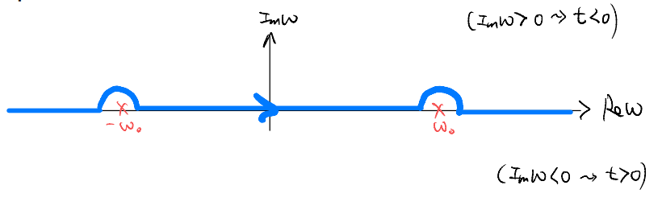

# Lec13

:::{note}
This is **NOT** the official course PHYS5340 website yet!

* If you are student in this course, **always** take the lecture notes as the correct one if you find any differences between lecture notes and website contents
* If you are just passerby, use the materials below at your own risk. Since the website is still the first version (even alpha version), there could be some typos, incorrect/inaccurate/improper statements.
:::

:::{note}
**All** materials in this website are based on the course offered at HKUST
:::

:::{note}
As a "casual course", we provide only general references but not specific ones to the materials introduced
:::

:::{note}
**All** materials' copyright in this website are reserved for the course lecturer

* If you want to use the material somewhere, you might need to contact the lecturer first
:::

:::{note}
Contribution is always **welcome**. if you find any typo, incorrect/inaccurate/improper statements or necessary references, do not hesitate to

* raise an issue on github repo
* make an pull request on github repo
* contact me directly
:::

20220318

Topics

1. Linear response
2. Susceptibility and retarded Greens' function

Goals

1. Establishing a more precise connection between Green's function and experimental observables

## Recap: reasons for thinking about Green's functions

Let us briefly recap what we have learnt about (zero-temperature) Green's functions.

1. We argued that, in real time, they could be understood simply as the matrix-element of the time-evolution operator evaluated in the ground state (Level I)
2. We also showed that, in the frequency space, the Green's function contains important physical information about the ground state and its excitations (Level II)
3. We then see that specific "time-ordered" combination of the real-time Green's function form the basic ingredients when we try to solve equation of motion with time-dependent operator "coefficients", which leads to the time-ordered exponential (Level III)
4. We just saw that, in fact, all these Green's functions are really the same in the frequency space, but just with different contour prescription in going to the real time (at least for free phonons)!

In particular, we saw that when we close the contour on the lower complex plane, we get the "retarded Green's function" taking the form

$$ G^{\mathrm{ret}}\left( q,t \right) =\left( -i \right) \Theta \left( t \right) \left< \left[ \hat{A}\left( t \right) ,\hat{B}\left( 0 \right) \right] \right> $$

It has a sense of causality, in that it is non-vanishing only for $t>0$. Furthermore, when $\hat{A}$ and $\hat{B}$ are Hermitian,

$$
\begin{align*}
    \left( -i\left[ \hat{A}\left( t \right) ,\hat{B}\left( 0 \right) \right] \right) ^{\dagger}&=\left( -i\hat{A}\left( t \right) \hat{B}\left( 0 \right) +i\hat{B}\left( 0 \right) \hat{A}\left( t \right) \right) ^{\dagger}\\
    &=i\hat{B}\left( 0 \right) \hat{A}\left( t \right) -i\hat{A}\left( t \right) \hat{B}\left( 0 \right) \\
    &=-i\left[ \hat{A}\left( t \right) ,\hat{B}\left( 0 \right) \right]
\end{align*}
$$

this implies our retarded Green's function could be measurable! Note how things start to fall into place: the mysterious "conventional factor" $(-i)$ now makes sense too!

## Linear response

Let us now consider a general problem and see how, indeed, the retarded Green's functions appear as the response of a system to perturbations.

Consider a static Hamiltonian $\hat{H}_0$ which wee disturb at some time by a perturbation $\hat{V}(t)$. The full Hamiltonian is given by

$$ \hat{H}\left( t \right) =\hat{H}_0+\hat{V}\left( t \right) $$

in the Schrodinger picture, i.e., the Schrodinger states evolve as

$$ i\partial _t|\Psi_S \left( t \right) \rangle=\hat{H}\left( t \right) |\Psi_S \left( t \right) \rangle$$

Taking the perspective that "the system" is simply described by $\hat{H}_0$ and $\hat{V}(t)$ is only "a probe", it will be natural to try going into a Heisenberg picture defined using $\hat{H}_0$ (instead of $\hat{H}(t)$). Consider an operator $\hat{O}$ which is time-independent in the Schrodinger picture:

$$ \langle \Psi_S \left( t \right) |\hat{O}_S|\Psi_S \left( t \right) \rangle =\langle \Psi_S \left( t \right) |e^{-i\hat{H}_0t}\left( e^{i\hat{H}_0t}\hat{O}_Se^{-i\hat{H}_0t} \right) e^{i\hat{H}_0t}|\Psi_S \left( t \right) \rangle $$

$$ \hat{O}_I\left( t \right) =e^{i\hat{H}_0t}\hat{O}_Se^{-i\hat{H}_0t}$$

where $\hat{O}_I(t)$ is equivalently Heisenberg picture for $\hat{O}$ defined using $\hat{H}_0$. Of course, this is something like a hybrid picture, because ultimately our full Hamiltonian (and so the "true" Heisenberg picture) also contains the perturbation.

We call this the "interaction picture". The equations of motions are now

$$ i\partial _t\hat{O}_I\left( t \right) =\left[ \hat{O}_I\left( t \right) ,\hat{H}_0 \right] $$

same as the Heisenberg picture for the unperturbed system.

$$
\begin{align*}
    i\partial _t|\Psi_I \left( t \right) \rangle&=i\partial _t\left( e^{i\hat{H}_0t}|\Psi_S \left( t \right) \rangle \right) \\
    &=-\hat{H}_0\left( e^{i\hat{H}_0t}|\Psi_S \left( t \right) \rangle  \right) +e^{i\hat{H}_0t}\left( i\partial _t|\Psi_S \left( t \right) \rangle \right) \\
    &=-\hat{H}_0|\Psi_I \left( t \right) \rangle+e^{i\hat{H}_0t}\left( \hat{H}_0+\hat{V}\left( t \right) \right) e^{-i\hat{H}_0t}|\Psi_I \left( t \right) \rangle\\
    &=\hat{V}_I\left( t \right) |\Psi_I \left( t \right) \rangle
\end{align*}
$$

$$ \hat{V}_I\left( t \right) =e^{i\hat{H}_0t}\hat{V}\left( t \right) e^{-i\hat{H}_0t}$$

i.e., the "effective Hamiltonian" for $|\Psi_I(t)\rangle$ is simply the perturbation, but with the operators acquiring additional time-dependence according to the Heisenberg picture of the unperturbed system. (Note: this holds even if $\hat{V}$ itself is time-independent to start with.)

We have seen already how such equation of motion could be solved: the (formal) solution is simply the time-ordered exponential:

$$ |\Psi _I\left( t \right) \rangle =\mathcal{T} \left[ e^{-i\int_{t_0}^t{dt'\hat{V}_I\left( t' \right)}} \right] |\Psi _I\left( t_0 \right) \rangle $$

In particular, at $t_0\to -\infty$ we simply have the original ground state $|\Omega\rangle$ of the unperturbed system $\hat{H}_0$, so

$$ |\Psi _I\left( t \right) \rangle =\mathcal{T} \left[ e^{-i\int_{-\infty}^t{dt'\hat{V}_I\left( t' \right)}} \right] |\Omega \rangle $$

We are now all set-up to consider how the system responds to the perturbations! As discussed, the expectation value of a physical observable is

$$ O\left( t \right) =\langle \Psi _I\left( t \right) |\hat{O}_I\left( t \right) |\Psi _I\left( t \right) \rangle $$

We could evaluate it as a perturbation series in powers of $\hat{V}$. Recall, $\hat{O}_I(t)$ is simply equivalently to the unperturbed Heisenberg operator, and so the lowest order term comes from

$$
\begin{align*}
    |\Psi _I\left( t \right) \rangle &=\mathcal{T} \left[ e^{-i\int_{-\infty}^t{dt'\hat{V}_I\left( t' \right)}} \right] |\Omega \rangle \\
    &=\left( I-i\int_{-\infty}^t{dt'\hat{V}_I\left( t' \right)}+\cdots \right) |\Omega \rangle
\end{align*}
$$

$$
\begin{align*}
    O\left( t \right) &=\langle \Omega |\left( I+i\int_{-\infty}^t{dt'\hat{V}_I\left( t' \right)}+\cdots \right) \hat{O}_I\left( t \right) \left( I-i\int_{-\infty}^t{dt'\hat{V}_I\left( t' \right)}+\cdots \right) |\Omega \rangle \\
    &\approx \langle \Omega |\hat{O}_I\left( t \right) |\Omega \rangle -i\langle \Omega |\left[ \hat{O}_I\left( t \right) ,\int_{-\infty}^t{dt'\hat{V}_I\left( t' \right)} \right] |\Omega \rangle
\end{align*}
$$

$$
\begin{align*}
    \delta O\left( t \right) &=O\left( t \right) -\langle \Omega |\hat{O}_S|\Omega \rangle \\
    &=O\left( t \right) -\langle \Omega |\hat{O}_I\left( t \right) |\Omega \rangle \\
    &=-i\langle \Omega |\left[ \hat{O}_I\left( t \right) ,\int_{-\infty}^t{dt'\hat{V}_I\left( t' \right)} \right] |\Omega \rangle
\end{align*}
$$

This relates the change in the observable to the lowest (linear) order in the perturbation $\hat{V}$. Let us further assume the perturbation takes the form

$$ \hat{V}_S\left( t \right) =\hat{O}_{S}^{'}f\left( t \right) $$

$$ \Rightarrow \hat{V}_I\left( t \right) =\hat{O}_{I}^{'}f\left( t \right) $$

i.e., its only time-dependence in the Schrodinger picture comes solely from a time-dependent "driving force" $f(t)$.

Our discussions simplify further in the frequency space. Consider the Fourier transform of the force

$$ f\left( t \right) =\int_{-\infty}^{\infty}{\frac{d\omega}{2\pi}f\left( \omega \right) e^{-i\omega t}}$$

$$
\begin{align*}
    \Rightarrow \delta O\left( t \right) &=\left( -i \right) \int_{-\infty}^t{dt'\langle \Omega |\left[ \hat{O}_I\left( t \right) ,\hat{O}_{I}^{'}\left( t' \right) \right] |\Omega \rangle \int_{-\infty}^{\infty}{\frac{d\omega}{2\pi}f\left( \omega \right) e^{-i\omega t'}}}\\
    &=\int_{-\infty}^{\infty}{\frac{d\omega}{2\pi}f\left( \omega \right) \left( -i \right) \int_{-\infty}^t{dt'\langle \Omega |\left[ \hat{O}_I\left( t \right) ,\hat{O}_{I}^{'}\left( t' \right) \right] |\Omega \rangle e^{-i\omega t'}}}
\end{align*}
$$

$$ \langle \Omega |\left[ \hat{O}_I\left( t \right) ,\hat{O}_{I}^{'}\left( t' \right) \right] |\Omega \rangle =\langle \Omega |\left[ \hat{O}_I\left( t-t' \right) ,\hat{O}_{I}^{'}\left( 0 \right) \right] |\Omega \rangle $$

where the time-translation invariance follows from a static non-perturbed $\hat{H}_0$, and that our interaction picture operators are simply the Heisenberg picture operators with respect to $\hat{H}_0$. Let $\delta_t=t-t'>0$, then

$$
\begin{align*}
    &\int_{-\infty}^t{dt'\left( -i \right) \langle \Omega |\left[ \hat{O}_I\left( t-t' \right) ,\hat{O}_{I}^{'}\left( 0 \right) \right] |\Omega \rangle e^{-i\omega t'}}\\
    &=\left( \int_0^{\infty}{d\delta _t\left( -i \right) \langle \Omega |\left[ \hat{O}_I\left( \delta _t \right) ,\hat{O}_{I}^{'}\left( 0 \right) \right] |\Omega \rangle e^{i\omega \delta _t}} \right) e^{-i\omega t}
\end{align*}
$$

Let us define the susceptibility

$$ \chi \left( \omega \right) =\int_{-\infty}^{\infty}{d\delta _t\left( -i \right) \Theta \left( \delta _t \right) \langle \Omega |\left[ \hat{O}_I\left( \delta _t \right) ,\hat{O}_{I}^{'}\left( 0 \right) \right] |\Omega \rangle e^{i\omega \delta _t}}$$

where we have again traded the integration bound with the Heaviside step function.

Importantly, notice that $\chi(\omega)$ is simply the frequency-space version of some retarded Green's function!

When the dust settles, we arrive at

$$ \delta O\left( t \right) =\int_{-\infty}^{\infty}{\frac{d\omega}{2\pi}\chi \left( \omega \right) f\left( \omega \right) e^{-i\omega t}}$$

and so, when we Fourier transform the observable, we get

$$ \delta O\left( \omega \right) =\chi \left( \omega \right) f\left( \omega \right) $$

$$ \Rightarrow \quad \chi \left( \omega \right) =\frac{\delta O\left( \omega \right)}{f\left( \omega \right)}$$

i.e., the susceptibility is measurable simply as the ratio of the Fourier component of the (change in the) observable and the driving force we used to perturb the system, and it is given by

$$ \chi \left( \omega \right) =\int_{-\infty}^{\infty}{dt\chi _R\left( t \right) e^{i\omega t}}$$

$$ \chi _R\left( t \right) =\left( -i \right) \Theta \left( t \right) \langle \Omega |\left[ \hat{O}_I\left( t \right) ,\hat{O}_{I}^{'}\left( 0 \right) \right] |\Omega \rangle ,\quad \mathrm{retarded}$$

Such relationships (linear-response susceptibilities to retarded Green's functions) are called "Kubo formulas". It is customary to split it into real and imaginary parts:

$$ \chi \left( \omega \right) =\Re \left[ \chi \left( \omega \right) \right] +i\Im \left[ \chi \left( \omega \right) \right] $$

$$ \Re \left[ \chi \left( \omega \right) \right] =\int_{-\infty}^{\infty}{\chi _R\left( t \right) \cos \left( \omega t \right)}$$

$$ \Im \left[ \chi \left( \omega \right) \right] =\int_{-\infty}^{\infty}{\chi _R\left( t \right) \sin \left( \omega t \right)}$$

From which we see that the real part is an even function of $\omega$, whereas the imaginary part is odd. Therefore, we may also simply write

$$ \Re \left[ \chi \left( \omega \right) \right] =\frac{\chi \left( \omega \right) +\chi \left( -\omega \right)}{2}$$

$$ \Im \left[ \chi \left( \omega \right) \right] =\frac{\chi \left( \omega \right) -\chi \left( -\omega \right)}{2i}$$

You might recall that, the imaginary susceptibility corresponds to energy dissipation / absorption. To see why, let us consider a "monochromatic" drive

$$ f\left( t \right) =f_0\cos \left( \Omega t \right) $$

$$ f\left( \omega \right) =\pi f_0\delta \left( \omega +\Omega \right) +\pi f_0\delta \left( \omega -\Omega \right) $$

Correspondingly, the change in the physical observable is

$$
\begin{align*}
    \delta O\left( t \right) &=\int_{-\infty}^{\infty}{\frac{d\omega}{2\pi}\chi \left( \omega \right) f\left( \omega \right) e^{-i\omega t}}\\
    &=\int_{-\infty}^{\infty}{\frac{d\omega}{2}f_0\chi \left( \omega \right) \left( \delta \left( \omega +\Omega \right) +\delta \left( \omega -\Omega \right) \right) e^{-i\omega t}}\\
    &=\frac{f_0}{2}\chi \left( \Omega \right) e^{-i\Omega t}+\frac{f_0}{2}\chi \left( -\Omega \right) e^{i\Omega t}\\
    &=f_0\cos \left( \Omega t \right) \Re \left[ \chi \left( \Omega \right) \right] +f_0\sin \left( \Omega t \right) \Im \left[ \chi \left( \Omega \right) \right]
\end{align*}
$$

In other words, the real part $\Re[\chi(\omega)]$ corresponds to the in-phase (also known as reactive) response, whereas the imaginary part $\Im[\chi(\omega)]$ corresponds to the out-of-phase response. As you might recall, the out-of-phase response corresponds to energy dissipation / absorption. To see that, let us consider a generalized power

$$
\begin{align*}
    P\left( t \right) &=f\left( t \right) \frac{d}{dt}\delta O\left( t \right) ,\quad \left( \mathrm{c}.\mathrm{f}. P=Fv=F\frac{dx}{dt} \right) \\
    &=f_{0}^{2}\cos \left( \Omega t \right) \frac{d}{dt}\left( \Re \left[ \chi \left( \Omega \right) \right] \cos \left( \Omega t \right) +\Im \left[ \chi \left( \Omega \right) \right] \sin \left( \Omega t \right) \right) \\
    &=f_{0}^{2}\Omega \left( -\Re \left[ \chi \left( \Omega \right) \right] \cos \left( \Omega t \right) \sin \left( \Omega t \right) +\Im \left[ \chi \left( \Omega \right) \right] \cos ^2\left( \Omega t \right) \right) \\
    &=\frac{f_{0}^{2}\Omega}{2}\left( -\Re \left[ \chi \left( \Omega \right) \right] \sin \left( 2\Omega t \right) +\Im \left[ \chi \left( \Omega \right) \right] \cos \left( 2\Omega t \right) +\Im \left[ \chi \left( \Omega \right) \right] \right)
\end{align*}
$$

When we average the power over one period of the drive, the only survive piece is

$$ \left< P\left( t \right) \right> =\pi f_{0}^{2}\Im \left[ \chi \left( \Omega \right) \right] $$

this shows explicitly the imaginary (the odd-in-frequency) part of the susceptibility captures the dissipation / absorption of the system.

These are very general conclusions, and, in fact, apply similarly even to systems at finite temperature. In particular, it provides a general platform for understanding the response, fluctuation, and dissipation in a system.

Let us now unpack these formal calculations by considering a "canonical" example.

## Driven QHO

As our first example, let us consider again our old friend now perturbed by a driving term

$$ \hat{H}_0=\frac{\hat{p}^2}{2m}+\frac{1}{2}m\omega _{0}^{2}\hat{x}^2-\frac{1}{2}\omega _0=\omega _0\hat{a}^{\dagger}\hat{a}$$

$$ \hat{a}=\frac{1}{\sqrt{2}}\left( \sqrt{m\omega _0}\hat{x}+i\frac{\hat{p}}{\sqrt{m\omega _0}} \right) $$

$$ \hat{V}_s=f\left( t \right) \hat{x}$$

Let us consider how the position of the particle responds to the drive, i.e., we look at the susceptibility

$$
\begin{align*}
    \chi \left( t \right) &=\left( -i \right) \Theta \left( t \right) \langle 0|\left[ \hat{x}\left( t \right) ,\hat{x}\left( 0 \right) \right] |0\rangle \\
    &=\frac{\left( -i \right) \Theta \left( t \right)}{2m\omega _0}\langle 0|\left[ \hat{a}\left( t \right) +\hat{a}^{\dagger}\left( t \right) ,\hat{a}\left( 0 \right) +\hat{a}^{\dagger}\left( 0 \right) \right] |0\rangle \\
    &=\frac{\left( -i \right) \Theta \left( t \right)}{2m\omega _0}\left( e^{-i\omega _0t}-e^{i\omega _0t} \right) \\
    &=-\frac{\Theta \left( t \right)}{m\omega _0}\sin \left( \omega _0t \right)
\end{align*}
$$

Hopefully this looks familiar. We already saw that it corresponds to the frequency-space pole structure

In the $i\eta$ prescription, we have

$$
\begin{align*}
    \chi \left( \omega \right) &=\frac{1}{2m\omega _0}\lim_{\eta \rightarrow 0^+} \left( \frac{1}{\omega -\omega _0+i\eta}-\frac{1}{\omega +\omega _0+i\eta} \right) \\
    &=\frac{1}{2m\omega _0}\lim_{\eta \rightarrow 0^+} \frac{2\omega _0}{\left( \omega +i\eta \right) ^2-\omega _{0}^{2}}\\
    &=\frac{1}{m}\lim_{\eta \rightarrow 0^+} \frac{1}{\omega ^2-\omega _{0}^{2}+2i\omega \eta}
\end{align*}
$$

This may look familiar to you: the response has a strong peak at the natural frequency, with the peak width controlled by $i\eta$.

Furthermore, we can extract the imaginary part. Recall the Sokhotski-Plemelj theorem

$$ \lim_{\eta \rightarrow 0^+} \frac{1}{x\pm i\eta}=P\frac{1}{x}\mp i\pi \delta \left( x \right) $$

$$
\begin{align*}
    \Rightarrow \quad \Im \left[ \chi \left( \omega \right) \right] &=\frac{1}{2m\omega _0}\Im \left[ \lim_{\eta \rightarrow 0^+} \left( \frac{1}{\omega -\omega _0+i\eta}-\frac{1}{\omega +\omega _0+i\eta} \right) \right] \\
    &=\frac{\pi}{2m\omega _0}\left( -\delta \left( \omega -\omega _0 \right) +\delta \left( \omega +\omega _0 \right) \right)
\end{align*}
$$

Earlier, we introduced this as the "spectral" function, obtained by the spectral decomposition for a general many-body Hamiltonian, which could be understood as the matrix-element-weighed density of states. Here, we see that, indeed, it corresponds to experimental observables.
