# lec16

:::{note}
This is **NOT** the official course PHYS5340 website yet!

* If you are student in this course, **always** take the lecture notes as the correct one if you find any differences between lecture notes and website contents
* If you are just passerby, use the materials below at your own risk. Since the website is still the first version (even alpha version), there could be some typos, incorrect/inaccurate/improper statements.
:::

:::{note}
**All** materials in this website are based on the course offered at HKUST
:::

:::{note}
As a "casual course", we provide only general references but not specific ones to the materials introduced
:::

:::{note}
**All** materials' copyright in this website are reserved for the course lecturer

* If you want to use the material somewhere, you might need to contact the lecturer first
:::

:::{note}
Contribution is always **welcome**. if you find any typo, incorrect/inaccurate/improper statements or necessary references, do not hesitate to

* raise an issue on github repo
* make an pull request on github repo
* contact me directly
:::

20220330

Topics

1. Interacting electron propagator: qualitative picture
2. Spectral function (again) and Landau Fermi liquid
3. Full propagator and Feynman diagrams

Goals

1. Appreciating the qualitative features of the interacting propagator and their relation to Fermi liquids
2. Connecting perturbative expansion to Feynman diagrams

## Spectral function yet again: let's go interacting

Having evaluated the bare propagator, let us consider the actual one-particle propagator in the interacting problem. It is defined in exactly the same way (suppressing the spin index):

$$ G^F\left( k,t \right) =-i\langle \Omega |\mathcal{T} \left[ \hat{c}_k\left( t \right) \hat{c}_{k}^{\dagger}\left( 0 \right) \right] |\Omega \rangle $$

where we emphasize that the expectation value is taken with respect to the interacting ground state. Note that this is **not** a "contraction": the interacting ground state is not Gaussian in general. Instead, we should think of this propagator as a two-point correlation function (in space-time, and Fourier-transformed).

Before we dwell into the technical calculation (through Gell-Mann-Low, perturbative expansion etc.), it may be good to highlight how interaction modifies the propagator. To this end we revisit the "spectral decomposition".

$$
\begin{align*}
    &iG^F\left( k,t \right)\\
    =&\langle \Omega |\mathcal{T} \left[ \hat{c}_k\left( t \right) \hat{c}_{k}^{\dagger}\left( 0 \right) \right] |\Omega \rangle \\
    =&\Theta \left( t \right) \sum_n{\langle \Omega |e^{i\hat{H}t}\hat{c}_ke^{-i\hat{H}t}|n\rangle \langle n|\hat{c}_{k}^{\dagger}|\Omega \rangle}-\Theta \left( -t \right) \sum_n{\langle \Omega |\hat{c}_{k}^{\dagger}|n\rangle \langle n|e^{i\hat{H}t}\hat{c}_ke^{-i\hat{H}t}|\Omega \rangle}\\
    =&\Theta \left( t \right) \sum_n{\left| \langle n|\hat{c}_{k}^{\dagger}|\Omega \rangle \right|^2e^{-i\left( E_n-E_{\Omega} \right) t}}-\Theta \left( -t \right) \sum_n{\left| \langle n|\hat{c}_k|\Omega \rangle \right|^2e^{i\left( E_n-E_{\Omega} \right) t}}
\end{align*}
$$

$$ G^F\left( k,\omega \right) =\lim_{\eta \rightarrow 0^+} \sum_n{\left( \frac{\left| \langle n|\hat{c}_{k}^{\dagger}|\Omega \rangle \right|^2}{\omega -\left( E_n-E_{\Omega} \right) +i\eta}+\frac{\left| \langle n|\hat{c}_k|\Omega \rangle \right|^2}{\omega +\left( E_n-E_{\Omega} \right) -i\eta} \right)}$$

Let us simplify the expression by making a few definitions.

1. if $\langle n|\hat{c}_{k}^{\dagger}|\Omega \rangle \ne 0$,
   $$ \begin{cases}
       M_n\left( k \right) =\langle n|\hat{c}_{k}^{\dagger}|\Omega \rangle\\
       \varepsilon _n=E_n-E_{\Omega}>0\\
       \eta _n=\eta \rightarrow 0^+\\
   \end{cases} $$
2. else if $\langle n|\hat{c}_k|\Omega \rangle \ne 0$,
   $$ \begin{cases}
       M_n\left( k \right) =\langle n|\hat{c}_k|\Omega \rangle\\
       \varepsilon _n=-\left( E_n-E_{\Omega} \right) <0\\
       \eta _n=-\eta \rightarrow 0^-\\
   \end{cases} $$
3. else,
   $$ M_n\left( k \right) =0 $$

$$ \Rightarrow \quad G^F\left( k,\omega \right) =\lim_{\eta _n\rightarrow 0^{\pm}} \sum_n{\frac{\left| M_n\left( k \right) \right|^2}{\omega -\varepsilon _n+i\eta _n}} $$

We might connect to physical observables by looking at the spectral function. However, the propagator, being the a T-ordered two-point function, is not an observable directly. Instead, we could look at its retarded version, the trick, as usual, is to shift the poles to the lower complex plane. Consider

$$ G^F\left( k,\omega +i\delta \right) =\lim_{\eta _n\rightarrow 0^{\pm}} \sum_n{\frac{\left| M_n\left( k \right) \right|^2}{\omega -\varepsilon _n+i\left( \delta +\eta _n \right)}}$$

and we take the limit in which $\delta$ overrides $\eta_n$ such that all the poles are now in the lower complex plane. We may now consider the spectral function again by looking at the imaginary part

$$
\begin{align*}
    A\left( k,\omega \right) &=-\frac{1}{\pi}\Im \left[ \lim_{\delta \rightarrow 0^+} G^F\left( k,\omega +i\delta \right) \right] \\
    &=\sum_n{\left| M_n\left( k \right) \right|^2\delta \left( \omega -\varepsilon _n \right)}
\end{align*}
$$

(Note: Coleman 5.3.3 considers shifting the poles to the upper complex plane instead, and so a sign difference from the above.)

Importantly,the spectral function enjoys a "normalization":

$$
\begin{align*}
    \int_{-\infty}^{\infty}{d\omega A\left( k,\omega \right)}&=\sum_n{\left| M_n\left( k \right) \right|^2}\\
    &=\sum_n{\left( {\color[RGB]{0, 0, 240} \left| \langle n|\hat{c}_{k}^{\dagger}|\Omega \rangle \right|^2}+{\color[RGB]{178, 34, 34} \left| \langle n|\hat{c}_k|\Omega \rangle \right|^2}+{\color{red} 0} \right)}\\
    &\quad \mathrm{one}\; \mathrm{term}\; \mathrm{per}\; n,\; \mathrm{among}\; {\color[RGB]{0, 0, 240} \mathrm{these}}\; {\color[RGB]{178, 34, 34} \mathrm{three}}\; {\color{red} \mathrm{possibilities}}\\
    &=\sum_n{\left( \langle \Omega |\hat{c}_k|n\rangle \langle n|\hat{c}_{k}^{\dagger}|\Omega \rangle +\langle \Omega |\hat{c}_{k}^{\dagger}|n\rangle \langle n|\hat{c}_k|\Omega \rangle \right)}\\
    &=\langle \Omega |\hat{c}_k\hat{c}_{k}^{\dagger}+\hat{c}_{k}^{\dagger}\hat{c}_k|\Omega \rangle \\
    &=1
\end{align*}
$$

Therefore, it is common to talk about the "transfer of spectral weight": the area under the spectral function a conserved quantity, and so it is meaningful to talk about its "transfer".

From the spectral function, we can already picture what should happen when interaction kicks in. Let's start with the non-interacting limit (i.e., the spectral function corresponding to the bare propagator)

$$
\begin{align*}
    A_0\left( k,\omega \right) &=\frac{-1}{\pi}\Im \left[ \lim_{\delta \rightarrow 0^+} G_0\left( k,\omega +i\delta \right) \right] \\
    &=\frac{-1}{\pi}\Im \left[ \lim_{\delta \rightarrow 0^+} \frac{1}{\omega -\varepsilon _k+i\delta} \right] \\
    &=\delta \left( \omega -\varepsilon _k \right)
\end{align*}
$$

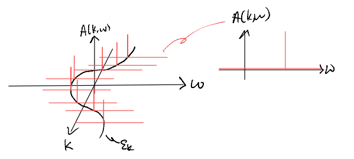

In particular, the delta function has weight $1$, as all the "area under the curve" has been hidden under the delta function. From the spectral decomposition itself, we see that this happens because there is exactly one eigenstate of $\hat{H}_0$ which is reached by one electron addition / removal with the right momentum.

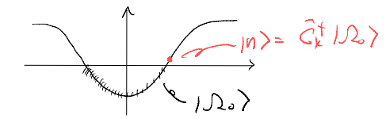

One may wonder what happens beyond the simple single-band picture. Generally speaking, even in the non-interacting limit one can get a few delta functions, with their respective weight corresponding to the overlap of the "test" electron compared to the eigenbasis. This is essentially the idea of a projected density-of-states in, e.g., DFT calculations.

Now, let's ask what happens when we add interaction. As we have seen from the impurity-phonon problem already (beyond the Einstein model), we expect the delta functions to be smeared out into a continuous background:

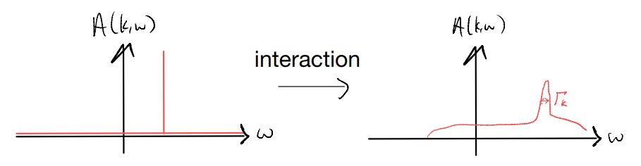

What is the physical meaning of $\Gamma_k$? From the uncertainty principle, we know that $\Delta E \& \Delta t$ form a canonical pair. In other words, an infinitely sharp peak (i.e., a delta function), with an infinite precision in energy, corresponds to an infinite lifetime (indeed, that happens when one can construct an eigenstate of the Hamiltonian with exact that energy on top of the ground state). Alternatively, with a finite $\Gamma_k$, there is a finite uncertainty in $E$, and so we also expect a finite uncertainty in $\Delta t$. This suggests $\frac{1}{\Gamma_k}$ corresponds to the lifetime of the quasi-particle.

How does interaction lead to a finite lifetime? Imagine creating an excitation on top of the Fermi sea:

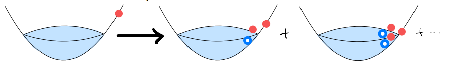

In other words, as interaction mixes the states with the same number of electrons (one extra compared to the ground state), the state with "one electron added" becomes superposed with configuration like (1 hole + 2 electrons), (2 holes + 3 electrons) etc.

Now imagine an excitation with an infinitesimal energy compared to the ground state, and so infinitesimally close to the Fermi surface. In our cartoon above, such an excitation has "no where to go" since the particle-hole pair created accompanying its scattering will have to be even closer to the Fermi surface.

Heuristically, one expects the quasi-particle decay to be suppressed for excitations close to the Fermi surface. In 3D, the lifetime is given by

$$ \tau _k\sim \frac{1}{\Gamma _k}\sim \frac{1}{\varepsilon _{k}^{2}}$$

where $\varepsilon_k$ is the excitation energy. (A more accurate description requires a phase-space analysis, and in fact our hand-waving arguments fails in 1D.)

This observation implies that, in fact, our picture for the spectral function is qualitatively different when we consider momenta lying on the Fermi surface: in that case, we recover a delta function on top of a broad background:

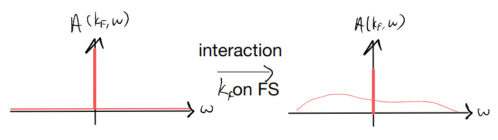

Furthermore,by our "spectral weight conservation" argument, the area under the broad "incoherent" background consumes the weight of the delta function. This is usually denoted by the quasi-particle weight

$$ \begin{cases}
    A\left( k_F,\omega \right) =Z_k\delta \left( \omega -\varepsilon _k \right) +A_{int}\\
    Z_k\le 1\\
\end{cases}$$

Physically, such a delta function manifests as a jump when the quantity is integrated. As it turns out, this quantity is simply the electron occupation number (momentum distribution function). Consider

$$ n_k=\langle \Omega |\hat{c}_{k}^{\dagger}\hat{c}_k|\Omega \rangle =\sum_n{\left| \langle n|\hat{c}_k|\Omega \rangle \right|^2}=\sum_n{\left| M_n\left( k \right) \right|^2}$$

for the "1 hole" states. Comparing with the spectral function

$$ A\left( k,\omega \right) =\sum_n{\left| M_n\left( k \right) \right|^2\delta a\left( \omega -\varepsilon _n \right)}$$

where $\varepsilon_n$ is positive (negative) for "1 electron (1 hole)" states

$$ \Rightarrow \quad n_k=\int_{-\infty}^0{d\omega A\left( k,\omega \right)}$$

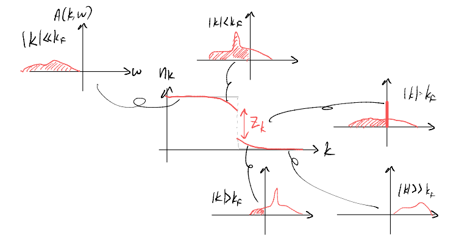

Such jump indicates the presence of infinitely long-lived electron-like quasi particle on the Fermi surface. This is the hallmark of a Landau Fermi liquid.

## Interacting propagator: attempting a perturbative expansion

Having explored the qualitative features of the propagator, let us attempt to evaluate it. Recall

$$
\begin{align*}
    G_{\sigma \sigma}^{F}\left( k,t \right) &=\left( -i \right) \langle \Omega |\mathcal{T} \left[ \hat{c}_{k\sigma}\left( t \right) \hat{c}_{k\sigma}^{\dagger}\left( 0 \right) \right] |\Omega \rangle _H\\
    &=\left( -i \right) \frac{\langle \Omega _0|\mathcal{T} \left[ \hat{c}_{k\sigma}\left( t \right) \hat{c}_{k\sigma}^{\dagger}\left( 0 \right) \hat{S}\left( \infty ,-\infty \right) \right] |\Omega _0\rangle _I}{\langle \Omega _0|\hat{S}\left( \infty ,-\infty \right) |\Omega _0\rangle _I}
\end{align*}
$$

where the interaction-picture operator evolution is determined by  that of the unperturbed, non-interacting problem $\hat{H}_0$ (and so it is solvable). The interaction is all "hidden" in the S-matrix

$$ \hat{S}\left( \infty ,-\infty \right) =\mathcal{T} \left[ \exp \left( -i\int_{-\infty}^{\infty}{dt'\hat{V}_I\left( t' \right)} \right) \right] $$

Assuming translation invariance, consider interaction of the form (c.f. PS4)

$$ \hat{V}=\frac{1}{2}\sum_{pp'q}{V\left( q \right) \sum_{\sigma \sigma '}{\hat{c}_{p+q,\sigma}^{\dagger}\hat{c}_{p'-q,\sigma '}^{\dagger}\hat{c}_{p',\sigma '}\hat{c}_{p,\sigma}}}$$

here, $q$ has the interpretation of a momentum transfer. Note also that, since the term is normal-ordered, it vanishes automatically if $p=p\prime$ or $2q=p\prime -p$.

Let us now attempt to expand the numerator directly in a power series of $V$ (through the Dyson's series for the S-matrix):
0th:

$$ \left( -i \right) \langle \Omega _0|\mathcal{T} \left[ \hat{c}_{k\sigma}\left( t \right) \hat{c}_{k\sigma}^{\dagger}\left( 0 \right) \right] |\Omega _0\rangle =G_{0}^{F}\left( k,t \right)$$
1st:

$$ \frac{\left( -i \right) ^2}{2}\sum_{pp'q}{V\left( q \right) \sum_{\mu \mu '}{\int_{-\infty}^{\infty}{dt_1\langle \Omega _0|\mathcal{T} \left[ \hat{c}_{k\sigma}\left( t \right) \hat{c}_{k\sigma}^{\dagger}\left( 0 \right) \hat{c}_{p+q,\mu}^{\dagger}\left( t_1 \right) \hat{c}_{p'-q,\mu '}^{\dagger}\left( t_1 \right) \hat{c}_{p',\mu '}\left( t_1 \right) \hat{c}_{p,\mu}\left( t_1 \right) \right] |\Omega _0\rangle}}}$$
The core part of the evaluation is the time-ordered expectation value for the product of three fermion creation and three annihilation operators. Since our unperturbed ground state is a Gaussian state, we can use Wick's theorem

$$ \langle \cdots \rangle _{\mathcal{T}}\,\,\mapsto \,\,\langle \Omega _0|\mathcal{T} \left[ \cdots \right] |\Omega _0\rangle $$

$$
\begin{align*}
    &\left< \hat{c}_{k\sigma}\left( t \right) \hat{c}_{k\sigma}^{\dagger}\left( 0 \right) \hat{c}_{p+q,\mu}^{\dagger}\left( t_1 \right) \hat{c}_{p'-q,\mu '}^{\dagger}\left( t_1 \right) \hat{c}_{p',\mu '}\left( t_1 \right) \hat{c}_{p,\mu}\left( t_1 \right) \right> _{\mathcal{T}}\\
    \sim& \left( 123 \right) -\left( 132 \right) +\left( 312 \right) -\left( 321 \right) +\left( 231 \right) -\left( 213 \right) \\
    =&\left< \hat{c}_{k\sigma}\left( t \right) \hat{c}_{k\sigma}^{\dagger}\left( 0 \right) \right> _{\mathcal{T}}\left< \hat{c}_{p'-q,\mu '}^{\dagger}\left( t_1 \right) \hat{c}_{p',\mu '}\left( t_1 \right) \right> _{\mathcal{T}}\left< \hat{c}_{p+q,\mu}^{\dagger}\left( t_1 \right) \hat{c}_{p,\mu}\left( t_1 \right) \right> _{\mathcal{T}}\\
    &-\left< \hat{c}_{k\sigma}\left( t \right) \hat{c}_{k\sigma}^{\dagger}\left( 0 \right) \right> _{\mathcal{T}}\left< {\color{red} \hat{c}_{p+q,\mu}^{\dagger}\left( t_1 \right) }\hat{c}_{p',\mu '}\left( t_1 \right) \right> _{\mathcal{T}}\left< {\color{red} \hat{c}_{p'-q,\mu '}^{\dagger}\left( t_1 \right) }\hat{c}_{p,\mu}\left( t_1 \right) \right> _{\mathcal{T}}\\
    &+\left< \hat{c}_{k\sigma}\left( t \right) {\color{red} \hat{c}_{p+q,\mu}^{\dagger}\left( t_1 \right) } \right> _{\mathcal{T}}\left< {\color{red} \hat{c}_{k\sigma}^{\dagger}\left( 0 \right) }\hat{c}_{p',\mu '}\left( t_1 \right) \right> _{\mathcal{T}}\left< \hat{c}_{p'-q,\mu '}^{\dagger}\left( t_1 \right) \hat{c}_{p,\mu}\left( t_1 \right) \right> _{\mathcal{T}}\\
    &-\left< \hat{c}_{k\sigma}\left( t \right) \hat{c}_{p+q,\mu}^{\dagger}\left( t_1 \right) \right> _{\mathcal{T}}\left< {\color{red} \hat{c}_{p'-q,\mu '}^{\dagger}\left( t_1 \right) }\hat{c}_{p',\mu '}\left( t_1 \right) \right> _{\mathcal{T}}\left< {\color{red} \hat{c}_{k\sigma}^{\dagger}\left( 0 \right) }\hat{c}_{p,\mu}\left( t_1 \right) \right> _{\mathcal{T}}\\
    &+\left< \hat{c}_{k\sigma}\left( t \right) {\color{red} \hat{c}_{p'-q,\mu '}^{\dagger}\left( t_1 \right) } \right> _{\mathcal{T}}\left< {\color{red} \hat{c}_{p+q,\mu}^{\dagger}\left( t_1 \right) }\hat{c}_{p',\mu '}\left( t_1 \right) \right> _{\mathcal{T}}\left< \hat{c}_{k\sigma}^{\dagger}\left( 0 \right) \hat{c}_{p,\mu}\left( t_1 \right) \right> _{\mathcal{T}}\\
    &-\left< \hat{c}_{k\sigma}\left( t \right) \hat{c}_{p'-q,\mu '}^{\dagger}\left( t_1 \right) \right> _{\mathcal{T}}\left< {\color{red} \hat{c}_{k\sigma}^{\dagger}\left( 0 \right) }\hat{c}_{p',\mu '}\left( t_1 \right) \right> _{\mathcal{T}}\left< {\color{red} \hat{c}_{p+q,\mu}^{\dagger}\left( t_1 \right) }\hat{c}_{p,\mu}\left( t_1 \right) \right> _{\mathcal{T}}
\end{align*}
$$

Imagine writing down all these without copy-and-pasting! Certainly it calls for a more paper-saving representation. If you still remember, performing the "full contraction" is closely related to problem of "matching" on a graph.

Along the same line, let us use six vertices to represent the six operators we need to contract

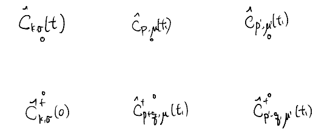

For instance, the first of the six terms above becomes

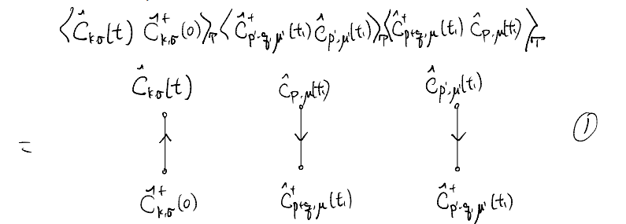

By the same token, the second term becomes

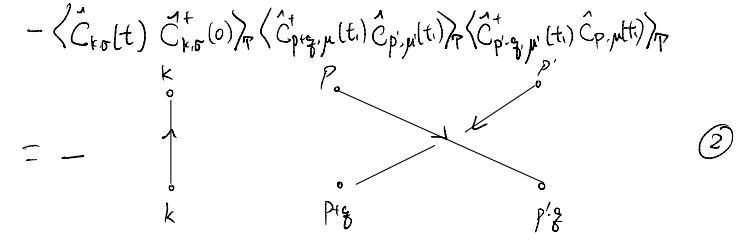

The reset follow similarly:

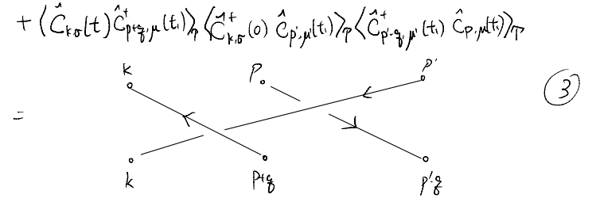

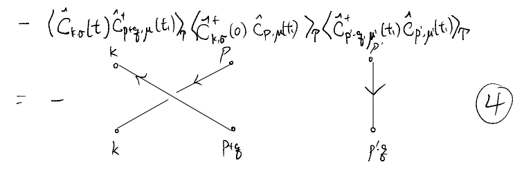

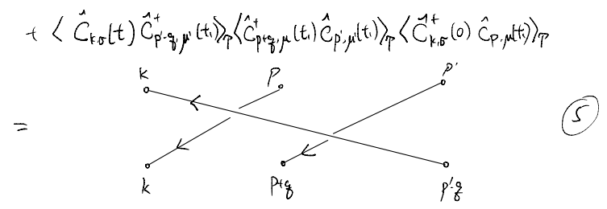

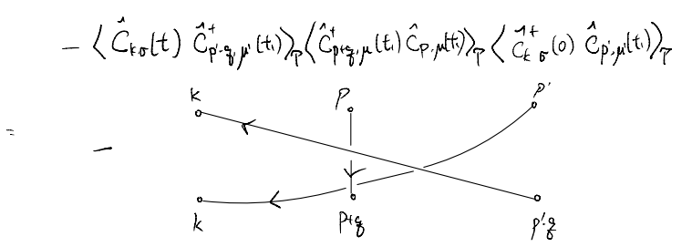

Note that some relative sign changes appear in the diagrams above, Here, essentially one sign change accompanies every crossing off the lines: starting from one crossing-free diagram, every crossing corresponds to an exchange of two fermion positions, which leads to a sign change. Furthermore, recall that when we reverse the arrow of the propagator, we also acquire sign changes. At this stage it seems quite annoying to keep track of the overall sign. We will later see that, fortunately, there is a simple way to keep track.
