# lec17

:::{note}
This is **NOT** the official course PHYS5340 website yet!

* If you are student in this course, **always** take the lecture notes as the correct one if you find any differences between lecture notes and website contents
* If you are just passerby, use the materials below at your own risk. Since the website is still the first version (even alpha version), there could be some typos, incorrect/inaccurate/improper statements.
:::

:::{note}
**All** materials in this website are based on the course offered at HKUST
:::

:::{note}
As a "casual course", we provide only general references but not specific ones to the materials introduced
:::

:::{note}
**All** materials' copyright in this website are reserved for the course lecturer

* If you want to use the material somewhere, you might need to contact the lecturer first
:::

:::{note}
Contribution is always **welcome**. if you find any typo, incorrect/inaccurate/improper statements or necessary references, do not hesitate to

* raise an issue on github repo
* make an pull request on github repo
* contact me directly
:::

20220401

Topics

1. Feynman diagrams
2. Linked cluster theorem

Goals

1. Understanding the relation between diagrams and Green's functions
2. Introducing common techniques in diagrammatic

Last time, we discussed how one might use diagrams to organize the (many) contractions one obtains when evaluating a Dyson's series expansion of the full propagator. Recall, to the first order in $V$, we have six possible contraction patterns, which can be conveniently indicated by "matching" vertices in a pair wise manner.

However, we should not forget that our terms come with "coefficients" and integrals. E.g., focusing

$$
\begin{align*}
    &\frac{\left( -i \right) ^2}{2}\sum_{{\color{red} pp'q}}{V\left( {\color{red} q} \right) \sum_{{\color{red} \mu \mu '}}{\int_{-\infty}^{\infty}{d{\color{red} t_1}\left< \hat{c}_{{\color[RGB]{0, 0, 240} k\sigma }}\left( {\color[RGB]{0, 0, 240} t} \right) \hat{c}_{{\color[RGB]{0, 0, 240} k\sigma }}^{\dagger}\left( {\color[RGB]{0, 0, 240} 0} \right) \right> _{\mathcal{T}}\left< \hat{c}_{{\color{red} p'-q,\mu '}}^{\dagger}\left( {\color{red} t_1} \right) \hat{c}_{{\color{red} p',\mu '}}\left( {\color{red} t_1} \right) \right> _{\mathcal{T}}\left< \hat{c}_{{\color{red} p+q,\mu }}^{\dagger}\left( {\color{red} t_1} \right) \hat{c}_{{\color{red} p,\mu }}\left( {\color{red} t_1} \right) \right> _{\mathcal{T}}}}}\\
    =&\left( -i \right) \left< \hat{c}_{{\color[RGB]{0, 0, 240} k\sigma }}\left( {\color[RGB]{0, 0, 240} t} \right) \hat{c}_{{\color[RGB]{0, 0, 240} k\sigma }}^{\dagger}\left( {\color[RGB]{0, 0, 240} 0} \right) \right> _{\mathcal{T}}\int_{-\infty}^{\infty}{d{\color{red} t_1}\sum_{{\color{red} q}}{\frac{\left( -i \right) V\left( {\color{red} q} \right)}{2}\sum_{{\color{red} p'\mu '}}{\left< \hat{c}_{{\color{red} p'-q,\mu '}}^{\dagger}\left( {\color{red} t_1} \right) \hat{c}_{{\color{red} p',\mu '}}\left( {\color{red} t_1} \right) \right> _{\mathcal{T}}\sum_{{\color{red} p\mu }}{\left< \hat{c}_{{\color{red} p+q,\mu }}^{\dagger}\left( {\color{red} t_1} \right) \hat{c}_{{\color{red} p,\mu }}\left( {\color{red} t_1} \right) \right> _{\mathcal{T}}}}}}\\
    =&G_{\sigma \sigma}^{F}\left( k,t \right) \int_{-\infty}^{\infty}{dt_1\frac{\left( -i \right) V\left( q=0 \right)}{2}\left( \sum_p{\mathrm{Tr}\left( \left( -i \right) G_{0}^{F}\left( p,0^- \right) \right)} \right) ^2}
\end{align*}
$$

where the internal and summed / integrated over variables are colored in red and external variables in blue.
note that

$$ \left< \hat{c}_{p+q,\mu}^{\dagger}\left( t_1 \right) \hat{c}_{p,\mu}\left( t_1 \right) \right> _{\mathcal{T}}=-\delta \left( q \right) \lim_{t\rightarrow 0^-} G_{0\mu}^{F}\left( p,t \right) =\delta \left( q \right) \hat{n}_p$$

and that the integral $\int_{-\infty}^{\infty}dt_1$ has nothing to integrate!

Instead of interpreting that as infinity, which is not very helpful, we can instead "regularize" it by claiming $\int{dt_1}=T$, the duration of time in which we turn on the interaction.

Staring at the expression above, we see that the three propagators in the expression actually do rather different things. In particular, one of them is completely external (and has nothing to do with the interaction), whereas the other two effectively "caps" the interaction and gives us some integrals to do. In the same spirit as the diagrams we have drawn above, it will be natural to "complete" the diagram by indicating more clearly which of the propagators are related to the interaction:

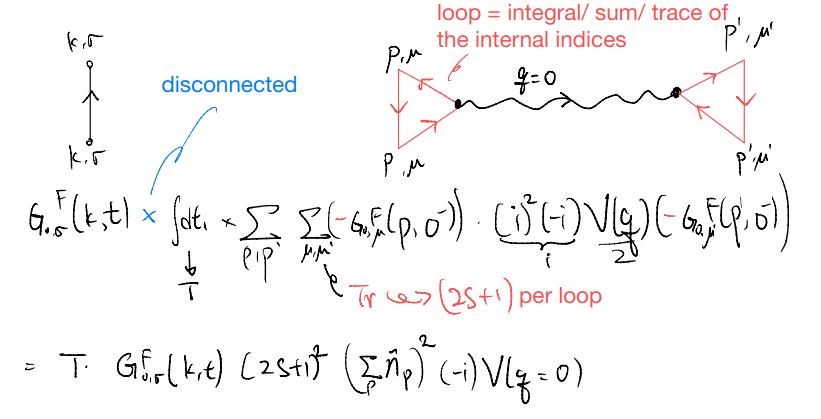

Similarly, we may now draw / write down the second term

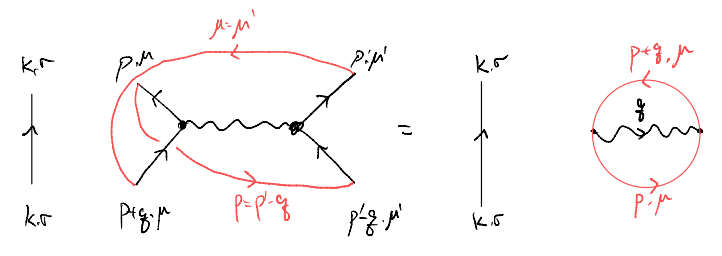

notice  that we have traded the crossing with a loop, this suggests the sign is now given by a loop counting (not proven here), and the term is

$$
\begin{align*}
    &G_{0\sigma}^{F}\left( k,t \right) \times \int{dt_1\sum_{pq}{G_{0\mu}^{F}\left( p,0^- \right) \frac{iV\left( q \right)}{2}G_{0\mu}^{F}\left( p+q,0^- \right) \times \left( -2S-1 \right)}}\\
    =&-\left( 2S+1 \right) TG_{0\sigma}^{F}\left( k,t \right) \sum_{pq}{\frac{-iV\left( q \right)}{2}n_{p+q}n_p}
\end{align*}
$$

Indeed, let us verify

$$
\begin{align*}
    &-\left( -i \right) ^2\sum_{pp'q}{\frac{V\left( q \right)}{2}\sum_{\mu \mu '}{\int_{-\infty}^{\infty}{dt_1\underset{iG_{0\sigma}^{F}\left( k,t \right)}{\underbrace{\left< \hat{c}_{k\sigma}\left( t \right) \hat{c}_{k\sigma}^{\dagger}\left( 0 \right) \right> _{\mathcal{T}}}}\underset{\delta _{\mu \mu '}\hat{n}_{p+q}\delta \left( p+q-p' \right)}{\underbrace{\left< \hat{c}_{p+q,\mu}^{\dagger}\left( t_1 \right) \hat{c}_{p',\mu '}\left( t_1 \right) \right> _{\mathcal{T}}}}\underset{\hat{n}_p}{\underbrace{\left< \hat{c}_{p'-q,\mu '}^{\dagger}\left( t_1 \right) \hat{c}_{p,\mu}\left( t_1 \right) \right> _{\mathcal{T}}}}}}}\\
    =&-\sum_{pq}{\frac{-iV\left( q \right)}{2}T\left( 2S+1 \right) G_{0\sigma}^{F}\left( k,t \right) \hat{n}_{p+q}\hat{n}_p}
\end{align*}
$$

Hopefully, the idea is now clear: starting with the operator to be contracted, which we represent diagrammatically as

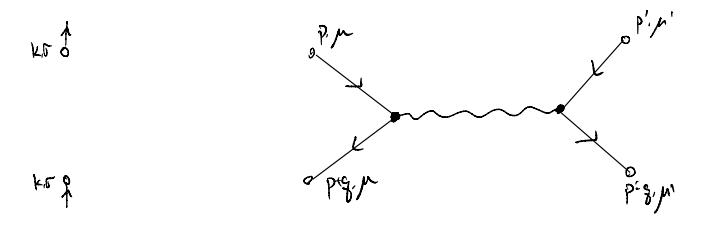

we "connect the dots" in all possible ways, as instructed by the Wick's theorem. All terms here will lead to, schematically, $\sim G\cdot G\cdot V\cdot G$, but the contraction can pair various internal indices and so some parts may get combined. Furthermore, we have to keep track of the sign and multiplicity factors (in our context, one sign change and one factor of $(2S+1)$ per fermion loop).

For instance, the rest of our terms become

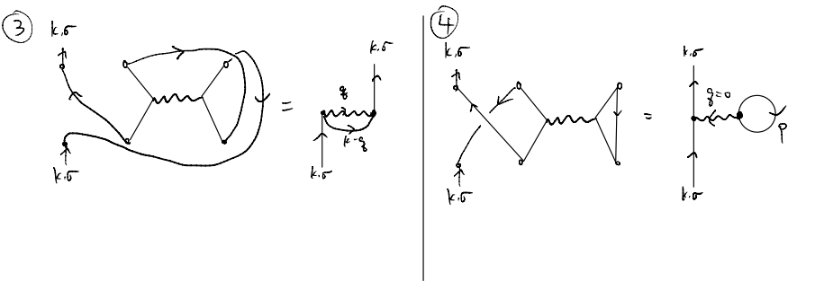

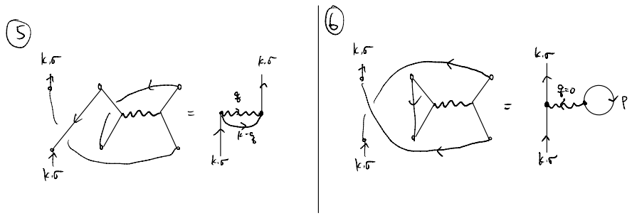

Combined, we see that these four diagrams, correspondingly initially to four distinct contraction patterns, actually give only two distinct terms. One could, and should, check that the prefactors and signs all agree, and as such we may write schematically that

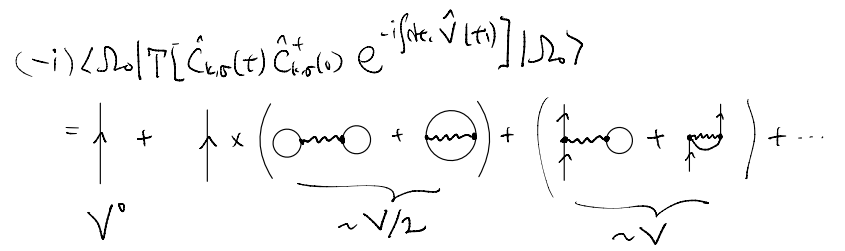

Now we may start to guess how the higher order terms look like. For instance, suppose we consider a $V^2$ term. We will begin by drawing what we ought to connect

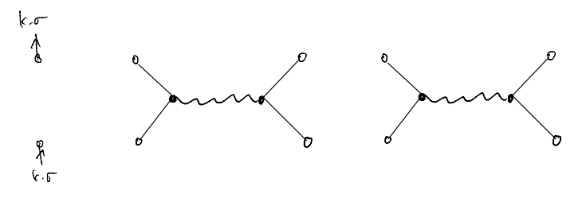

where we leave the internal variables implicit. For our current problem, we have $10$ "vertices" ($5$ for $\hat{c}$ and $5$ for $\hat{c}^\dagger$) to connect. For instance, one can have (skipping the directions)

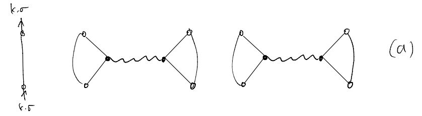

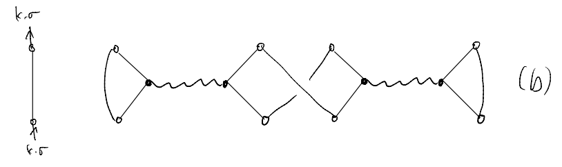

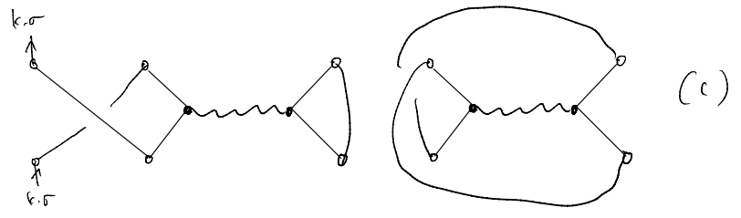

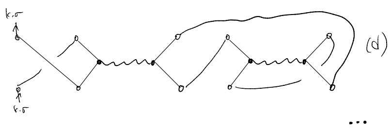

We may clean up the drawings and arrive at a more compact form

Now, instead of what we have been doing, namely, first consider all the possible contractions, one could as well start directly with the "compact" diagrams and ask the reverse question of what the corresponding contraction is, and how many contractions are there which will give the same diagram. This "reversed" approach is essentially called "Feynman diagrams", and the rules for converting the diagrams back to some integrals (corresponding to an actual term in the perturbative expansion) are called Feynman rules.

## Linked-cluster theorem

In this process, a question naturally arises: how do we organize the diagrams? So far, we have only considered the order-by-order expansion in powers of $V$. That, however, is not necessarily the best organization principle. Instead, we could notice that,

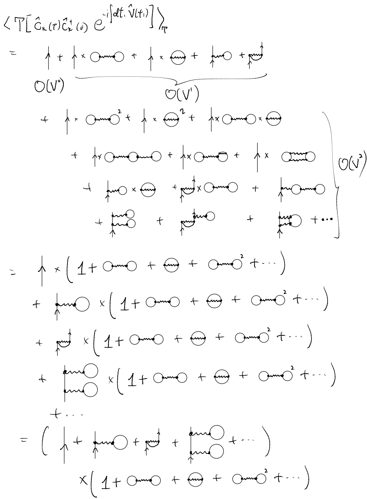

In other words, in our brute-force expansion, many of the diagrams actually consist of disconnected pieces. Out of these disconnected pieces, exactly one depends on the external variables. The rest are all "(linked) loops" and so whatever variables they carry are dummy and eventually integrated / summed over. As such, we see that it is natural to factor out the "linked-cluster" terms, which get multiplied to all possible ways of forming "disconnected clusters of loops" which do not depend on our external variables.

What are these "purely internal" diagrams? Remember, form Gell-Mann-Low, we see that the full propagator takes the form of

$$ \langle \Omega |\mathcal{T} \left[ \hat{c}_k\left( t \right) \hat{c}_{k}^{\dagger}\left( 0 \right) \right] |\Omega \rangle =\frac{\langle \Omega _0|\mathcal{T} \left[ \hat{c}_k\left( t \right) \hat{c}_{k}^{\dagger}\left( 0 \right) \exp \left( -i\int_{-\infty}^{\infty}{dt\hat{V}_I\left( t \right)} \right) \right] |\Omega _0\rangle}{\langle \Omega _0|\mathcal{T} \left[ \exp \left( -i\int_{-\infty}^{\infty}{dt\hat{V}_I\left( t \right)} \right) \right] |\Omega _0\rangle}$$

So far, we only focused on the numerator. Let us imagine performing the same kind of perturbative expansion for the denominator.

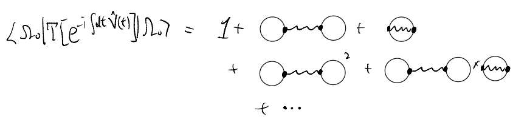

Diagrammatically, we see that we necessarily get what we have factored out above! This is almost a consequence of tautology: in the numerator, we factor out everything that is "purely internal", and the denominator is, indeed, "purely internal". On top of that, they follow the same set of contraction / diagram-drawing rules, and so they must look the same.

The only question, therefore, is whether or not all the details like signs and coefficients will exactly agree with each other. The answer is a reassuring yes, and we conclude

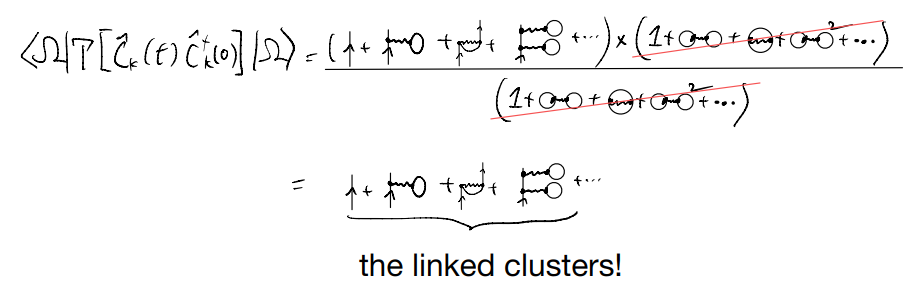

i.e., although we worried about how to properly count powers of $V$ given the cancellation from the denominator, this can be fixed by simply focusing on the diagrams which do not contain any disconnected pieces! This is called the linked-cluster theorem. Of course we only motivated why the linked-cluster theorem makes sense, and didn't actually prove it. There are usually two approaches to prove it:

1. Show that, indeed, these terms in the numerator and denominator cancel out with all the signs and factors agreeing with each other;
2. Go back to the statistics mechanics correspondence, in which the linked-cluster diagrams emerge naturally upon taking the log (and in the statistics mechanics context this is called the cumulant expansion)

In the interest of time, we will not prove it here (we are not in a position to do so anyway: the heuristic discussion above doesn't contain enough details to really establish the theorem). If you are interested, you can consult Coleman-7.2 for a cool argument along route(2), through introducing the generating functional and a replica trick for $\ln(S)$
