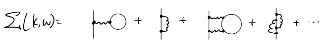
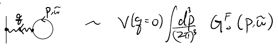
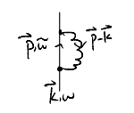
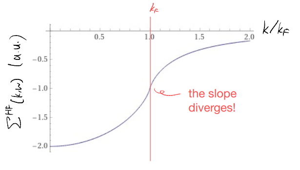
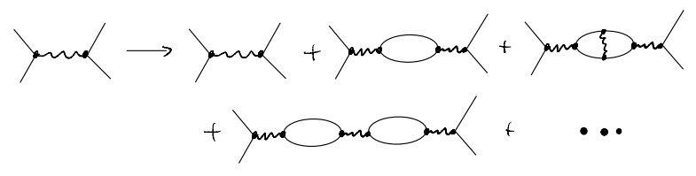
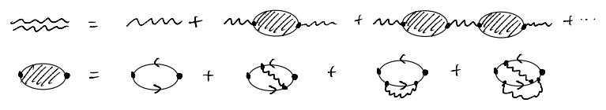
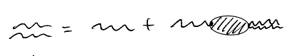
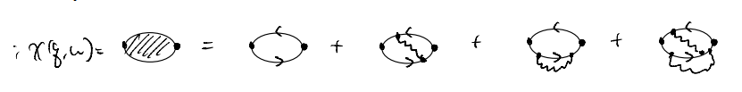
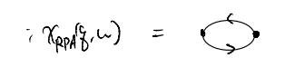
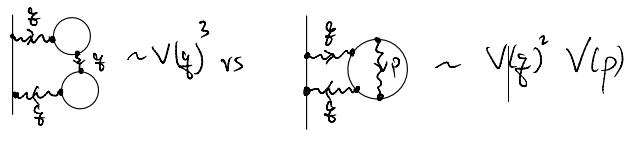

# lec19

:::{note}
This is **NOT** the official course PHYS5340 website yet!

* If you are student in this course, **always** take the lecture notes as the correct one if you find any differences between lecture notes and website contents
* If you are just passerby, use the materials below at your own risk. Since the website is still the first version (even alpha version), there could be some typos, incorrect/inaccurate/improper statements.
:::

:::{note}
**All** materials in this website are based on the course offered at HKUST
:::

:::{note}
As a "casual course", we provide only general references but not specific ones to the materials introduced
:::

:::{note}
**All** materials' copyright in this website are reserved for the course lecturer

* If you want to use the material somewhere, you might need to contact the lecturer first
:::

:::{note}
Contribution is always **welcome**. if you find any typo, incorrect/inaccurate/improper statements or necessary references, do not hesitate to

* raise an issue on github repo
* make an pull request on github repo
* contact me directly
:::

20220408

Topics

1. Jellium: positive background charge
2. Hartree-Fock (self-)energy
3. Dielectric function, effective interaction, and RPA

Goals

1. Putting our formalism to use
2. A first taste on physics of interacting electrons

Recall the jellium model Hamiltonian

$$ \hat{H}=\int{\frac{d^3p}{\left( 2\pi \right) ^3}\varepsilon _p\sum_{\sigma}{\hat{\psi}_{p\sigma}^{\dagger}\hat{\psi}_{p\sigma}}}+\frac{e^2}{2}\int{d^3rd^3r'\frac{:\left( \hat{\rho}\left( r \right) -\rho \left( 0 \right) \right) \left( \hat{\rho}\left( r' \right) -\rho \left( 0 \right) \right) :}{\left| r-r' \right|}}$$

in which we assumed the presence of a positive, neutralizing background uniform charge of $e\rho_0$ such that the Coulomb energy only depends on the variation of local charge density, and equals to zero when we replace $\left< \hat{\rho}\left( r \right) \right> \rightarrow \rho _0$. As the ground state is uniform (or, at least, we assume that is the case), it will be interesting to ask the following: is there an interaction energy in the ground state?

To answer this question, it will be helpful to first Fourier transform into the momentum space. Here we define

$$ \hat{\psi}_{r\sigma}^{\dagger}=\int{\frac{d^3k}{\left( 2\pi \right) ^3}\hat{\psi}_{k\sigma}^{\dagger}e^{-ikr}}$$

$$ \hat{\psi}_{k\sigma}^{\dagger}=\int{d^3r\hat{\psi}_{r\sigma}^{\dagger}e^{\,\,ikr}}$$

where we used the "plane-wave" normalization

$$ \int{d^3re^{ikr}}=\left( 2\pi \right) ^3\delta \left( k \right) $$

In momentum space, the density operator reads

$$ \hat{\rho}\left( r \right) =\int{\frac{d^3kd^3p}{\left( 2\pi \right) ^6}\sum_{\sigma}{\hat{\psi}_{k\sigma}^{\dagger}\hat{\psi}_{p\sigma}e^{-i\left( k-p \right) r}}}$$

and the number of electrons is

$$
\begin{align*}
    N_e&=\int{d^3r\hat{\rho}\left( r \right)}\\
    &=\int{d^3r\frac{d^3kd^3p}{\left( 2\pi \right) ^6}\sum_{\sigma}{\hat{\psi}_{k\sigma}^{\dagger}\hat{\psi}_{p\sigma}e^{-i\left( k-p \right) r}}}\\
    &=\int{\frac{d^3k}{\left( 2\pi \right) ^3}\sum_{\sigma}{\hat{\psi}_{k\sigma}^{\dagger}\hat{\psi}_{k\sigma}}}
\end{align*}
$$

$$ \hat{n}_k=\sum_{\sigma}{\hat{\psi}_{k\sigma}^{\dagger}\hat{\psi}_{k\sigma}}$$

The interaction term is now given by

$$
\begin{align*}
    \hat{V}&=\frac{e^2}{2}\int{d^3rd^3r':\left( \hat{\rho}\left( r \right) -\rho \left( 0 \right) \right) \left( \hat{\rho}\left( r' \right) -\rho \left( 0 \right) \right) :V\left( r-r' \right)}\\
    &=\frac{e^2}{2}\int{d^3rd^3r':\hat{\rho}\left( r \right) \hat{\rho}\left( r' \right) :V\left( r-r' \right)}^{{\color{red} \left( 1 \right) }}\\
    &\quad -e^2\rho _0\int{d^3rd^3r'\hat{\rho}\left( r \right) V\left( r-r' \right)}^{{\color{red} \left( 2 \right) }}+\frac{e^2\rho _{0}^{2}}{2}\int{d^3rd^3r'V\left( r-r' \right)}^{{\color{red} \left( 3 \right) }}
\end{align*}
$$

Let us look at these three terms one-by-one

$$
\begin{align*}
    {\color{red} \left( 1 \right) }=&\frac{e^2}{2}\int{d^3rd^3r'\frac{d^3kd^3pd^3k'd^3p'}{\left( 2\pi \right) ^{12}}}\\
    &\quad \times \sum_{\sigma \sigma '}{e^{-i\left( k-p \right) r}e^{-i\left( k'-p' \right) r}V\left( r-r' \right) :\hat{\psi}_{k\sigma}^{\dagger}\hat{\psi}_{p\sigma}\hat{\psi}_{k'\sigma '}^{\dagger}\hat{\psi}_{p'\sigma '}:}
\end{align*}
$$

Let $R=r+r'$ and $\delta _r=r-r'$

$$
\begin{align*}
    {\color{red} \left( 1 \right) }&=\frac{e^2}{16}\int{d^3Rd^3\delta _r\frac{d^3kd^3pd^3k'd^3p'}{\left( 2\pi \right) ^{12}}}\\
    &\quad \times \sum_{\sigma \sigma '}{e^{-i\left( k-p+k'-p' \right) R/2}e^{-i\left( k-p-k'+p' \right) \delta _r/2}V\left( \delta _r \right) :\hat{\psi}_{k\sigma}^{\dagger}\hat{\psi}_{p\sigma}\hat{\psi}_{k'\sigma '}^{\dagger}\hat{\psi}_{p'\sigma '}:}
\end{align*}
$$

Integrating over the center of mass $R$ gives

$$ \int{d^3Re^{-i\left( k-p+k'-p' \right) R/2}}=8\left( 2\pi \right) ^3\delta \left( k-p+k'-p' \right) $$

$$ \Rightarrow \begin{cases}
   k=p+q\\
   k'=p'-q\\
\end{cases}$$

$$ V\left( q \right) =\int{d^3\delta _rV\left( \delta _r \right) e^{-iq\delta _r}}$$

$$ {\color{red} \left( 1 \right) }=\frac{e^2}{2}\int{\frac{d^3pd^3p'd^3q}{\left( 2\pi \right) ^9}V\left( q \right) \sum_{\sigma \sigma '}{:\hat{\psi}_{p+q,\sigma}^{\dagger}\hat{\psi}_{p'-q,\sigma '}^{\dagger}\hat{\psi}_{p'\sigma '}\hat{\psi}_{p\sigma}:}}$$

It will be instructive to look at the piece contributed by $q=0$:

$$
\begin{align*}
    &\Rightarrow \frac{e^2}{2}\int{\frac{d^3pd^3p'}{\left( 2\pi \right) ^6}\frac{V\left( q=0 \right)}{\mathcal{V}}\sum_{\sigma \sigma '}{:\hat{\psi}_{p,\sigma}^{\dagger}\hat{\psi}_{p\sigma}\hat{\psi}_{p',\sigma '}^{\dagger}\hat{\psi}_{p'\sigma '}:}}\\
    & =\frac{e^2}{2}\frac{V\left( q=0 \right)}{\mathcal{V}}:\left( \int{\frac{d^3p}{\left( 2\pi \right) ^3}\hat{n}_p} \right) ^2:\\
    &=\frac{e^2}{2}V\left( q=0 \right) N_e\rho _0
\end{align*}
$$

$$
\begin{align*}
    {\color{red} \left( 2 \right) }&=-e^2\rho _0\int{d^3rd^3r'\frac{d^3kd^3p}{\left( 2\pi \right) ^6}\frac{\sum_{\sigma}{\hat{\psi}_{k\sigma}^{\dagger}\hat{\psi}_{p\sigma}e^{-i\left( k-p \right) r}}}{\left| r-r' \right|}}\\
    &=-8e^2\rho _0\int{d^3Rd^3\delta _r\frac{d^3kd^3p}{\left( 2\pi \right) ^6}\frac{\sum_{\sigma}{\hat{\psi}_{k\sigma}^{\dagger}\hat{\psi}_{p\sigma}e^{-i\left( k-p \right) R/2}e^{-i\left( k-p \right) \delta _r/2}}}{\left| \delta _r \right|}}\\
    &=-e^2\rho _0\int{\frac{d^3k}{\left( 2\pi \right) ^3}\sum_{\sigma}{\hat{\psi}_{k\sigma}^{\dagger}\hat{\psi}_{k\sigma}}}\int{d^3\delta _rV\left( \delta _r \right)}\\
    &=-e^2\rho _0N_eV\left( q=0 \right)
\end{align*}
$$

$$
\begin{align*}
    {\color{red} \left( 3 \right) }&=\frac{e^2\rho _{0}^{2}}{2}\int{d^3rd^3r'V\left( r-r' \right)}\\
    &=\frac{e^2\rho _{0}^{2}\mathcal{V}}{2}\int{d^3\delta _rV\left( \delta _r \right)}\\
    &=\frac{e^2\rho _0N_e}{2}V\left( q=0 \right)
\end{align*}
$$

Combined, we have

$$ {\color{red} \left( 2 \right) +\left( 3 \right) }=-\frac{e^2\rho _0N_e}{2}V\left( q=0 \right) $$

But this is, as anticipated, exactly the $q=0$ piece in ${\color{red} \left( 2 \right)}$. This gives

$$ \hat{V}=\frac{1}{2}\int{\frac{d^3pd^3p'd^3q}{\left( 2\pi \right) ^9}V^*\left( q \right) \sum_{\sigma \sigma '}{:\hat{\psi}_{p+q,\sigma}^{\dagger}\hat{\psi}_{p'-q,\sigma '}^{\dagger}\hat{\psi}_{p'\sigma '}\hat{\psi}_{p\sigma}:}}$$

where, using the Fourier transform of the Coulomb potential, we have

$$ V^*\left( q \right) =\begin{cases}
   \frac{4\pi e^2}{q^2},\quad \mathrm{if}\; q\ne 0\\
   0,\quad \mathrm{if}\; q=0\\
\end{cases}$$

In other words, the positive background charge precisely cancels the $q=0$ piece of the Coulomb potential. As we will soon see this is intuitive.

For simplicity, we simply write $V(q)$ instead of $V^*(q)$ in the following, with the understanding that the $q=0$ piece has been removed.

## Hartree-Fock (self-)energy

As an application of the perturbative theory we discussed, let's look at the self-energy of the electron in the jellium model.

As mentioned, the self-energy consist of all 1PI diagram

Keeping the lowest order contributions, we have only two terms:

$$ V\left( q=0 \right) \int{\frac{d^3p}{\left( 2\pi \right) ^3}G_{0}^{F}\left( p,\tilde{\omega} \right)}$$

But we have $V(q=0)=0$! In other words, this Hartree term vanishes identically in the jellium model. One way to phrase this is that, the positive background charges contribute a potential term which precisely cancel the Hartree term in the e-e interaction. (c.f. Coleman 7.7.1)

What about the Fock term? We have (restoring vector notation for clarity)

$$
\begin{align*}
    &=\int{\frac{d^3\vec{p}d\tilde{\omega}}{\left( 2\pi \right) ^4}\left( iV\left( \vec{p}-\vec{k} \right) \right) G_{0}^{F}\left( \vec{p},\tilde{\omega} \right) e^{i\omega 0^+}}\\
    &=\int{\frac{d^3\vec{p}d\tilde{\omega}}{\left( 2\pi \right) ^3}\frac{4\pi e^2}{\left( \vec{p}-\vec{k} \right) ^2}\int{\frac{d\tilde{\omega}}{2\pi}iG_{0}^{F}\left( \vec{p},\tilde{\omega} \right) e^{i\omega 0^+}}}\\
    &\quad \Downarrow iG_{0}^{F}\left( \vec{p},t\rightarrow 0^- \right) =\lim_{t\rightarrow 0^-} \left< \mathcal{T} \left[ \hat{c}_{\vec{p}}\left( t \right) \hat{c}_{\vec{p}}^{\dagger}\left( 0 \right) \right] \right> _0=-n_{\vec{p}}\\
    &=-\int{\frac{d^3\vec{p}d\tilde{\omega}}{\left( 2\pi \right) ^3}\frac{4\pi e^2}{\left( \vec{p}-\vec{k} \right) ^2}n_{\vec{p}}}\\
    &=-\frac{4\pi e^2}{\left( 2\pi \right) ^3}\int_0^{k_F}{p^2dp\int_0^{\pi}{\sin \theta d\theta \int_0^{2\pi}{d\phi \frac{1}{p^2+k^2-2pk\cos \theta}}}}\\
    &\quad \Downarrow u=\cos \theta \\
    &=-\frac{e^2}{\pi}\int_0^{k_F}{p^2dp\int_{-1}^1{\frac{du}{p^2+k^2-2pku}}}\\
    &=-\frac{e^2}{2\pi k}\int_0^{k_F}{dp\left( p\ln \frac{\left( k+p \right) ^2}{\left( k-p \right) ^2} \right)}\\
    &=-\frac{e^2}{\pi k}\int_0^{k_F}{dp\left( p\ln \left| \frac{k+p}{k-p} \right| \right)}\\
    &=-\frac{e^2k_F}{\pi}\left( 1+\frac{k_{F}^{2}-k^2}{2kk_F}\ln \left| \frac{k_F+k}{k_F-k} \right| \right)
\end{align*}
$$

$$ \left| \frac{k_F+k}{k_F-k} \right|\ge 1$$

As such, we have $\Sigma^{\text{HF}}(k,\omega)<0$, due to the Fock / exchange piece!

We might plot the self-energy as a function of $k$ (Plot by Wolfram alpha)

We can also compute the Hartree-Fock ground state energy. Recall, the full propagator is

$$ G\simeq \frac{1}{G_{0}^{-1}-\Sigma _{k}^{\mathrm{HF}}}=\frac{1}{\omega -\varepsilon _k-\Sigma _{k}^{\mathrm{HF}}+i\eta}$$

and so we could simply interpret the self-energy as an interaction correction to the dispersion. The ground state energy per particle is

$$ E=\frac{2\cdot 4\pi}{N_e}\int_0^{k_F}{\frac{dk}{\left( 2\pi \right) ^3}k^2\left( \varepsilon _k+\Sigma _{k}^{\mathrm{HF}} \right)}$$

Instead of computing this seriously (doable, just some integrals), let us simply compare the competition between the two terms.

First, the kinetic energy

$$ E_{\mathrm{kinetic}}\sim \frac{1}{N_e}\int_0^{k_F}{dk\left( \frac{k^4}{2m} \right)}\sim \frac{k_{F}^{5}}{N_e}$$

The number of electrons equals to the volume inside the Fermi surface, and so

$$ N_e\sim k_{F}^{3}\quad \Rightarrow E_{\mathrm{kinetic}}\sim K_{F}^{2}$$

In contrast, the exchange energy scales as

$$
\begin{align*}
    E_{\mathrm{ex}}&\sim -\frac{k_F}{N_e}\int_0^{k_F}{k^2dk\left( 1+\frac{k_{F}^{2}-k^2}{2kk_F}\ln \left| \frac{k_F+k}{k_F-k} \right| \right)}\\
    &=-\frac{k_{F}^{4}}{N_e}\int_0^1{dyy^2\left( 1+\frac{1-y^2}{2y}\ln \left| \frac{1+y}{1-y} \right| \right)}\\
    &\sim -\frac{k_{F}^{4}}{N_e}\\
    &\sim -k_F
\end{align*}
$$

The inverse of the Fermi wave vector is a length scale characterizing the inter-particle spacing (i.e., the density of the electrons), and this is typically parameterized by

$$ \frac{4\pi \left( r_sa_0 \right) ^3}{3}\rho _0=1$$

$$ \Rightarrow k_F\sim \frac{1}{r_sa_0}$$

where $a_0$ is the Bohr radius. In other words, $r_s$ is the radius, in terms of the Bohr radius, of a sphere containing one electron. A high density electron gas has a small $r_s$. This implies the ground state energy of the jellium model is, within the Hartree-Fock approximation

$$ E\simeq \frac{\#}{r_{s}^{2}}-\frac{\#1}{r_s}+\cdots $$

It turns out that, in the "standard" units, the energy is

$$ E\simeq \frac{2.2099}{r_{s}^{2}}-\frac{0.9163}{r_s}+\cdots $$

(c.f. Mahan Eq.(5.28)).

An important observation to make is that the kinetic energy dominates for small $r_s$! I.e., the interaction correction is small for a high-density gas. In contrast, at low density the interaction effects become more important.

## Dielectric function and RPA

After 5 lectures or so we are finally ready to tackle our "humble" motivating question: how do we compute the basic quantities of an interacting electronic system, like the dielectric function? Recall, the key insight is that the system could respond to the external perturbation and screen part of that. Such response leads to an effective dielectric function in the medium (restoring units for highlight)

$$ V\left( q \right) =\frac{e^2}{\varepsilon _0q^2}\rightarrow \frac{e^2}{\left( \varepsilon \varepsilon _0 \right) q^2}$$

Equivalently, we can also think of the response of the system as modifying the effective interaction between the elctrons. In our perturbative theory, such modification comes from processes like

Of course more distinct terms appear as we go to higher orders in the interaction strength. In the same spirit as the 1PI discussion, it makes sense to organize the diagrams as

such terms are called the "polarization bubble". Physically, they represent (virtual) processes in which electron-hole pairs emerge, interact, and then disappear. In fact, our "wavy line" could be recognized as the photon (although we didn't keep their dynamics in the theory), and such diagrams are simply the self-energy for the photon. correspondingly, we also have a Dyson's equation

$$ iV_{\mathrm{eff}}=iV+\left( iV \right) \left( i\chi \right) \left( iV_{\mathrm{eff}} \right) $$

$$ \Rightarrow V_{\mathrm{eff}}\left( q,\omega \right) =\frac{V\left( q \right)}{1+V\left( q \right) \chi \left( q,\omega \right)}$$

As with the earlier discussion on electron self-energy, we see that all the correction to the interaction has been encapsulated in the bubble

In the simplest approximation we simply drop all the higher order terms

this is called the "random phase approximation". Of course, in the way we introduced it, the approximation seems rather ad hoc. The name "RPA" is also quite mysterious. This can be better justified by

1. In the original treatment, the RPA was introduced by looking at the equation of motion and assuming certain terms with non-cancelling momentum average to zero. This is (?) the origin of the name "random phase" (I think??). See Mahan 5.5.2.
2. One can also ask more seriously which terms in the electronic self-energy, at every order of interaction $V$, diverges most significantly with the Coulomb potential. E.g., compare
   
   from this analysis, the key divergence comes from terms with the maximal number of interaction depending on one single momentum $q\to 0$. I.e., in the polarization bubble we ignore diagrams with wavy lines featuring internal momentum. This corresponds to the RPA (discussed in a seminal paper by Gell-Mann and Brueckner)
3. From yet another angle, the RPA can also be justified as the exact (mean-field) result in the large-$N$ limit, if we promote the "flavor" symmetry of the electron from $SU(2)\to SU(N)$: recall each fermion loop corresponds to a trace over the spin indices. At the same order of $V$, diagrams with the maximum number of fermion loops dominate in the large-$N$ limit. This again implies the RPA approximation.

In any case, within the RPA and for the Coulomb potential, we have

$$ V_{\mathrm{eff}}\left( q,\omega \right) =\frac{V\left( q \right)}{1+V\left( q \right) \chi _{\mathrm{RPA}}\left( q,\omega \right)}=\frac{4\pi e^2}{q^2\left( 1+\frac{4\pi e^2}{q^2}\chi _{\mathrm{RPA}}\left( q,\omega \right) \right)}$$

$$ \varepsilon _{\mathrm{RPA}}=1+\frac{4\pi e^2}{q^2}\chi _{\mathrm{RPA}}\left( q,\omega \right) $$
