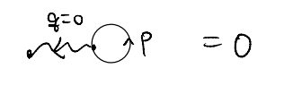
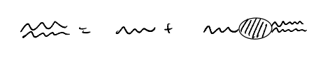
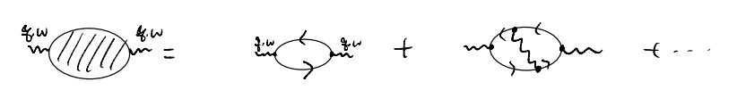
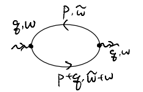
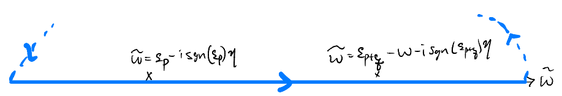
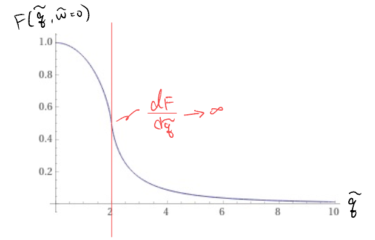

# lec20

:::{note}
This is **NOT** the official course PHYS5340 website yet!

* If you are student in this course, **always** take the lecture notes as the correct one if you find any differences between lecture notes and website contents
* If you are just passerby, use the materials below at your own risk. Since the website is still the first version (even alpha version), there could be some typos, incorrect/inaccurate/improper statements.
:::

:::{note}
**All** materials in this website are based on the course offered at HKUST
:::

:::{note}
As a "casual course", we provide only general references but not specific ones to the materials introduced
:::

:::{note}
**All** materials' copyright in this website are reserved for the course lecturer

* If you want to use the material somewhere, you might need to contact the lecturer first
:::

:::{note}
Contribution is always **welcome**. if you find any typo, incorrect/inaccurate/improper statements or necessary references, do not hesitate to

* raise an issue on github repo
* make an pull request on github repo
* contact me directly
:::

20220420

Topics

1. Jellium in RPA, Lindhard function
2. Screening
3. Plasmon

Goals

1. Computing the dielectric function in RPA
2. Appreciating how screening and plasmons in metals arise in our formalism

## RPA: recap

Let us recap what we last considered before the one-week break. We consider the electrons in 3D continuum space interacting with the "neutralized" Coulomb

$$ \hat{V}=\frac{1}{2}\int{\frac{d^3pd^3p'd^3q}{\left( 2\pi \right) ^9}V\left( q \right) :\hat{\psi}_{p+q,\sigma}^{\dagger}\hat{\psi}_{p'-q,\sigma '}^{\dagger}\hat{\psi}_{p'\sigma '}\hat{\psi}_{q\sigma}:}$$

$$ V\left( q \right) =\begin{cases}
   \frac{4\pi e^2}{q^2},\quad \mathrm{if}\; q\ne 0\\
   0,\quad \mathrm{if}\; q=0\\
\end{cases}$$

where $V(q=0)=0$ follows from the cancellation from the uniform positive background, and corresponding the Hartree term

We motivated the RPA by asking how we might incorporate screening into our evaluation of the (finite-frequency) dielectric function. This could be understood by considering the Dyson's equation for the "photon"

$$ V_{\mathrm{eff}}\left( q,\omega \right) =\frac{V\left( q \right)}{1+V\left( q \right) \chi \left( q,\omega \right)}$$

$$ i\chi \left( q,\omega \right) =i\chi _{\mathrm{RPA}}\left( q,\omega \right) +\cdots $$

Our main task for "performing the RPA" is, therefore, to evaluate

$$
\begin{align*}
    i\chi _{\mathrm{RPA}}\left( q,\omega \right) &=-\int{\frac{d\tilde{\omega}}{2\pi}\int{\frac{d^3p}{\left( 2\pi \right) ^3}\sum_{\sigma}{G_{\sigma}\left( p+q,\tilde{\omega}+\omega \right) G_{\sigma}\left( p,\tilde{\omega} \right)}}}\\
    &=-\left( 2S+1 \right) \int{\frac{d\tilde{\omega}d^3p}{\left( 2\pi \right) ^4}\frac{1}{\omega +\tilde{\omega}-\varepsilon _{p+q}+i\eta _{p+q}}\frac{1}{\tilde{\omega}-\varepsilon _p+i\eta _p}e^{i\tilde{\omega}0^+}}
\end{align*}
$$

We could perform the frequency integral by noticing the function contains two poles, and closing the contour in the upper complex plane

In particular, we enclose the poles only if they correspond to "hole" excitations (which live in the upper complex plane), i.e., the pole contribution in proportional to $n_k$:

$$ i\chi _{\mathrm{RPA}}\left( q,\omega \right) =-\left( 2S+1 \right) \frac{2\pi i}{2\pi}\int{\frac{d^3p}{\left( 2\pi \right) ^3}\left( \frac{n_{\vec{p}}}{\omega +\varepsilon _{\vec{p}}-\varepsilon _{\vec{p}+\vec{q}}}+\frac{n_{\vec{p}+\vec{q}}}{\varepsilon _{\vec{p}+\vec{q}}-\omega -\varepsilon _{\vec{p}}} \right)}$$

$$ \Rightarrow \chi _{\mathrm{RPA}}\left( q,\omega \right) =\left( 2S+1 \right) \int{\frac{d^3p}{\left( 2\pi \right) ^3}\frac{n_{\vec{p}}-n_{\vec{p}+\vec{q}}}{\varepsilon _{\vec{p}+\vec{q}}-\varepsilon _{\vec{p}}-\omega}}$$

Note that we have, with a sleight of hand, dropped the $i\eta$ factors. More later.

The integral above is called Lindhard function. Its evaluation is very similar to what we have seen for the Fock / exchange self-energy:

$$
\begin{align*}
    \chi _{\mathrm{RPA}}\left( q,\omega \right) &=\left( 2S+1 \right) \int{\frac{d^3p}{\left( 2\pi \right) ^3}\left( \frac{n_{\vec{p}}}{\varepsilon _{\vec{p}+\vec{q}}-\varepsilon _{\vec{p}}-\omega}-\frac{n_{\vec{p}}}{\varepsilon _{\vec{p}}-\varepsilon _{\vec{p}-\vec{q}}-\omega} \right)}\\
    &=\frac{2S+1}{\left( 2\pi \right) ^3}\int_0^{k_F}{dp\int_0^{\pi}{d\theta p^2\sin \theta \int_0^{2\pi}{d\phi}}}\\
    &\quad \times \left( \frac{2m}{q^2+2pq\cos \theta -2m\omega}-\frac{2m}{2pq\cos \theta -q^2-2m\omega} \right)
\end{align*}
$$

$$ \int_0^{\pi}{d\theta \sin \theta \frac{1}{a+b\cos \theta}}=\int_{-1}^1{du\frac{1}{a+bu}}=\frac{1}{b}\ln \left( \frac{a+bu}{a-bu} \right) $$

$$
\begin{align*}
    \chi _{\mathrm{RPA}}\left( q,\omega \right) &=\frac{2S+1}{4\pi ^2}\int_0^{k_F}{dp\frac{p^2m}{pq}\left[ \ln \left( \frac{-2m\omega +q^2+2pq}{-2m\omega +q^2-2pq} \right) -\ln \left( \frac{-2m\omega -q^2+2pq}{-2m\omega -q^2-2pq} \right) \right]}\\
    &=\frac{\left( 2S+1 \right) mk_F}{4\pi ^2\tilde{q}}\int_0^1{d\tilde{p}\tilde{p}\left[ \ln \left( \frac{-\tilde{\omega}/\tilde{q}+\tilde{q}+2\tilde{p}}{-\tilde{\omega}/\tilde{q}+\tilde{q}-2\tilde{p}} \right) -\ln \left( \frac{-\tilde{\omega}/\tilde{q}-\tilde{q}+2\tilde{p}}{-\tilde{\omega}/\tilde{q}-\tilde{q}-2\tilde{p}} \right) \right]}
\end{align*}
$$

$$ \tilde{p}=\frac{p}{k_F},\tilde{q}=\frac{q}{k_F},\tilde{\omega}=\frac{\omega}{k_{F}^{2}/2m}$$

$$
\begin{align*}
    \int_0^1{dxx\ln \left( \frac{a+x}{a-x} \right)}&=\left. \frac{x^2}{2}\ln \left( \frac{a+x}{a-x} \right) \right|_{0}^{1}-\int_0^1{\frac{x^2}{2}\frac{2a}{a^2-x^2}dx}\\
    &=\frac{1}{2}\ln \left( \frac{a+1}{a-1} \right) +a\int_0^1{\left( 1-\frac{a^2}{a^2-x^2} \right) dx}\\
    &=\frac{1}{2}\ln \left( \frac{a+1}{a-1} \right) +a-\frac{a^2}{2}\int_0^1{\left( \frac{1}{a+x}+\frac{1}{a-x} \right) dx}\\
    &=\frac{1}{2}\ln \left( \frac{a+1}{a-1} \right) +a-\frac{a^2}{2}\left. \ln \left( \frac{a+x}{a-x} \right) \right|_{0}^{1}\\
    &=\frac{1}{2}\left( 1-a^2 \right) \ln \left( \frac{a+1}{a-1} \right) +a
\end{align*}
$$

$$ \chi _{\mathrm{RPA}}\left( q,\omega \right) =\frac{\left( 2S+1 \right) mk_F}{4\pi ^2\tilde{q}}\left( a_++\frac{1}{2}\left( 1-a_{+}^{2} \right) \ln \left( \frac{a_++1}{a_+-1} \right) -\left( a_+\leftrightarrow a_- \right) \right) $$

$$ a_{\pm}=\pm \frac{\tilde{q}}{2}-\frac{\tilde{\omega}}{2\tilde{q}}$$

The prefactor could be simplified further using the 3D density of states (per spin)

$$
\begin{align*}
    N_0&=\left. \frac{d}{d\varepsilon _k}\left( \frac{4\pi}{3}\frac{\left( 2m\varepsilon _k \right) ^{3/2}}{\left( 2\pi \right) ^3} \right) \right|_{k=k_F}\\
    &=2\pi \left( \frac{\sqrt{2m}}{2\pi} \right) ^3\sqrt{\varepsilon _{k_F}}\\
    &=\frac{2mk_F}{4\pi ^2};\quad \varepsilon _k=\frac{k^2}{2m}
\end{align*}
$$

$$
\begin{align*}
    \chi _{\mathrm{RPA}}\left( q,\omega \right) &=\frac{\left( 2S+1 \right) N_0}{2\tilde{q}}\left( \frac{1}{2}\left( 1-a_{+}^{2} \right) \ln \left( \frac{a_++1}{a_+-1} \right) -\left( a_+\leftrightarrow a_- \right) +\tilde{q} \right) \\
    &=\left( 2S+1 \right) N_0F\left( \tilde{q},\tilde{\omega} \right)
\end{align*}
$$

$$ F\left( \tilde{q},\tilde{\omega} \right) =\frac{1}{4\tilde{q}}\left( 1-a_{+}^{2} \right) \ln \left( \frac{a_++1}{a_+-1} \right) -\left( a_+\leftrightarrow a_- \right) +\frac{1}{2}$$

The function $F(\tilde{q},\tilde{\omega})$ is known as the Lindhard function. Let us first consider its static limit

$$ \lim_{\omega \rightarrow 0} a_{\pm}=\lim_{\omega \rightarrow 0} \left( \pm \frac{\tilde{q}}{2}-\frac{\tilde{\omega}}{2\tilde{q}} \right) =\pm \frac{\tilde{q}}{2}$$

$$
\begin{align*}
    F\left( \tilde{q},\tilde{\omega}=0 \right) &=\frac{1}{4\tilde{q}}\left( 1-\frac{\tilde{q}^2}{4} \right) \left[ \ln \left( \frac{\tilde{q}+2}{\tilde{q}-2} \right) -\ln \left( \frac{-\tilde{q}+2}{-\tilde{q}-2} \right) \right] +\frac{1}{2}\\
    &=\frac{1}{2\tilde{q}}\left( 1-\frac{\tilde{q}^2}{4} \right) \ln \left| \frac{\tilde{q}+2}{\tilde{q}-2} \right|+\frac{1}{2}
\end{align*}
$$

Notice that, this time, we have a singularity at $\tilde{q}=2 \Rightarrow q=2k_F$ when the absolute value inside the log changes sign. We may plot it (the following by Wolfram alpha)

More generally, we obtain the RPA result for the dielectric function

$$ V_{\mathrm{eff}}\left( q,\omega \right) =\frac{V\left( q \right)}{1+V\left( q \right) \chi _{\mathrm{RPA}}\left( q,\omega \right)}=\frac{1}{\varepsilon _{\mathrm{RPA}}\left( q,\omega \right)}V\left( q \right) $$

$$
\begin{align*}
    \Rightarrow \varepsilon _{\mathrm{RPA}}\left( q,\omega \right) &=1+V\left( q \right) \chi _{\mathrm{RPA}}\left( q,\omega \right) \\
    &=1+\frac{4\pi e^2}{q^2}\left( 2S+1 \right) N_0F\left( \frac{q}{k_F},\frac{\omega}{k_{F}^{2}/2m} \right)
\end{align*}
$$

## Screening

One interesting observation now is that, in the static limit,

$$ \lim_{q\rightarrow 0} \varepsilon _{\mathrm{RPA}}\left( q,\omega =0 \right) =\lim_{q\rightarrow 0} \left( 1+\frac{4\pi e^2}{q^2}\left( 2S+1 \right) N_0F\left( \frac{q}{k_F},\frac{\omega}{k_{F}^{2}/2m} \right) \right) \rightarrow +\infty $$

such divergence of the dielectric constant is characteristic of a metal, in which the charges always move to shield the interior from any possible external, static electric field. The picture may be clearer if we instead consider the effective interaction

$$
\begin{align*}
    V_{\mathrm{eff}}\left( q,\omega =0 \right) &\stackrel{\text{RPA}}{=}\frac{V\left( q \right)}{1+V\left( q \right) \left( 2S+1 \right) N_0F\left( \frac{q}{k_F},0 \right)}\\
    &=\frac{4\pi e^2}{q^2+4\pi e^2\left( 2S+1 \right) N_0F\left( \frac{q}{k_F},0 \right)}\\
    &\stackrel{q\to 0}{\approxeq}\frac{4\pi e^2}{q^2+k^2}
\end{align*}
$$

We may Fourier transform back to the real space, which gives (c.f. PS4)

$$ V_{\mathrm{eff}}^{\mathrm{static}}\stackrel{\text{RPA}}{=}\frac{e^2e^{-kr}}{r}$$

and we could interpret $k^{-1}=\frac{1}{\sqrt{4\pi e^2\left( 2S+1 \right) N_0}}$ as the length scale characterizing the screening of any stray charges in the metal. This is known as the Thomas-Fermi screening length.

## Plasmon

As a second interesting observation, we consider the other order of the limits, in which we first send $q\to 0$ and keep $\omega$ finite. This order of limit might be considered by expanding the integrand directly

$$
\begin{align*}
    \chi ^{\mathrm{RPA}}\left( q,\omega \right) &=\frac{\left( 2S+1 \right) N_0}{2\tilde{q}}\int_0^1{d\tilde{p}\tilde{p}\left[ \ln \left( \frac{-\tilde{\omega}/\tilde{q}+\tilde{q}+2\tilde{p}}{-\tilde{\omega}/\tilde{q}+\tilde{q}-2\tilde{p}} \right) -\ln \left( \frac{-\tilde{\omega}/\tilde{q}-\tilde{q}+2\tilde{p}}{-\tilde{\omega}/\tilde{q}-\tilde{q}-2\tilde{p}} \right) \right]}\\
    &=\frac{\left( 2S+1 \right) N_0}{2\tilde{q}}\int_0^1{d\tilde{p}\tilde{p}\ln \left( \frac{\left( \tilde{\omega}/\tilde{q} \right) ^2-\left( \tilde{q}+2\tilde{p} \right) ^2}{\left( \tilde{\omega}/\tilde{q} \right) ^2-\left( \tilde{q}-2\tilde{p} \right) ^2} \right)}\\
    &\Downarrow \omega \ne 0;q\rightarrow 0\\
    &=\frac{\left( 2S+1 \right) N_0}{2}\int_0^1{d\tilde{p}\tilde{p}\left( -\frac{8\tilde{p}\tilde{q}^2}{\tilde{\omega}^2}+O\left( \tilde{q}^4 \right) \right)}\\
    &\approx -\frac{4\left( 2S+1 \right) N_0}{3}\frac{\tilde{q}^2}{\tilde{\omega}^2}+O\left( \tilde{q}^4 \right) \\
    &=-\frac{4\left( 2S+1 \right) N_0}{3}\frac{q^2}{k_{F}^{2}\omega ^2}\frac{k_{F}^{4}}{4m^2}+O\left( \tilde{q}^4 \right) \\
    &=-\frac{\left( 2S+1 \right) k_{F}^{2}}{3m}\frac{mk_F}{2\pi ^2}\frac{q^2}{m\omega ^2}+O\left( \tilde{q}^4 \right) \\
    &=-n_0\frac{q^2}{m\omega ^2}+O\left( \tilde{q}^4 \right)
\end{align*}
$$

$$ n_0=\frac{\left( 2S+1 \right)}{\left( 2\pi \right) ^3}\frac{4}{3}\pi k_{F}^{3}$$

where $n_0$ is the electron density. This gives the dielectric function

$$ \lim_{q\rightarrow 0} \varepsilon _{\mathrm{RPA}}\left( q,\omega \right) =1+\frac{4\pi e^2}{q^2}\left( -n_0\frac{q^2}{m\omega ^2}+O\left( \tilde{q}^4 \right) \right) =1-\frac{\omega _{p}^{2}}{\omega ^2}\left( 1+O\left( q^2 \right) \right) $$

where

$$ \omega _p=\sqrt{\frac{4\pi e^2n_0}{m}}$$

is the plasma frequency. This characterizes the time it takes for the electrons to respond to an oscillating electric field: while they screen stray charges completely in the static limit, such screening is ineffective when the field is changing at frequencies $\omega > \omega_p$ such that the electron distribution is not able to follow.

To get a more physical sense, let us try to put in some numbers. First we go from the CGS-ESU units to SI:

$$ \omega _p=\sqrt{\frac{4\pi e^2n_0}{m}}\rightarrow \sqrt{\frac{e^2n_0}{\varepsilon _0m}}$$

As an example, consider sodium

$$ \begin{cases}
   n_0=2.65\times 10^{22}cm^{-3}=2.65\times 10^{28}m^{-3}\\
   m=1.06m_e=9.656\times 10^{-31}kg\\
\end{cases}$$

and putting in

$$ \begin{cases}
   e^2/\varepsilon _0=0.29\times 10^{-26}kgm^3s^{-2}\\
   \hbar =6.58\times 10^{-16}eV\cdot s^{-1}\\
\end{cases}$$

We find

$$ \hbar \omega _p=5.87eV$$

In comparison, the visible spectrum is around $\sim 1.6-3.3 eV$. This explains why metals are shiny: visible light is not oscillating fast enough to penetrate, and it gets reflected.
