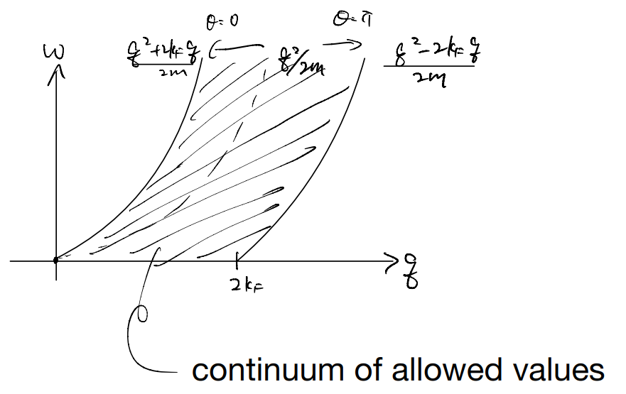
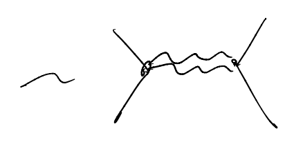
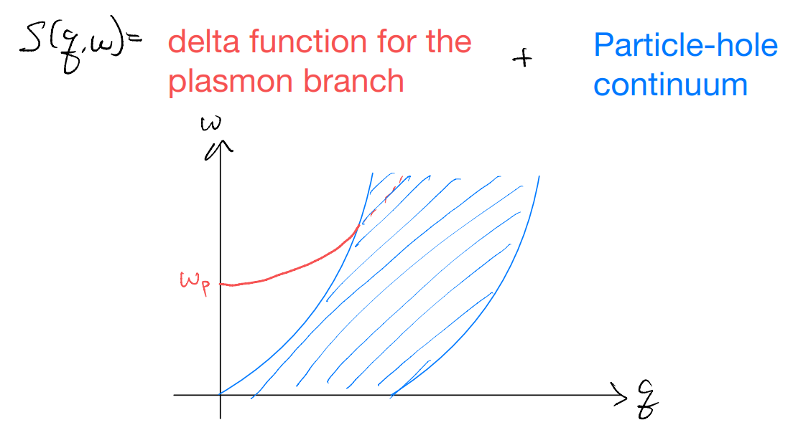

# lec21

:::{note}
This is **NOT** the official course PHYS5340 website yet!

* If you are student in this course, **always** take the lecture notes as the correct one if you find any differences between lecture notes and website contents
* If you are just passerby, use the materials below at your own risk. Since the website is still the first version (even alpha version), there could be some typos, incorrect/inaccurate/improper statements.
:::

:::{note}
**All** materials in this website are based on the course offered at HKUST
:::

:::{note}
As a "casual course", we provide only general references but not specific ones to the materials introduced
:::

:::{note}
**All** materials' copyright in this website are reserved for the course lecturer

* If you want to use the material somewhere, you might need to contact the lecturer first
:::

:::{note}
Contribution is always **welcome**. if you find any typo, incorrect/inaccurate/improper statements or necessary references, do not hesitate to

* raise an issue on github repo
* make an pull request on github repo
* contact me directly
:::

20220422

Topics

1. Last words on Jellium: particle-hole excitations
2. Finite temperature: imaginary time, thermal Green's functions

Goals

1. Connecting the dielectric function to collective excitations
2. Appreciating the (striking) similarity between zero and finite temperature physics

## Complex dielectric function and particle-hole excitations

In the last class, we have treated the frequency $\omega$ as a real number when we interpret the results for the dielectric function. There is, however, an important subtlety which we glossed over: as reasoned earlier, physical observables correspond to retarded Green's functions, whereas Gell-Mann-Loww and its associated diagrammatic expansion gives us the time-ordered Green's functions. The two are related by an analytic continuation

$$ \chi ^{\mathrm{ret}}\left( q,\omega \right) =\lim_{\delta \rightarrow 0^+} \chi ^T\left( q,\omega +i\delta \right) $$

which guarantees that, in the spectral decomposition, we shift all the poles to the negative complex plane and therefore respects causality when Fourier transformed back to real time. Correspondingly, in the above we have implicitly focused only on the real part of the true RPA dielectric function. The full expression should have been

$$ \varepsilon _{\mathrm{RPA}}\left( q,\omega \right) =1+\frac{4\pi e^2}{q^2}\left( 2S+1 \right) N_0\lim_{\delta \rightarrow 0^+} F\left( \frac{q}{k_F},\frac{\omega +i\delta}{k_{F}^{2}/2m} \right) $$

One could anticipate a nontrivial imaginary part given the branch cuts associated with the natural log in the Lindhard function. Instead of analyzing the function directly, however, it is a bit less tedious to revert back to the integral itself:

$$  \chi _{\mathrm{RPA}}^{\mathrm{ret}}\left( q,\omega \right) =\lim_{\delta \rightarrow 0^+} \left( 2S+1 \right) \int{\frac{d^3\vec{p}}{\left( 2\pi \right) ^3}\frac{n_{\vec{p}}-n_{\vec{p}+\vec{q}}}{\varepsilon _{\vec{p}+\vec{q}}-\varepsilon _{\vec{p}}-\omega -i\delta}}$$

we again use the "Cauchy-Dirac" relation

$$ \lim_{\delta \rightarrow 0^+} \frac{1}{x-i\delta}=P\frac{1}{x}+i\pi \delta \left( x \right) $$

to tease out the imaginary part

$$
\begin{align*}
    \Im \left[ \chi _{\mathrm{RPA}}^{\mathrm{ret}}\left( q,\omega \right) \right] &=\pi \left( 2S+1 \right) \int{\frac{d^3\vec{p}}{\left( 2\pi \right) ^3}\left( n_{\vec{p}}-n_{\vec{p}+\vec{q}} \right) \delta \left( \varepsilon _{\vec{p}+\vec{q}}-\varepsilon _{\vec{p}}-\omega \right)}\\
    &=\frac{2S+1}{4\pi}\int_0^{k_F}{dp\int_0^{\pi}{d\theta p^2\sin \theta}}\\
    &\quad \times \left[ \delta \left( \omega -\left( \varepsilon _{\vec{p}+\vec{q}}-\varepsilon _{\vec{p}} \right) \right) -\delta \left( \omega -\left( \varepsilon _{\vec{p}}-\varepsilon _{\vec{p}-\vec{q}} \right) \right) \right]
\end{align*}
$$

the delta functions could be interpreted as a density of states of the particle-hole excitations. The energy is

$$ \varepsilon _{\vec{p}+\vec{q}}-\varepsilon _{\vec{p}}=\frac{2pq\cos \theta +q^2}{2m}$$

$$ \varepsilon _{\vec{p}}-\varepsilon _{\vec{p}-\vec{q}}=\frac{2pq\cos \theta -q^2}{2m}$$

with $\vec{p}$ restricted inside the Fermi sea. It is helpful to try plotting the "dispersion"

To really relate to the excitation energies in the electron gas, we recall the two-particle Green's function / density-density response function

$$ \Theta \left( t \right) \left< \left[ \hat{\rho}\left( t \right) ,\hat{\rho}\left( 0 \right) \right] \right> $$

and its spectral function is

$$ S\left( q,\omega \right) =-\frac{q^2}{4\pi e^2n_0}\Im \left[ \frac{1}{\varepsilon ^{\mathrm{ret}}\left( q,\omega \right)} \right] $$

(c.f. Mahan Eqs.(5.111)-(5.119) for a derivation)

Writing the dielectric function as

$$ \varepsilon ^{\mathrm{ret}}\left( q,\omega \right) =\varepsilon _1\left( q,\omega \right) +i\varepsilon _2\left( q,\omega \right) $$

$$ \Rightarrow S\left( q,\omega \right) =\frac{q^2}{4\pi e^2n_0}\frac{\varepsilon _2\left( q,\omega \right)}{\varepsilon _{1}^{2}\left( q,\omega \right) +i\varepsilon _{2}^{2}\left( q,\omega \right)}$$

This suggests the excitation spectral function is non-zero precisely when $\varepsilon _2\left( q,\omega \right) \sim \Im \left[ \chi _{\mathrm{RPA}}^{\mathrm{ret}}\left( q,\omega \right) \right] $ is non-zero. But there is a catch: the expression above is ill-defined when both $\varepsilon_1$ and $\varepsilon_2$ vanish. This happens when we hit the plasmon frequency, for which $\varepsilon_1=0$ in a region with $\varepsilon_2=0$. More concretely,

$$ \lim_{q\rightarrow 0} \varepsilon _1\left( q,\omega \right) =1-\frac{\omega _{p}^{2}}{\omega ^2}\left( 1+\#q^2 \right) =0$$

$$
\begin{align*}
    \Rightarrow \omega &=\omega _p\sqrt{1+\#q^2}\\
    &=\omega _p\left( 1+\frac{\#}{2}q^2+\cdots \right)
\end{align*}
$$

Along this plasmon branch, we have

$$ \lim_{\delta \rightarrow 0^+} \Im \left[ \frac{1}{\varepsilon _{\mathrm{RPA}}\left( q,\omega +i\delta \right)} \right] =\lim_{\delta \rightarrow 0^+} \Im \left[ \frac{1}{\varepsilon _1\left( q,\omega \right) +i\delta} \right] =-\pi \delta \left( \varepsilon _1\left( q,\omega \right) \right) $$

and so, schematically, we have

(c.f. Coleman Fig-7.8 for a fancier color plot)

Notice that the spectral isolation of the plasmon is critical for its identity as a well-defined excitation: otherwise, it can readily decay into lower-energy particle-hole excitations. This indeed happens at higher momentum when it merges with the continuum.

This concludes our discussion for the dielectric function of an interacting electron gas (in RPA). Let us just remark that we have barely scratched the surface: for instance, instead of simply considering the EM scalar potential one could have considered the more complete discussion with the vector potential, and consider current-current response functions. What we discussed corresponds only to what is called the "longitudinal dielectric function".

Along another direction, one can naturally ask how one might improve beyond the RPA. C.f. Mahan Chapter-5 for a detailed discussions on the more popular schemes.

## Turning the heat on: finite temperature as imaginary time

So far, we have focused quite exclusively on the quantum many-body ground state, which one could argue capture the physics at temperature $T=0$. As our last topic on perturbative quantum many-body theory, we go back to the physical reality of a finite-temperature problem.

Before we go into the details, let us highlight two "conclusions":

1. The finite-temperature calculation is not any harder
2. The repeatedly mentioned "Statistics Mechanics" correspondence will become clearer

Let us recall some quantum Statistics mechanics. Given a Hamiltonian $\hat{H}$, an inverse temperature $\beta=\frac{1}{k_BT}$, the expectation value of an observable $\hat{O}$ is

$$ \left< \hat{O} \right> =\mathrm{Tr}\left( \hat{O}\hat{\rho} \right) =\frac{\mathrm{Tr}\left( \hat{O}e^{-\beta \hat{H}} \right)}{\mathrm{Tr}\left( e^{-\beta \hat{H}} \right)}$$

In particular, the partition function

$$ \mathcal{Z} =\mathrm{Tr}\left( e^{-\beta \hat{H}} \right) =\mathrm{Tr}\left( e^{-i\left( -i\beta \right) \hat{H}} \right) =\mathrm{Tr}\left( \hat{U}\left( -i\beta \right) \right) $$

can be recognized as the trace of the time-evolution operator $\hat{U}$ (in the Schrodinger picture), but with an imaginary time $-i\beta$.

In this notation, the expectation value is simply

$$ \left< \hat{O} \right> =\frac{\mathrm{Tr}\left[ \hat{O}\hat{U}\left( -i\beta \right) \right]}{\mathrm{Tr}\left[ \hat{U}\left( -i\beta \right) \right]}$$

as we mentioned earlier, this is very similar in form to the Gell-Mann-Low formula, with the key differences

1. S matrix (evolution in the interaction picture) vs $\hat{U}\sim e^{-i\hat{H}t}$
2. evaluating the ground-state expectation value with respect to the unperturbed ground state vs trace
3. infinite time $t:-\infty\to +\infty$ vs $t:0\to -i\beta$

This suggests the following modifications are needed in order to tackle finite temperature

1. We should reconsider the Schrodinger vs Heisenberg vs interaction picture with imaginary time
2. We should replace our definition of expectation value by the thermal one
3. We should consider a finite imaginary time interval

Let us consider these one by one. (Essentially following Coleman)

## Schrodinger vs Heisenberg vs Interaction with finite temperature

Starting with the Schrodinger equation

$$ i\partial _t|\Psi \left( t \right) \rangle =\hat{H}|\Psi \left( t \right) \rangle $$

we now consider imaginary time by a change of variable

$$ \tau =it\quad \Rightarrow \quad -\partial _{\tau}|\Psi \left( t \right) \rangle =\hat{H}|\Psi \left( t \right) \rangle $$

This is still solved, formally, by

$$ |\Psi \left( t \right) \rangle =e^{-\hat{H}\tau}|\Psi \left( 0 \right) \rangle $$

Accordingly, to go to the Heisenberg picture, we instead keep the state fixed and ascribe the dynamics to that of the operators:

$$ \hat{O}_H\left( \tau \right) =e^{\hat{H}\tau}\hat{O}_H\left( 0 \right) e^{-\hat{H}\tau}$$

we can then verify that its equation of motion is

$$ -\partial _{\tau}\hat{O}_H\left( \tau \right) =\left[ \hat{O}_H\left( \tau \right) ,\hat{H} \right] $$

Lastly, to go to the interaction picture, we evolve the operators according to the "unperturbed" Hamiltonian $\hat{H}_0$, evolve the state in such a way that it would be consistent with the full Hamiltonian

$$ \hat{H}=\hat{H}_0+\hat{V}$$

$$ \Rightarrow \begin{cases}
   \hat{O}_I\left( \tau \right) =e^{\hat{H}_0\tau}\hat{O}_I\left( 0 \right) e^{-\hat{H}_0\tau}\\
   |\Psi _I\left( \tau \right) \rangle =e^{\hat{H}_0\tau}e^{-\hat{H}\tau}|\Psi _I\left( 0 \right) \rangle\\
\end{cases}$$

$$
\begin{align*}
    \Rightarrow -\partial _{\tau}|\Psi _I\left( \tau \right) \rangle &=-\left( e^{\hat{H}_0\tau}\hat{H}_0e^{-\hat{H}\tau}-e^{\hat{H}_0\tau}\hat{H}e^{-\hat{H}\tau} \right) |\Psi _I\left( 0 \right) \rangle \\
    &=\hat{V}_I\left( \tau \right) |\Psi _I\left( \tau \right) \rangle
\end{align*}
$$

$$ \hat{V}_I\left( \tau \right) =e^{\hat{H}_0\tau}\hat{V}e^{-\hat{H}_0\tau}$$

The imaginary time evolution of the state is again solved by a time-ordered exponential

$$ \begin{cases}
   |\Psi _I\left( \tau _1 \right) \rangle =\hat{S}\left( \tau _1,\tau _2 \right) |\Psi _I\left( \tau _2 \right) \rangle\\
   \hat{S}\left( \tau _1,\tau _2 \right) =\mathcal{T} \left[ \exp \left( -\int_{\tau _1}^{\tau _2}{\hat{V}_I\left( \tau \right) d\tau} \right) \right]\\
\end{cases}$$

We will also need to know how to relate the Heisenberg-picture operators (with respect to the full Hamiltonian) to the interaction-picture ones

$$
\begin{align*}
    \hat{O}_H\left( \tau \right) &=e^{\hat{H}\tau}\hat{O}_Se^{-\hat{H}\tau}\\
    &=\left( e^{\hat{H}\tau}e^{-\hat{H}_0\tau} \right) e^{\hat{H}_0\tau}\hat{O}_Se^{-\hat{H}_0\tau}\left( e^{\hat{H}_0\tau}e^{-\hat{H}\tau} \right) \\
    &=\hat{U}\left( \tau \right) ^{-1}\hat{O}_I\left( \tau \right) \hat{U}\left( \tau \right)
\end{align*}
$$

$$ \hat{U}\left( \tau \right) =\hat{S}\left( \tau ,0 \right) $$

So far, it looks like we are just doing a revision, and nothing seems to be different. If you have keen eyes, however, you would have noticed that we wrote $-1$ instead of $\dagger$ above: it's important to notice that with an imaginary time the "evolution" is no longer unitary. Correspondingly, one now has to be careful with how Hermitian conjugate pairs "evolve". For instance, let us take the unperturbed part to be that of non-interacting electrons:

$$ \hat{H}_0=\sum_k{\varepsilon _k\hat{c}_{k}^{\dagger}\hat{c}_k}$$

The interaction-picture equations of motion for the fermion operators are

$$ \begin{cases}
   -\partial _{\tau}\hat{c}_k=\varepsilon _k\hat{c}_k\\
   -\partial _{\tau}\hat{c}_{k}^{\dagger}=-\varepsilon _k\hat{c}_{k}^{\dagger}\\
\end{cases}$$

$$ \Rightarrow \begin{cases}
   \hat{c}_k\left( \tau \right) =e^{-\varepsilon _k\tau}\hat{c}_k\left( 0 \right)\\
   \hat{c}_{k}^{\dagger}\left( \tau \right) =e^{\varepsilon _k\tau}\hat{c}_{k}^{\dagger}\left( 0 \right)\\
\end{cases}$$

Importantly, notice that

$$ \left( \hat{c}_k\left( \tau \right) \right) ^{\dagger}=e^{{\color{red} -\varepsilon _k\tau }}\hat{c}_{k}^{\dagger}\left( 0 \right) =\hat{c}_{k}^{\dagger}\left( -\tau \right) \ne \hat{c}_{k}^{\dagger}\left( \tau \right) $$

where ${\color{red} -\varepsilon_k\tau}$ is real.
