# lec26

:::{note}
This is **NOT** the official course PHYS5340 website yet!

* If you are student in this course, **always** take the lecture notes as the correct one if you find any differences between lecture notes and website contents
* If you are just passerby, use the materials below at your own risk. Since the website is still the first version (even alpha version), there could be some typos, incorrect/inaccurate/improper statements.
:::

:::{note}
**All** materials in this website are based on the course offered at HKUST
:::

:::{note}
As a "casual course", we provide only general references but not specific ones to the materials introduced
:::

:::{note}
**All** materials' copyright in this website are reserved for the course lecturer

* If you want to use the material somewhere, you might need to contact the lecturer first
:::

20220511

Topics

1. Fermions to bosons, and back
2. 1D quantum magnet and Jordan-Wigner
3. Spin liquids

Goals

1. Appreciating how the emergent degrees of freedom can be vastly different from the microscopic ones
2. Introducing the ideas of fractionalization

## Fermions become bosons, and the story continues

In the magnon problem, we obtain bosonic excitation from fermionic (electronic) building blocks. While that is interesting, it might not be too surprising after all: combining an even number of fermions lead to a boson. In fact, we already encountered one such collective excitation in the jellium model, namely, the plasmon.

Conversely, can we get fermions out of bosonic building blocks? (The bosons need not be "microscopic", as in the quantum magnets.) At a glance, this may seem pretty impossible: bosons stay as bosons no matter how we combine them. Yet, let's imagine what happens in a 1D Neel magnet:

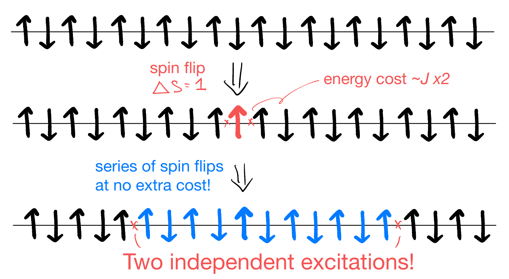

Importantly, the original spin flip of $\Delta S=1$ is now shared by two independent excitations. Each of them can only carry half of that, i.e., $\Delta S_x=\frac{1}{2}$. This is superficially like an electron, but in our quantum magnet model the low-energy excitations must be charge neutral! We call this phenomenon "spin-charge separation".

## 1D quantum magnets with a Z2 symmetry

To investigate how such interesting physics could arise, let us consider a 1D quantum magnet with a spin-$\frac{1}{2}$ moment on each site. For simplicity, we let $\hat{X}_i,\hat{Y}_i,\hat{Z}_i$ be the respective "Pauli operators" on site $i$, which differ by the earlier spin operator only by a factor of $\frac{1}{2}$ and satisfies

$$ \hat{X}_{i}^{2}=\hat{Y}_{i}^{2}=\hat{Z}_{i}^{2}=1$$

$$ \hat{X}_i\hat{Y}_i=-\hat{Y}_i\hat{X}$$

$$ \left[ \hat{X}_i,\hat{Y}_i \right] =2i\hat{Z}_i$$

Consider the Hamiltonian

$$ \hat{H}=J\sum_i{\hat{X}_i\hat{X}_{i+1}}+h\sum_i{\hat{Z}_i}$$

with $J>0$. If we had $h=0$, it will be the AFM Ising model. The Ising model is classical, in the sense that all the eigenstates of the Hamiltonian are necessarily specified by the simultaneous eigenstates of $\left\{ X_i=\pm 1 \right\}$. The term proportional to $h$ breaks such property, and so serves to introducing some "quantumness" into the problem. This model is usually called the transverse-field Ising model.

First, we notice that the model has a Z2 spin-flip symmetry, given by

$$ \hat{G}=\prod_i{\hat{Z}_i}$$

since

$$ \hat{G}\left( \hat{X}_i\hat{X}_{i+1} \right) \hat{G}^{\dagger}=\left( -\hat{X}_i \right) \left( -\hat{X}_{i+1} \right) =\hat{X}_i\hat{X}_{i+1}$$

as it turns out, this global symmetry has an interesting interpretation in our solution to the problem.

Let us now try to solve the Hamiltonian exactly (unlike the magnon mean-field discussion, which was only approximate given the bosons are interacting). At first sight, it is not obvious that it could be solved, afterall this is not a "quadratic" boson / fermion Hamiltonian. Also, the terms in the Hamiltonian do not commute with each other and so we cannot readily write down their joint eigenstates. Nevertheless ,this model is exactly solved, through the "Jordan-Wigner transformation" which relates fermions to hardcore bosons (spin-$\frac{1}{2}$ moments).

To motivate the transformation, we first notice that, for a single site, there's no difference between hardcore boson (two-level system) and spinless fermion: in all cases the Hilbert space is two-dimensional. Now we may denote

$$ \hat{Z}_i=\begin{cases}
   |+\rangle \Rightarrow |\hat{n}_i=1\rangle\\
   |-\rangle \Rightarrow |\hat{n}_i=0\rangle\\
\end{cases}$$

If we interpret the local Hilbert space as that of a fermion, we have

$$ |\hat{n}_i=1\rangle =\hat{c}_{i}^{\dagger}|0\rangle $$

which seems fine. In addition, the action of the Pauli operators can now be reconciled with

$$ \hat{X}_i\mapsto \hat{c}_{i}^{\dagger}+\hat{c}_i$$

$$ \hat{Y}_i\mapsto i\left( \hat{c}_i-\hat{c}_{i}^{\dagger} \right) $$

$$ \hat{Z}_i\mapsto -e^{i\pi \hat{n}_i}$$

note that

$$ -e^{i\pi \hat{n}_i}=-\left( 1+\left( e^{i\pi}-1 \right) \hat{n}_i \right) =2\hat{c}_{i}^{\dagger}\hat{c}_i-1$$

It will be good to verify that the algebraic relations between the Pauli operators are preserved. For instance, check that

$$ \hat{X}_{i}^{2}\mapsto \left( \hat{c}_{i}^{\dagger}+\hat{c}_i \right) ^2=\hat{c}_{i}^{\dagger}\hat{c}_i+\hat{c}_i\hat{c}_{i}^{\dagger}=I$$

$$ \hat{X}_i\hat{Y}_i\mapsto \left( \hat{c}_{i}^{\dagger}+\hat{c}_i \right) \left( i\hat{c}_i-i\hat{c}_{i}^{\dagger} \right) =-i\hat{c}_i\hat{c}_{i}^{\dagger}+i\hat{c}_{i}^{\dagger}\hat{c}_i=i\left( 2\hat{c}_{i}^{\dagger}\hat{c}_i-1 \right) $$

it will be natural to give these even and odd combinations of the fermion operators a symbol. Define

$$ \hat{X}_i\mapsto \hat{\gamma}_i=\hat{c}_{i}^{\dagger}+\hat{c}_i$$

$$ \hat{Y}_i\mapsto \hat{\gamma}'_i=i\left( \hat{c}_i-\hat{c}_{i}^{\dagger} \right) $$

which anti-commutes $\left\{ \hat{\gamma}_i,\hat{\gamma}'_i \right\} =0$, and we may as well write

$$ \hat{c}_i=\frac{1}{2}\left( \hat{\gamma}_i-i\hat{\gamma}'_i \right) $$

$$ \hat{c}_{i}^{\dagger}=\frac{1}{2}\left( \hat{\gamma}_i+i\hat{\gamma}'_i \right) $$

the operators $\hat{\gamma}_i$ and $\hat{\gamma}'_i$ can therefore be viewed as the "real and imaginary parts" of the complex fermions, analogous to representing a complex number as a pair of real numbers. These "real fermions" are called Majorana, which have famously disappeared multiple times in history (if you get the joke here, you know too much :)

So far, we have seen that it is completely consistent to describe the single two-level system with these fermionic operators. But the very notion of fermions requires that we consider what happens when we have a collection of them, i.e., when we have multiple sites. Here we see a major problem with our identification. E.g., consider, for $i,j$

$$ \left[ \hat{X}_i,\hat{X}_j \right] =0\quad \mathrm{vs}\quad \left[ \hat{\gamma}_i,\hat{\gamma}_j \right] =2\hat{\gamma}_i\hat{\gamma}_j$$

In other words, our fermionic interpretation of the quantum magnet Hilbert space is inconsistent once we have more than one site! The root of the problem is the following observation: in the quantum magnet Hilbert space, which is a tensor product of the local Hilbert spaces, operators localized to different sites necessarily commute. However, fermions at different sites anti-commute by definition, and so we can never consistently identify all of the local fermion operators with local spin operators.

The discussion above also suggests immediately how we could circumvent the problem: we just need to invoke some non-locality! That's the idea behind the Jordan-Wigner transformation. Starting from a reference site (call that 0), we attach a string to all operators to the right of the site such that

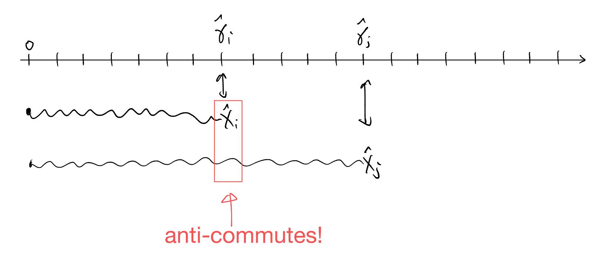

Similar requirement applies to $\hat{\gamma}'_i\mapsto \sim \hat{Y}_i$. In addition, notice that the product $i\hat{\gamma}_i\hat{\gamma}'_i\sim -\hat{Z}_i$ commutes with the other fermions $\hat{\gamma}_j,\hat{\gamma}'_j$ at $j\ne i$. Combined, we see that it will be natural to identify the "string" with a product of $\hat{Z}$ operators, up to a phase. Let us pick

$$ \hat{\gamma}_i\leftrightarrow \hat{Z}_0\hat{Z}_1\cdots \hat{Z}_{i-1}\hat{X}_i$$

$$ \hat{\gamma}'_i\leftrightarrow \hat{Z}_0\hat{Z}_1\cdots \hat{Z}_{i-1}\hat{Y}_i$$

And we may now toy with some fermionic terms and see how they translate into spin operators:

$$
\begin{align*}
    i\hat{\gamma}_i\hat{\gamma}'_i&\leftrightarrow i\left( \hat{Z}_0\hat{Z}_1\cdots \hat{Z}_{i-1}\hat{X}_i \right) \left( \hat{Z}_0\hat{Z}_1\cdots \hat{Z}_{i-1}\hat{Y}_i \right) \\
    &=i\left( \hat{Z}_0\hat{Z}_1\cdots \hat{Z}_{i-1} \right) ^2\hat{X}_i\hat{Y}_i\\
    &=-\hat{Z}_i
\end{align*}
$$

$$
\begin{align*}
    i\hat{\gamma}'_i\hat{\gamma}_{i+1}&\leftrightarrow i\left( \hat{Z}_0\hat{Z}_1\cdots \hat{Z}_{i-1}\hat{Y}_i \right) \left( \hat{Z}_0\hat{Z}_1\cdots \hat{Z}_i\hat{X}_{i+1} \right) \\
    &=i\hat{Y}_i\hat{Z}_i\hat{X}_{i+1}\\
    &=-\hat{X}_i\hat{X}_{i+1}
\end{align*}
$$

Notice how the string cancels! Such cancellation is general for any product of an even number of fermionic operators. Schematically,

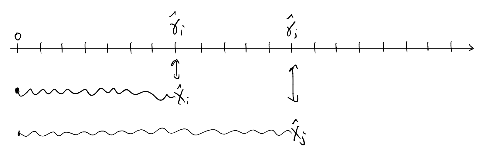

$$ \Rightarrow i\hat{\gamma}_i\hat{\gamma}_j\leftrightarrow \hat{Y}_i\hat{Z}_{i+1}\hat{Z}_{i+2}\cdots \hat{Z}_{j-1}\hat{X}_j$$

So a local fermionic Hamiltonian gets transformed into a local (bosonic) quantum magnet problem! The only cost is that there would generally be a string connecting the two end points of the fermionic process.

The converse question is also interesting: what kind of quantum magnet Hamiltonian will become a local fermionic problem under the inverse transformation?

One could, indeed, write down the inverse transform for which the string operator become $\sim \exp \left( i\pi \prod_{j<i}{\hat{n}_j} \right)$. Since the string appears only for the inverse transform of $\hat{X},\hat{Y}$, but not $\hat{Z}$, we conclude locality is preserved so long as the $\hat{X},\hat{Y}$ operators always appear in pairs. Now, notice that the spin flip symmetry

$$ \hat{G}\hat{X}_i\hat{G}=-\hat{X}_i$$

$$ \hat{G}\hat{Y}_i\hat{G}=-\hat{Y}_i$$

$$ \hat{G}\hat{Z}_i\hat{G}=+\hat{Z}_i$$

imposes the same condition! This tells us that the mapping between fermions and bosons (spin-$\frac{1}{2}$) with a Z2 spin-flip symmetry is actually very general, and the cancellation of the string in 1D implies locality is also preserved.

Finally, back to the main thread: by looking at the terms $i\hat{\gamma}_i\hat{\gamma}'_i$ and $i\hat{\gamma}'_i\hat{\gamma}_{i+1}$ above, we see that

$$ \hat{H}=J\sum_i{\hat{X}_i\hat{X}_{i+1}}+h\sum_i{\hat{Z}_i}$$

$$ \leftrightarrow \hat{H}_{\gamma}=-J\sum_i{i\hat{\gamma}'_i\hat{\gamma}_{i+1}}-h\sum_i{i\hat{\gamma}_i\hat{\gamma}'_i} + \mathrm{boundary}\;\mathrm{problems}$$

where we have added a warning that the mapping actually becomes more subtle in the presence (or not) of a boundary. The main reason is the need of defining a string starting with a "reference site". When we have an open chain, it will be natural to use the left-most site as our reference. For a closed chain (i.e. a circle), any choice of reference is arbitrary and indeed the interpretation of the transformation becomes more subtle. Depending on taste, such "boundary problem" is the most interesting / annoying part of the discussion. In any case, it will be more involved than what we would want to cover here.

Instead, we simply emphasize that $\hat{H}_\gamma$ above is quadratic in the (Majorana) fermions, and so we should have the confidence that it will be an exactly solvable problem. (There are some small generalizations required, like $U(n)\mapsto SO(2n)$ etc., but the diagonalization is fundamentally similar to that of the free-fermion tight-binding like models.) It would be a good question for a problem set but we have no PS left. So, let us be content with simply drawing some pictures.

Recall the Majorana fermions are like "half" of the regular fermion, in that a pair of them make a fermion (with occupancy state of 0 and 1). It is typical to represent them as splitting a site (with one fermion mode) into two dots:

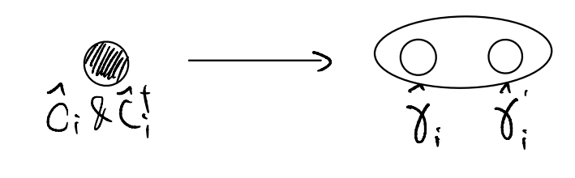

where the oval emphasizes that the two Majorana fermions belonged to the same site. Now, we can try to compare the two terms we have in $\hat{H}_\gamma$:

$$ h\sum_i{\hat{Z}_i}\rightarrow -h\sum_i{i\hat{\gamma}_i\hat{\gamma}'_i}$$

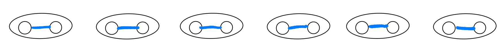

$$ J\sum_i{\hat{X}_i\hat{X}_{i+1}}\rightarrow -J\sum_i{i\hat{\gamma}'_i\hat{\gamma}_{i+1}}$$

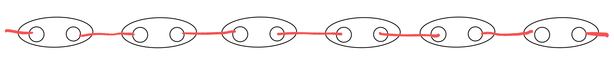

If you have heard about the Kitaev chain / 1D topological superconductors, you most likely have seen these pictures before. Our transverse field Ising model is essentially the same problem in disguise! In particular, the competition between the AFM coupling $J$ and the transverse field $h$ becomes that between the inter-site (p-wave) pairing and an on-site term.

To finish up the story, let us imagine starting with the large $J>0$ limit, for which we expect the ground state to be

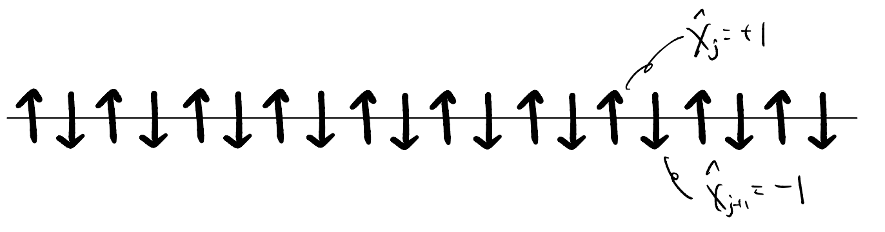

(This is an example of spontaneous symmetry breaking; there are actually a pair of ground states differing by a flip of all spins. On a finite ring the true ground state becomes the even / odd combination of them, usually called cat states. Those are interesting problems but unfortunately we don't have the time to cover any of them. Anyway, for our picture we simply use one of the symmetry-broken ground states to illustrate the idea.)

Now, recall our discussion on the excitations on top of the ordered ground state. While it takes an energy cost of $4J$ to create a single localized spin flip, it takes little energy (if $h$ is small) to separate the two "wrong bonds" apart. What operator might create such a pair of well-separated excitations? Consider

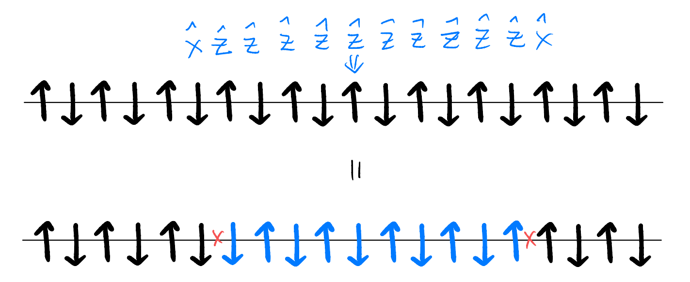

What is this "string of spin flip" operator? Under the Jordan-Wigner transformation, we have

$$ \hat{X}_i\hat{Z}_{i+1}\hat{Z}_{i+2}\cdots \hat{Z}_{j-1}\hat{Z}_j\mapsto i\hat{\gamma}'_i\hat{\gamma}_j$$

and so, in fact, our lowest-energy excitations have a fermionic interpretation. This is remarkable, considering we have gone from strongly interacting electrons (fermions) to an effective quantum magnet problem (bosons), and finally back to fractionalized low-energy fermionic excitations!

## 1D is special ... or not

According to the standard lore, I should end here by declaring that the Jordan-Wigner transformation is nice and powerful, but its utility is sort of restricted to (quasi-)1D. The main problem is one on locality: We could always perform the transformation in any dimension, but in doing so one needs to pick a one-dimensional ordering of the sites in order to define the string operator. For instance, on a 2D lattice it is common to pick a "snake" (zigzag) ordering, e.g., (Wiki page on JPEG encoding),

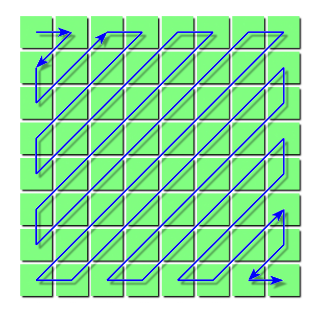

For our purpose, however, it will be more convenient to pick a "spiral" ordering, i.e., starting with a reference site (say at the center), we order other sites according to an anti-clockwise spiral

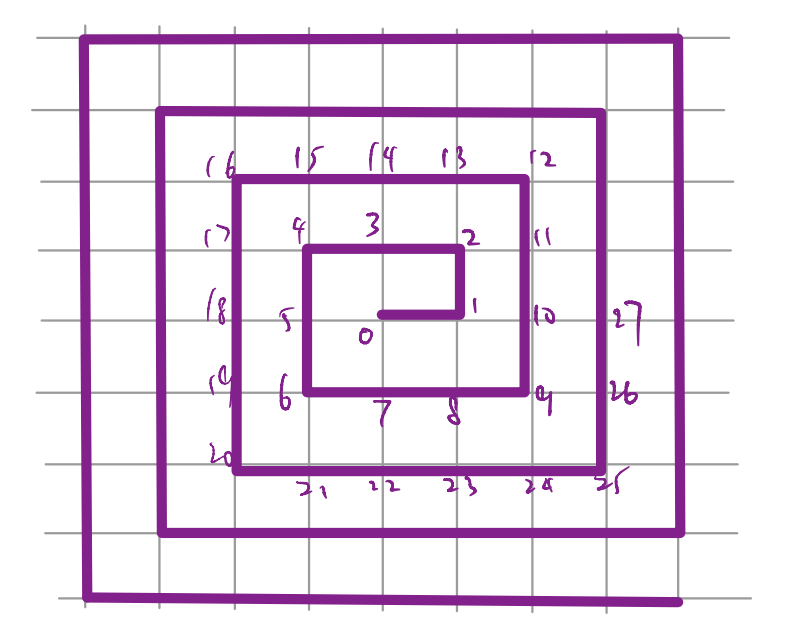

Now, imagine performing the classic Jordan-Wigner transformation in this scheme. Consider, for instance, a fermion bilinear involving the sites labeled by $11$ and $27$. In terms of the operators, we have

$$ \hat{\gamma}'_{11}\leftrightarrow \hat{Z}_0\hat{Z}_1\cdots \hat{Z}_{10}\hat{Y}_{11}$$

$$ \hat{\gamma}_{27}\leftrightarrow \hat{Z}_0\hat{Z}_1\cdots \hat{Z}_{26}\hat{X}_{27}$$

$$ \Rightarrow \quad i\hat{\gamma}'_{11}\hat{\gamma}_{27}\leftrightarrow -\hat{X}_{11}\hat{Z}_{12}\hat{Z}_{13}\cdots \hat{Z}_{26}\hat{X}_{27}$$

while the string cancellations work in the same way as in the 1D problem, when we draw it in the 2D space the problem becomes apparent:

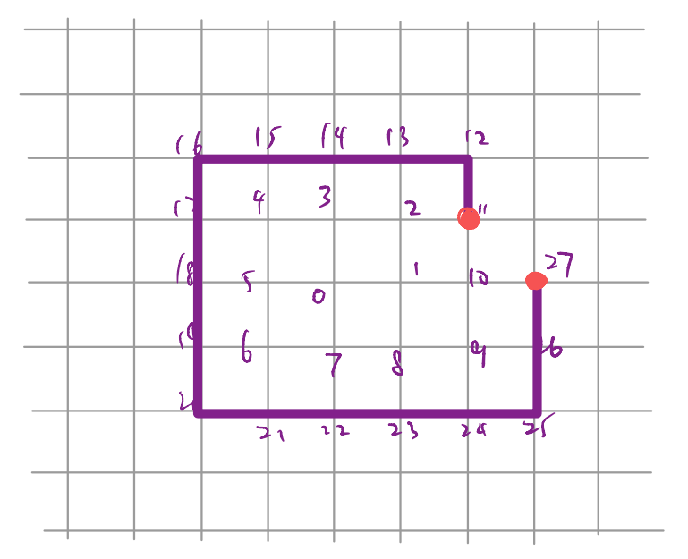

therefore, although on the fermionic side we considered a local operator (next-nearest neighbor), after Jordan-Wigner the string part becomes non-local. In other words, while the transformation continues to provide an exact rewriting of the original fermionic problem, on the bosonic side it ceases to be a reasonable "quantum magnet" Hamiltonian.

Can we do better? THe short answer is a reassuring yes! Of course this "higher-dimensional Jordan-Wigner" problem has been investigated for decades from multiple angles (lattice vs field theory vs quantum information). In the following we offer a sketch of a solution based on the recent decades of research on topological orders.

Our strategy is simple: if you dislike something, get rid of it. In our context, we hope to get rid of the non-local part of the Jordan-Wigner string. This can be sharpened as follows: staring with a hardcore boson (spin-$\frac{1}{2}$) qubit per site, we consider states $|\Psi\rangle$ in the Hilbert space for which

$$ \Box |\Psi \rangle =|\Psi \rangle $$

where $\Box$ denotes a small, closed loop of JW string (say around a plaquette).

Now, restricting our attention to these states (which span a sub-Hilbert space), we can deform the "non-local" operators as follows

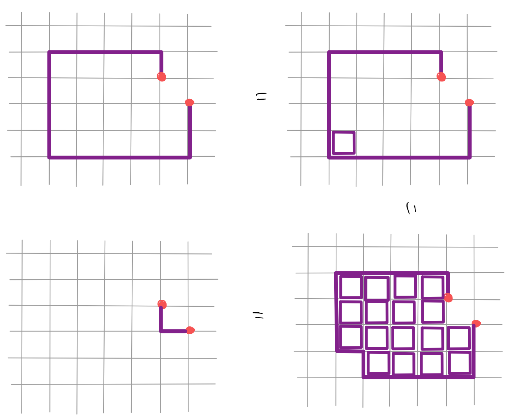

In other words, we define the restricted Hilbert space such that the states inside are capable of "dissolving" the small JW loops. Now acting on this restricted sub-Hilbert space, the JW transformed fermionic Hamiltonian can stay local! As the JW string we saw was simply a product of $\hat{Z}$, our constraint reads

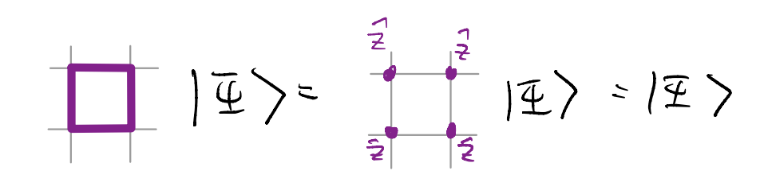

for all plaquettes on the lattice. Nice and easy! Except that it doesn't work... To see why, consider the "basic" deformation procedure we discussed

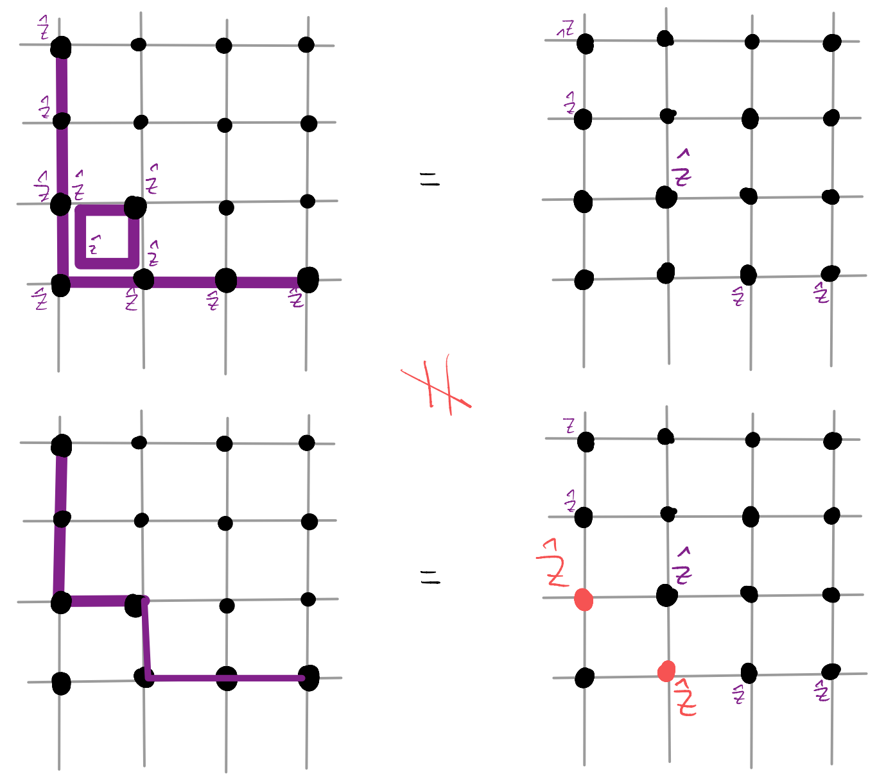

So, for our idea to work we need to find an alternative way to define the JW string! Turns out the solution is just round the corner. More specifically, we consider

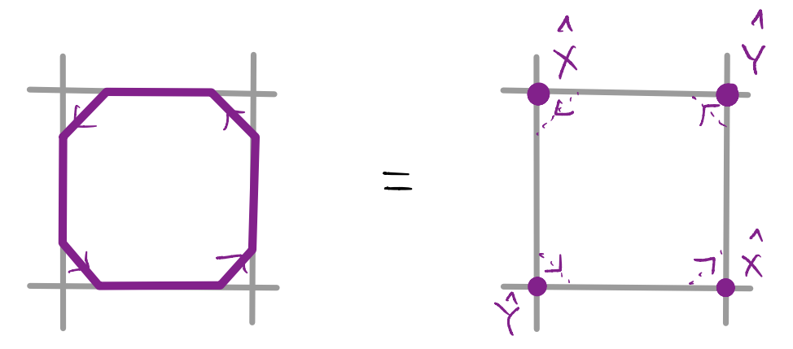

where we associate either $\hat{X}$ or $\hat{Y}$ to the site depending on the direction of the segment there. Note that we have added an orientation to the loop, which is required to keep track of signs: if we reverse the arrow compared to what we draw above, we add a $-1$ sign.

At a first sight, it might seem a bit odd that we are using $\hat{X}$ and $\hat{Y}$ but not $\hat{Z}$. This could be resolved by considering the product of two adjacent loops:

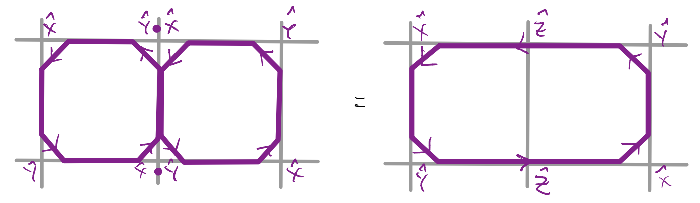

Furthermore, one could verify that these two loops commute, and so their associated constraints are consistent. As such, along a straight segment we do recover

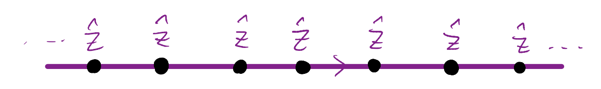

confirming expectations. Furthermore, we can now verify that the "loop dissolution" story works

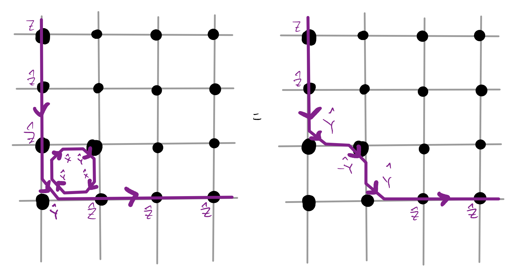

and so, to perform the JW transformation, we can restrict our attention to the sub-space satisfying the loop constraint. These constraints can again be imposed energetically through

$$ \hat{H}_{\mathrm{constraint}}=-\tilde{U}\sum_r{\hat{Y}_r\hat{X}_{r+x}\hat{Y}_{r+x+y}\hat{X}_{r+y}},\quad \tilde{U}\rightarrow +\infty $$

this is known as the "Wen's plaquette model". One can also perform a basis rotation on half of the sites in the following way

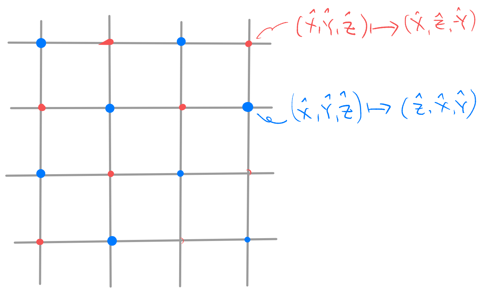

After this basis rotation, we get two different looking terms for the constraints

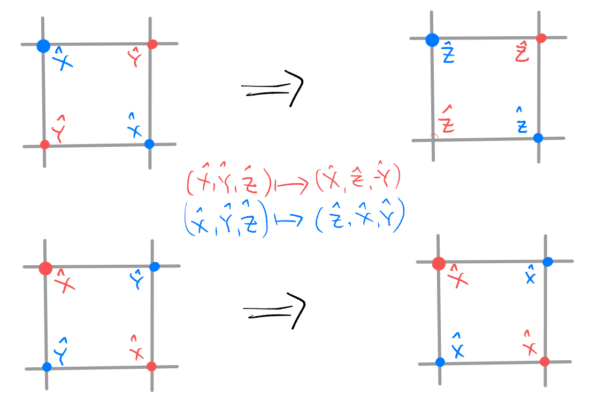

It is customary to redraw our model in a rotated manner, using an enlarged unit cell

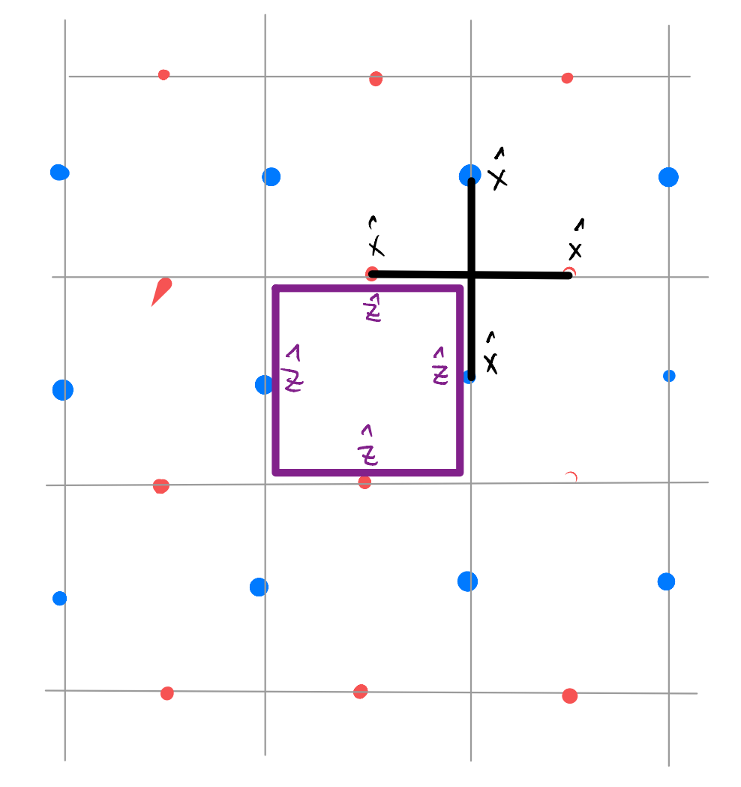

and one typically call the ZZZZ term the "plaquette operator", and the XXXX term the "star operator" (as reflected by the shape above). This is known as the (Kitaev's) toric code. (The terminology here descends from the picture of a lattice Z2 gauge theory.)

## Topological order, spin liquids, and what not

So, at long last, we have achieved our lofty goal of generalizing JW transformation to 2D... or have we?

As argued, local fermionic operators should now act locally in the constrained Hilbert space, which we impose energetically by the constraint Hamiltonian. But, in "rounding the corner" we use $\hat{X}$ and $\hat{Y}$ as part of the string and so lost the original identification of the fermionic operators! Furthermore, one can inspect the dimension of the constrained Hilbert space, and it turns out to be basically picking up a unique state in the full quantum magnet Hilbert space.

(More accurately, the number of states is intensive, and depends on the topology of the space we define the model on. E.g., with periodic boundary conditions in both directions in the toric code setup, the constrained Hilbert space is 4 dimensional. This is the famous topological ground state degeneracy, into which one can encode quantum information which is immune to local perturbations. That's why the toric code is called a "code".)

If we were performing an honest JW transformation, the constrained subspace should resemble the fermionic Fock space, i.e., of dimension $2^V$ when we have $V$ sites and one fermionic mode per site. In contrast, in our construction above one could say we only capture the fermionic vacuum in our constrained subspace! Nevertheless, once we allow for constraint violation with a finite value $\tilde{U}$, we would find that fermionic excitations do exist at energy cost of $O(\tilde{U})$ (alongside with other anyons).

In this sense, we do manage to obtain emergent fermionic excitations out of a bosonic problem (i.e., a quantum magnet). We call this "fractionalization", it that the emergent excitations carry quantum numbers which are only fractions of the microscopic building block. Such phases of matter are frequently called "spin liquids", and the examples above are known as "Z2 spin liquids".

Along this line, we'd also mention that the fractional quantum Hall effect is another prototypical setup in which electrons get fractionalized. When electrons are subjected to a strong magnetic field, their kinetic energy becomes quenched and get organized into dispersion-less Landau levels. This effectively put the system into the $\frac{t}{U} \to 0$ limit, but with the important differences rooting in the nontrivial topology of the Landau levels. As such, the "highly degenerate Hilbert space" does not have a description of localized electronic modes! This serves as a fruitful breeding ground for many interesting phenomena.

in any case, it is impressive that, beyond the JW blurring of boson vs fermion in 1D, we can still obtain fermionic excitations out of a bosonic model. Still, can we do better? In particular, can we really generalize the JW transformation and capture a fermionic model (i.e., not just the vacuum) in a bosonic quantum magnet? The short answer is yes, and indeed Kitaev's honeycomb model can be viewed as an early example along this line. Now we do understand this problem much better, but that's going to be a topic for another day.

## That's it

This concludes our lightning introduction to some strongly correlated phenomena in quantum many-body physics. Let us summarize it again with the schematic many-body energy spectrum:

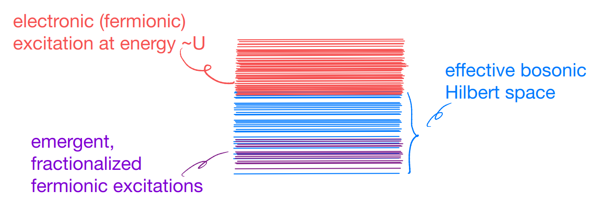

The distinction between fermions and bosons is one of the most fundamental aspects of quantum mechanics, and in quantum many-body theory (hopefully experiments too!) we can even tamper with such fundamental distinctions. More is different.

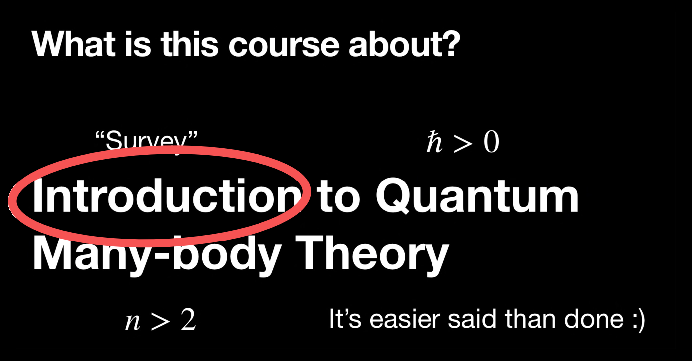

## One last time

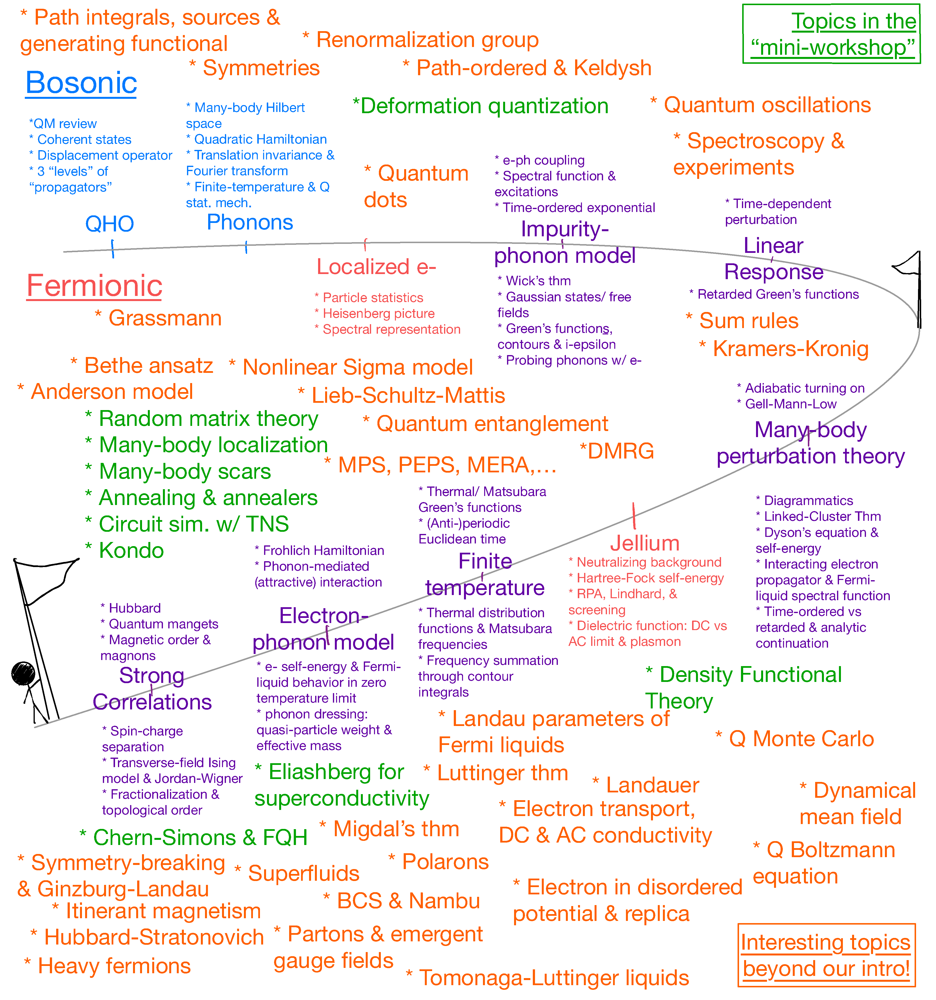
